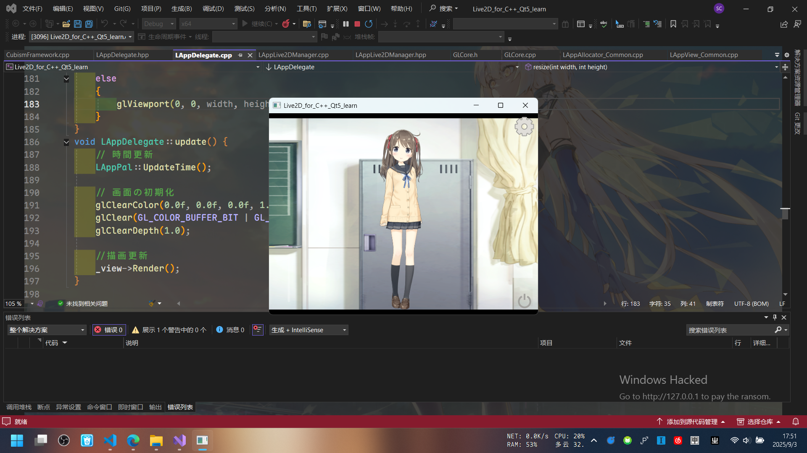
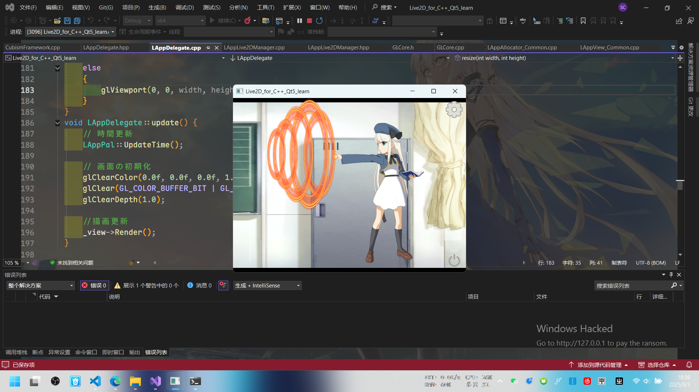

<div style="border-left:4px solid #0969da;background:#ddf4ff;padding:8px 12px;margin:8px 0"><div style="color:#0969da;font-weight:bold">NOTE</div><div>教程 <a href="https://www.bilibili.com/video/BV1H5k8YPEwz" target="_blank">《Live2D SDK For CppQt(OpenGL)》 by 見崎音羽</a></div></div>



debug了两天，一直找为什么模型加载不出来……

程序也不报错……

```
Folder PATH listing for volume home
Volume serial number is 66AD-F4DF
D:.
├─FrameworkShaders
├─Resources
│  ├─Haru
│  │  ├─expressions
│  │  ├─Haru.2048
│  │  ├─motions
│  │  └─sounds
│  ├─Hiyori
│  │  ├─Hiyori.2048
│  │  └─motions
│  ├─Mao
│  │  ├─expressions
│  │  ├─Mao.2048
│  │  └─motions
│  ├─Mark
│  │  ├─Mark.2048
│  │  └─motions
│  ├─Natori
│  │  ├─exp
│  │  ├─motions
│  │  └─Natori.2048
│  ├─Rice
│  │  ├─motions
│  │  └─Rice.2048
│  └─Wanko
│      ├─motions
│      └─Wanko.1024
└─SampleShaders
```

最后发现是**这三个主文件夹**没全部导入……


哭哭哭

---


<span style="color:green;">不管了，先来一发！</span>
