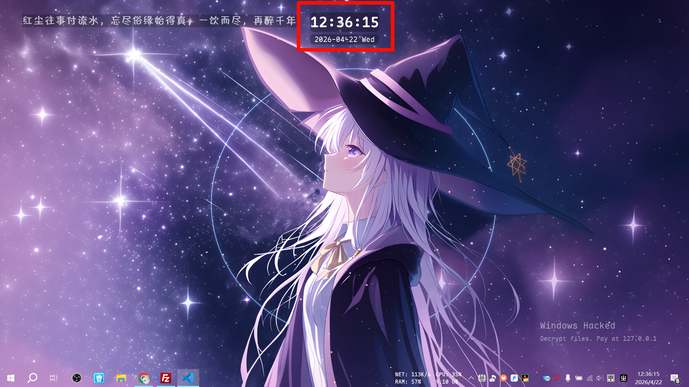

> [!NOTE]
> Image by <a href="https://pixabay.com/users/pheladii-21191309/?utm_source=link-attribution&utm_medium=referral&utm_campaign=image&utm_content=7371349">Pheladi Shai</a> from <a href="https://pixabay.com//?utm_source=link-attribution&utm_medium=referral&utm_campaign=image&utm_content=7371349">Pixabay</a>

## What the hell

30小时制是一种特殊的时间表示方式：

- 0-6点显示为前一天的24-30点
- 日期相应也会显示为前一天
- 这种方式适合熬夜党，让深夜感觉不那么晚

隐约记得这种时间是日本那边一些人在用，太小众了。

## KWGT Android


实际上，图中的时间是：`01:37 2026-04-22nd`

这段KWGT代码可以简单实现30小时制：

如 26:30

```markdown
$if(df(H)<6,df(H)+24,df(H))$:$df(mm)$
```

这段代码则是对日期进行处理：

2026-04-22nd

```markdown
$if(df(H)<6, df(yyyy/MM/dd, df(S)-86400), df(yyyy/MM/dd))$$tc(ord, if(df(H)<6, df(dd, df(S)-86400), df(dd)))$
```

其中：

- `$if(df(H)<6, df(yyyy/MM/dd, df(S)-86400), df(yyyy/MM/dd))$`是对日期进行处理，使得在24-29点内，日期显示为前一天。
- `$tc(ord, if(df(H)<6, df(dd, df(S)-86400), df(dd)))$` 是处理`st nd rd th`后缀，可有可无。

## Python Windows

我并没有截取到Windows上的显示效果，在大多数情况下（6-23点），时钟会显示正常的时间。



[](https://github.com/igugyj/time30)

这个仓库没有提供`release`。

核心代码：

```python
hour = now.hour + 24 if now.hour < 6 else now.hour
time_str = f"{hour:02d}:{now.minute:02d}:{now.second:02d}"
display_date = now - timedelta(days=1) if now.hour < 6 else now
```

用PySide6处理显示的部分则不再详述，源码可运行但打包会报路径（引用）错误，可以进一步处理再打包。
