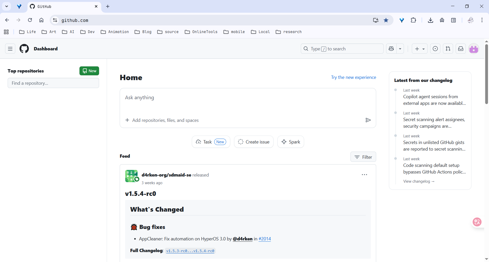
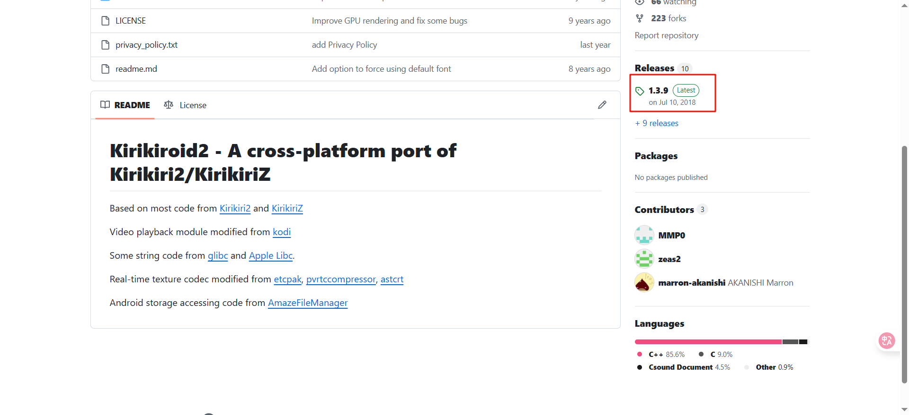
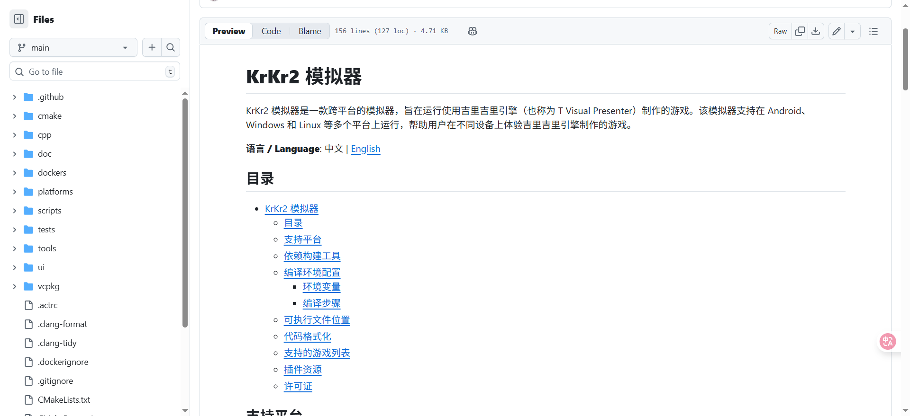
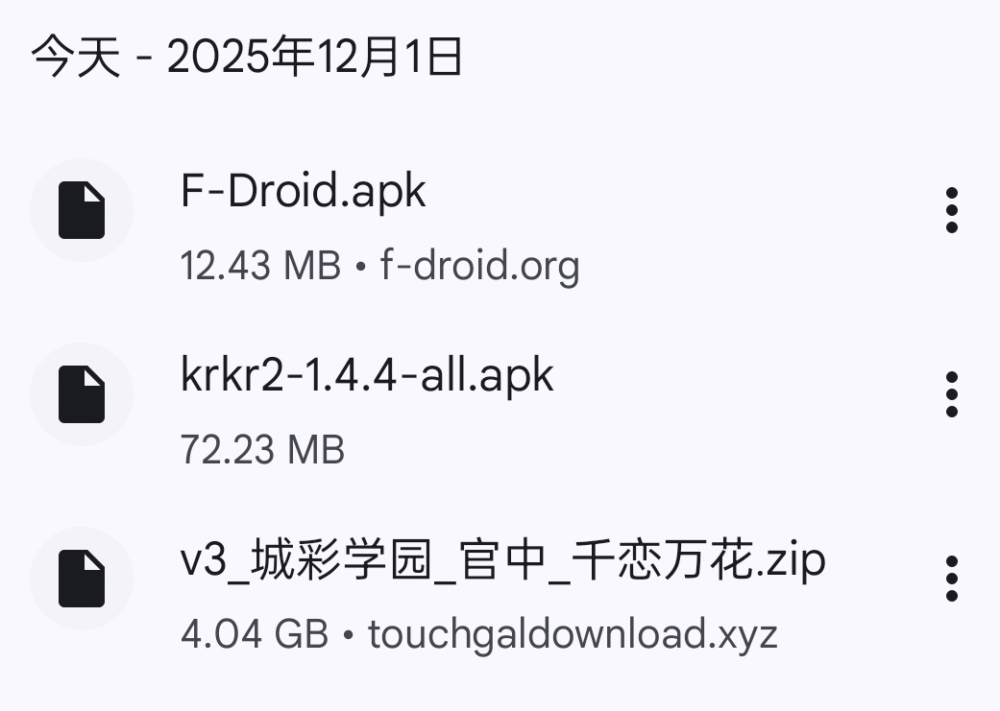
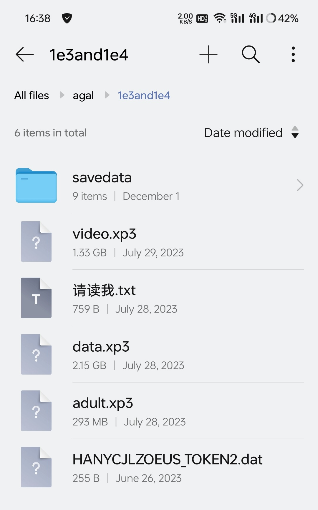
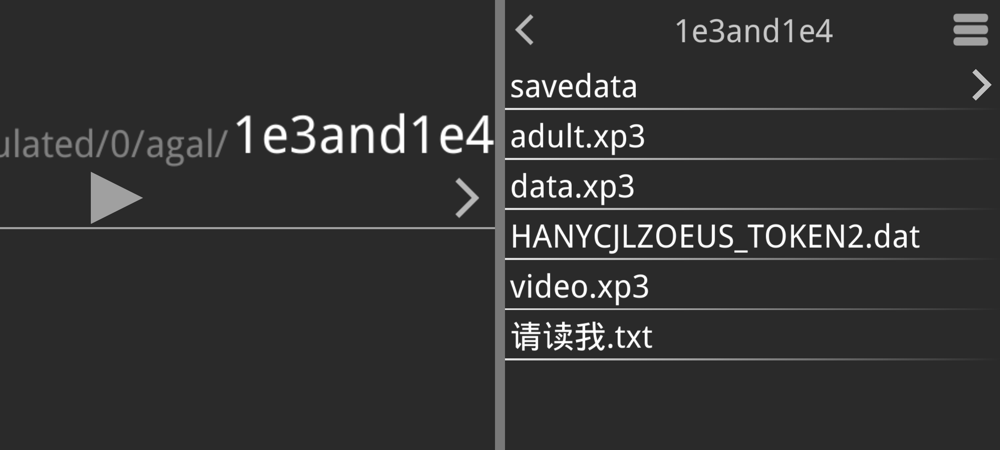
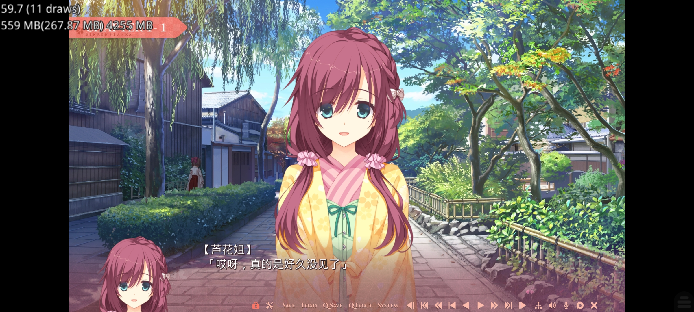

> [!NOTE]
>
> Image by <a href="https://pixabay.com/users/katzen_tupas-11531692/?utm_source=link-attribution&utm_medium=referral&utm_campaign=image&utm_content=7096666">Katzen Rodroi Tupas</a> from <a href="https://pixabay.com//?utm_source=link-attribution&utm_medium=referral&utm_campaign=image&utm_content=7096666">Pixabay</a>

## 前言

> ~~*常年玩柚子社的人都目光炯炯有神，非常自信，且智商逐年上升，最后完全成为天才。玩柚子社会改造身体结构，预防各种不治之症。人一旦开始玩柚子社就说明这个人的智慧品行样貌通通都是上等，这辈子都能在任何地方风姿飒爽。柚子厨具有强烈的社会正义感，对治安稳定有巨大的贡献，保护普通人的生命！*~~

## 精神品质

在Android上玩GalGame的人，一般有以下宝贵的品质：

1. 懂看手机配置选模拟器，会清后台、调设置，让游戏不卡帧
2. 熟悉常用模拟器，能搞定黑屏、闪退、中文路径报错这些小问题
3. 会整理游戏文件、解压导入，记得备份存档，不怕进度丢了
4. 能找到靠谱的游戏本体和汉化包，还会分辨资源有没有病毒
5. 愿意学新技巧，遇到问题会去论坛找答案，跟着更新玩法
6. 会调操作方式、字体大小、音量，不管触屏还是连手柄都玩得舒服

well，闲话就少说了，不谈剧情（我玩的真的很少），我们来具体分析一下。

## 会预习

[【手机上运行galgame常用的四个模拟器。galgame保姆级教程第四期，游戏的运行。第4.1期。-哔哩哔哩](https://b23.tv/Btj57tU)】

## 会找资源

有自己的找资源方式，不囿于应用商店和Steam等。

或者一个已经发霉的网站：

~~能白嫖绝对不会出钱~~，有经济实力就会支持正版。

以及会逛[全世界最大的同性交友网站](https://github.com/)：

能进入这个网站就已经很有石粒了！（肯定❤）

## 肯钻研

会在互联网上找各种教程、攻略、工具。

如[Kirikiroid2](https://github.com/zeas2/Kirikiroid2)：

但是这个release日期是2018年，你可以先捏一把汗了。

然后某网站的用户就在[帖子 《吉里吉里2模拟器最新版（附教程）》](https://zhuanlan.zhihu.com/p/617792919)下请教了……

好巧不巧，我也是**Android版本过高**无法正常启动Kirikiroid2。

---

于是他找到了[KrKr2 模拟器](https://github.com/2468785842/krkr2)

> [!TIP]
>
> 受人恩惠，记得给他们点个Star！
>
> 

---

## 会操作文件

工具齐全：

资料齐全：

会把文件解压到一个叫`1e3and1e4`的目录下：

> *没什么特殊含义？不是中文就行。*

## 知道自己为什么要用Android玩GalGame

有些人会觉得Android上玩GalGame很难，因为Android系统太过复杂，而且游戏本体也不少，玩起来很麻烦。

yeyeye~ (no)

**只方便一点足矣**

电脑可不像手机，手机可以带着到处走，GalGame不一定需要网络，可以随时随地玩。

## 会用模拟器

知道点击`data.xp3`来启动游戏。

嗯，这是一些重要的加载动画。

然后就是娱乐时间了。

## 会享受

“嗯嗯，很久没见了，记得上次见你还是~~上辈子~~。”

布兑，这是2016的游戏吧……

无伤大雅，接下来，就是成为所谓 **[天才](#前言)** 的时间了。

---
> [!TIP]
>
> 你猜我为什么要把这篇文章放到笔记里面？
