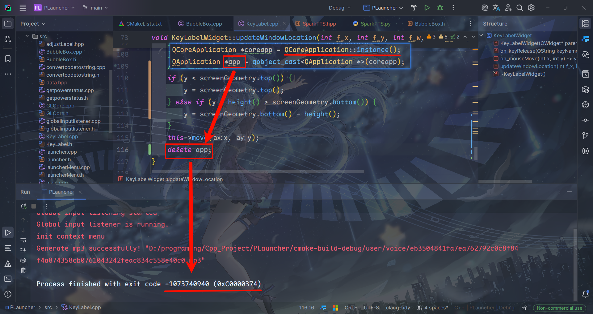

> [!NOTE]
>
> Image by <a href="https://pixabay.com/users/andsproject-26081561/?utm_source=link-attribution&utm_medium=referral&utm_campaign=image&utm_content=9875626">ANDRI TEGAR MAHARDIKA</a> from <a href="https://pixabay.com//?utm_source=link-attribution&utm_medium=referral&utm_campaign=image&utm_content=9875626">Pixabay</a>

我是直接把进程给删啦？！

### 解释

我使用指针获取了当前运行的主进程的内存地址，然后直接使用delete删除了主进程的内存，这就导致了程序崩溃，因为主进程的内存已经被释放掉了，所以程序无法正常运行。
