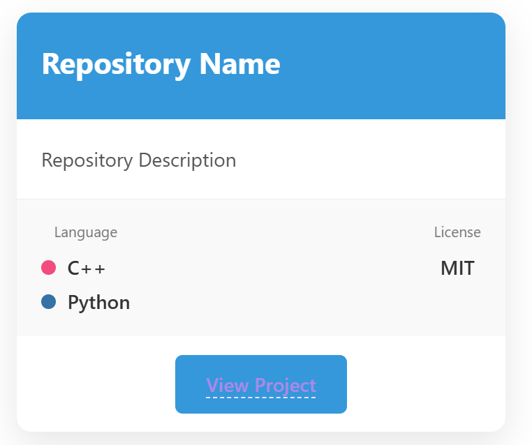
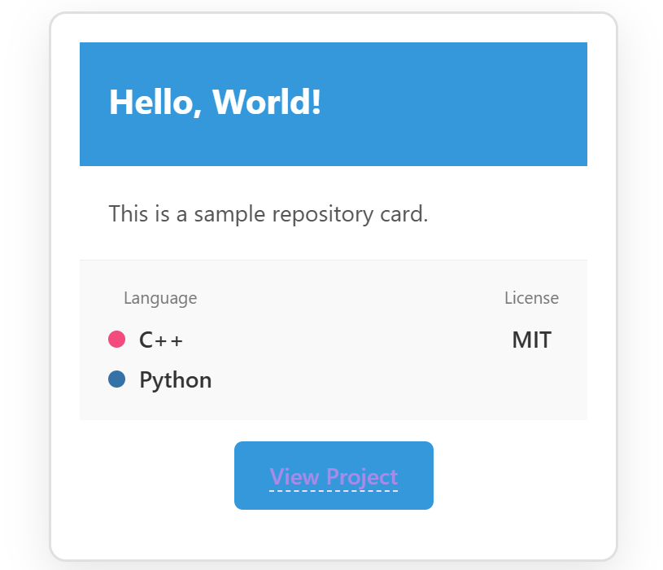

> [!NOTE]
> Image by <a href="https://pixabay.com/users/qiaominxu_橋茗旭-18717949/?utm_source=link-attribution&utm_medium=referral&utm_campaign=image&utm_content=8477357">qiaominxu 橋茗旭</a> from <a href="https://pixabay.com//?utm_source=link-attribution&utm_medium=referral&utm_campaign=image&utm_content=8477357">Pixabay</a>
> [!WARNING]
> 本文使用了大量的HTML/CSS代码，页面渲染可能有bug，见谅！

**参考**
::github{repo="nwtgck/gh-card"}

这个卡片是这个博客主题专有的，源格式为：

```txt
::github{repo="nwtgck/gh-card"}
```

GitHub的仓库用这个最快：

<https://gh-card.dev/>

## 基本实现

> [!NOTE]
> 纯HTML/CSS实现

<html>
<head>
    <style>
        .project-card {
            width: 300px;
            border: 2px solid #e0e0e0;
            border-radius: 12px;
            padding: 20px;
            margin: 15px;
            background: white;
            box-shadow: 0 4px 12px rgba(0,0,0,0.1);
            font-family: Arial, sans-serif;
        }
        .project-name {
            font-size: 20px;
            font-weight: bold;
            margin-bottom: 10px;
            color: #2c3e50;
        }
        .project-description {
            color: #666;
            line-height: 1.5;
            margin-bottom: 15px;
        }
        .project-link {
            display: inline-block;
            background: #3498db;
            color: white;
            padding: 8px 16px;
            border-radius: 6px;
            text-decoration: none;
            font-weight: bold;
        }
    </style>
</head>
<body>
    <div class="project-card">
        <div class="project-name">项目名称</div>
        <div class="project-description">
            这里是项目的描述内容，可以详细说明项目的功能、特点等信息。
        </div>
        <a href="https://example.com" class="project-link">查看项目</a>
    </div>
</body>
</html>

```html collapse={1-999}
<html>
  <head>
    <style>
      .project-card {
        width: 300px;
        border: 2px solid #e0e0e0;
        border-radius: 12px;
        padding: 20px;
        margin: 15px;
        background: white;
        box-shadow: 0 4px 12px rgba(0, 0, 0, 0.1);
        font-family: Arial, sans-serif;
      }
      .project-name {
        font-size: 20px;
        font-weight: bold;
        margin-bottom: 10px;
        color: #2c3e50;
      }
      .project-description {
        color: #666;
        line-height: 1.5;
        margin-bottom: 15px;
      }
      .project-link {
        display: inline-block;
        background: #3498db;
        color: white;
        padding: 8px 16px;
        border-radius: 6px;
        text-decoration: none;
        font-weight: bold;
      }
    </style>
  </head>
  <body>
    <div class="project-card">
      <div class="project-name">项目名称</div>
      <div class="project-description">
        这里是项目的描述内容，可以详细说明项目的功能、特点等信息。
      </div>
      <a href="https://example.com" class="project-link">查看项目</a>
    </div>
  </body>
</html>
```

---

<div class="project-card">
    <div class="project-name">📦 Author/HelloWorld</div>
    <div class="project-description">
        仓库描述内容，可以详细说明仓库的功能、特点等信息。
    </div>
    <div style="margin-top: 15px;">
        <a href="https://example.com" style="background:#333; color:white; padding:6px 12px; border-radius:4px; text-decoration:none; margin-right:8px;">GitHub</a>
        <a href="https://example.com" style="background:#c71d23; color:white; padding:6px 12px; border-radius:4px; text-decoration:none;">Gitee</a>
    </div>
</div>

```html collapse={1-999}
<style>
  .project-card {
    width: 300px;
    border: 2px solid #e0e0e0;
    border-radius: 12px;
    padding: 20px;
    margin: 15px;
    background: white;
    box-shadow: 0 4px 12px rgba(0, 0, 0, 0.1);
    font-family: Arial, sans-serif;
  }
  .project-name {
    font-size: 20px;
    font-weight: bold;
    margin-bottom: 10px;
    color: #2c3e50;
  }
  .project-description {
    color: #666;
    line-height: 1.5;
    margin-bottom: 15px;
  }
  .project-link {
    display: inline-block;
    background: #3498db;
    color: white;
    padding: 8px 16px;
    border-radius: 6px;
    text-decoration: none;
    font-weight: bold;
  }
</style>
<div class="project-card">
  <div class="project-name">📦 Author/HelloWorld</div>
  <div class="project-description">
    仓库描述内容，可以详细说明仓库的功能、特点等信息。
  </div>
  <div style="margin-top: 15px;">
    <a
      href="https://example.com"
      style="background:#333; color:white; padding:6px 12px; border-radius:4px; text-decoration:none; margin-right:8px;"
      >GitHub</a
    >
    <a
      href="https://example.com"
      style="background:#c71d23; color:white; padding:6px 12px; border-radius:4px; text-decoration:none;"
      >Gitee</a
    >
  </div>
</div>
```

---

<div style="width:280px; border:1px solid #ddd; border-radius:8px; padding:20px; background:#f9f9f9;">
    <div style="font-size:18px; font-weight:bold; margin-bottom:8px;">项目标题</div>
    <div style="color:#666; margin-bottom:15px; line-height:1.4;">项目描述内容放在这里</div>
    <a href="https://example.com" style="background:#007acc; color:white; padding:6px 12px; border-radius:4px; text-decoration:none;">访问项目</a>
</div>

```html collapse={1-999}
<div
  style="width:280px; border:1px solid #ddd; border-radius:8px; padding:20px; background:#f9f9f9;"
>
  <div style="font-size:18px; font-weight:bold; margin-bottom:8px;">
    项目标题
  </div>
  <div style="color:#666; margin-bottom:15px; line-height:1.4;">
    项目描述内容放在这里
  </div>
  <a
    href="https://example.com"
    style="background:#007acc; color:white; padding:6px 12px; border-radius:4px; text-decoration:none;"
    >访问项目</a
  >
</div>
```

## 进阶

### 使用内联样式和硬编码内容

> [!NOTE]
> 渲染有bug，自行调试



```html collapse={1-999}
<!DOCTYPE html>
<html lang="zh-CN">
<head>
    <style>
        * {
            margin: 0;
            padding: 0;
            box-sizing: border-box;
            font-family: 'Segoe UI', 'Microsoft YaHei', sans-serif;
        }
        body {
            background: linear-gradient(135deg, #f5f7fa 0%, #c3cfe2 100%);
            display: flex;
            justify-content: center;
            align-items: center;
            min-height: 100vh;
            padding: 20px;
        }
        .card {
            width: 100%;
            max-width: 400px;
            background: white;
            border-radius: 12px;
            overflow: hidden;
            box-shadow: 0 10px 30px rgba(0,0,0,0.1);
            transition: transform 0.3s, box-shadow 0.3s;
        }
        .card:hover {
            transform: translateY(-5px);
            box-shadow: 0 15px 35px rgba(0,0,0,0.15);
        }
        .card-header {
            color: white;
            padding: 20px;
            position: relative;
        }
        .card-title {
            font-size: 24px;
            font-weight: 700;
            margin-bottom: 5px;
        }
        .card-description {
            padding: 20px;
            color: #555;
            line-height: 1.6;
            border-bottom: 1px solid #eee;
        }
        .card-details {
            padding: 15px 20px;
            display: flex;
            justify-content: space-between;
            background: #f9f9f9;
        }
        .detail-item {
            display: flex;
            flex-direction: column;
            align-items: center;
        }
        .detail-label {
            font-size: 12px;
            color: #777;
            margin-bottom: 5px;
        }
        .detail-value {
            font-weight: 600;
            color: #333;
        }
        .card-footer {
            padding: 15px 20px;
            text-align: center;
        }
        .card-link {
            display: inline-block;
            color: white;
            padding: 10px 25px;
            border-radius: 6px;
            text-decoration: none;
            font-weight: 600;
            transition: background 0.3s, transform 0.2s;
        }
        .card-link:hover {
            transform: scale(1.05);
        }
        .language-badge {
            display: inline-block;
            height: 12px;
            width: 12px;
            border-radius: 50%;
            margin-right: 5px;
        }
        /* 编程语言样式 */
        .cpp { background-color: #f34b7d; }
        .javascript { background-color: #f1e05a; }
        .python { background-color: #3572A5; }
        .java { background-color: #b07219; }
        .typescript { background-color: #3178c6; }
        .go { background-color: #00ADD8; }
        .rust { background-color: #dea584; }
    </style>
</head>
<body>
    <div class="card">
        <!-- 在这里直接修改内容和颜色 -->
        <div class="card-header" style="background-color: #3498db;">
            <div class="card-title">Repository Name</div>
        </div>
        <div class="card-description">
            Repository Description
        </div>
        <div class="card-details">
            <div class="detail-item">
                <div class="detail-label">Language</div>
                <div class="detail-value">
                    <span class="language-badge cpp"></span>
                    Cpp
                    </br>
                    <span class="language-badge python"></span>
                    Python
                </div>
            </div>
            <div class="detail-item">
                <div class="detail-label">License</div>
                <div class="detail-value">MIT</div>
            </div>
        </div>
        <div class="card-footer">
            <a href="https://example.com" class="card-link" style="background-color: #3498db;">View Project</a>
        </div>
    </div>
</body>
</html>
```

### JavaScript定义变量

> [!WARNING]
> markdown渲染不了，可能无法使用

> [!NOTE]
> 渲染有bug，自行调试



```html collapse={1-999}
<!DOCTYPE html>
<html lang="zh-CN">
<head>
    <style>
        /* 在这里定义变量 */
        .project-card {
            --card-color: #3498db;
        }
        * {
            margin: 0;
            padding: 0;
            box-sizing: border-box;
            font-family: 'Segoe UI', 'Microsoft YaHei', sans-serif;
        }
        body {
            background: linear-gradient(135deg, #f5f7fa 0%, #c3cfe2 100%);
            display: flex;
            justify-content: center;
            align-items: center;
            min-height: 100vh;
            padding: 20px;
        }
        .card {
            width: 100%;
            max-width: 400px;
            background: white;
            border-radius: 12px;
            overflow: hidden;
            box-shadow: 0 10px 30px rgba(0, 0, 0, 0.1);
            transition: transform 0.3s, box-shadow 0.3s;
        }
        .card:hover {
            transform: translateY(-5px);
            box-shadow: 0 15px 35px rgba(0, 0, 0, 0.15);
        }
        .card-header {
            background-color: var(--card-color, #3498db);
            color: white;
            padding: 20px;
            position: relative;
        }
        .card-title {
            font-size: 24px;
            font-weight: 700;
            margin-bottom: 5px;
        }
        .card-description {
            padding: 20px;
            color: #555;
            line-height: 1.6;
            border-bottom: 1px solid #eee;
        }
        .card-details {
            padding: 15px 20px;
            display: flex;
            justify-content: space-between;
            background: #f9f9f9;
        }
        .detail-item {
            display: flex;
            flex-direction: column;
            align-items: center;
        }
        .detail-label {
            font-size: 12px;
            color: #777;
            margin-bottom: 5px;
        }
        .detail-value {
            font-weight: 600;
            color: #333;
        }
        .card-footer {
            padding: 15px 20px;
            text-align: center;
        }
        .card-link {
            display: inline-block;
            background-color: var(--card-color, #3498db);
            color: white;
            padding: 10px 25px;
            border-radius: 6px;
            text-decoration: none;
            font-weight: 600;
            transition: background 0.3s, transform 0.2s;
        }
        .card-link:hover {
            transform: scale(1.05);
        }
        .language-badge {
            display: inline-block;
            height: 12px;
            width: 12px;
            border-radius: 50%;
            margin-right: 5px;
        }
        .cpp {
            background-color: #f34b7d;
        }
        .javascript {
            background-color: #f1e05a;
        }
        .python {
            background-color: #3572A5;
        }
        .java {
            background-color: #b07219;
        }
    </style>
</head>
<body>
    <div class="card project-card">
        <div class="card-header">
            <div class="card-title" id="repo-name"></div>
        </div>
        <div class="card-description" id="description">
        </div>
        <div class="card-details">
            <div class="detail-item">
                <div class="detail-label">Language</div>
                <div class="detail-value">
                    <span class="language-badge cpp"></span>
                    Cpp
                    </br>
                    <span class="language-badge python"></span>
                    Python
                </div>
            </div>
            <div class="detail-item">
                <div class="detail-label">License</div>
                <div class="detail-value" id="License"></div>
            </div>
        </div>
        <div class="card-footer">
            <a href="https://example.com" class="card-link" id="link">View Project</a>
        </div>
    </div>
    <script>
        var repoName = "Hello, World!";
        var repoDescription = "This is a sample repository card.";
        var repoLink = "https://example.com";
        var license = "MIT";
        document.getElementById("repo-name").innerText = repoName;
        document.getElementById("description").innerText = repoDescription;
        document.getElementById("License").innerText = license;
        document.getElementById("link").href = repoLink;
    </script>
</body>
</html>
```

## 实际应用

<style>
        .project-card0 {
            width: 300px;
            border: 2px solid #e0e0e0;
            border-radius: 12px;
            padding: 20px;
            margin: 15px;
            background: #4ca496ff;
            box-shadow: 0 4px 12px rgba(0,0,0,0.1);
            font-family: Arial, sans-serif;
        }
        .project-name0 {
            font-size: 20px;
            font-weight: bold;
            margin-bottom: 10px;
            color: #ffffffff;
        }
        .project-description0 {
            color: #ffffffff;
            line-height: 1.5;
            margin-bottom: 15px;
        }
        .project-link0 {
            display: inline-block;
            background: #3498db;
            color: white;
            padding: 8px 16px;
            border-radius: 6px;
            text-decoration: none;
            font-weight: bold;
        }
    </style>
<div class="project-card0">
    <div class="project-name0">📦 Pfolg/Plauncher</div>
    <div class="project-description0">
        集成 Ollama 和 讯飞TTS 的 Live2D 虚拟桌面助手
    </div>
    <div style="margin-top: 15px;color:white;">
        <a href="https://gitee.com/Pfolg/plauncher" style="background:#c71d23; color:white; padding:6px 12px; border-radius:4px; text-decoration:none; margin-right:8px;">Gitee</a>
        <a href="https://sourceforge.net/projects/pfolg-plauncher/" style="background:#ff6600; color:white; padding:6px 12px; border-radius:4px; text-decoration:none;">SourceForge</a>
    </div>
</div>

```markdown collapse={1-999}
<style>
        .project-card0 {
            width: 300px;
            border: 2px solid #e0e0e0;
            border-radius: 12px;
            padding: 20px;
            margin: 15px;
            background: #4ca496ff;
            box-shadow: 0 4px 12px rgba(0,0,0,0.1);
            font-family: Arial, sans-serif;
        }
        .project-name0 {
            font-size: 20px;
            font-weight: bold;
            margin-bottom: 10px;
            color: #ffffffff;
        }
        .project-description0 {
            color: #ffffffff;
            line-height: 1.5;
            margin-bottom: 15px;
        }
        .project-link0 {
            display: inline-block;
            background: #3498db;
            color: white;
            padding: 8px 16px;
            border-radius: 6px;
            text-decoration: none;
            font-weight: bold;
        }
    </style>
<div class="project-card0">
    <div class="project-name0">📦 Pfolg/Plauncher</div>
    <div class="project-description0">
        集成 Ollama 和 讯飞TTS 的 Live2D 虚拟桌面助手
    </div>
    <div style="margin-top: 15px;color:white;">
        <a href="https://gitee.com/Pfolg/plauncher" style="background:#c71d23; color:white; padding:6px 12px; border-radius:4px; text-decoration:none; margin-right:8px;">Gitee</a>
        <a href="https://sourceforge.net/projects/pfolg-plauncher/" style="background:#ff6600; color:white; padding:6px 12px; border-radius:4px; text-decoration:none;">SourceForge</a>
    </div>
</div>
```

---

建议只使用简单的模板，不要使用过多的css样式（大佬随意），以免与自己的博客样式冲突。

如基本样式2，只需要将css的style模块放到文件靠前部分，后面只需要使用html代码即可，可确保风格统一，界面稳定。
