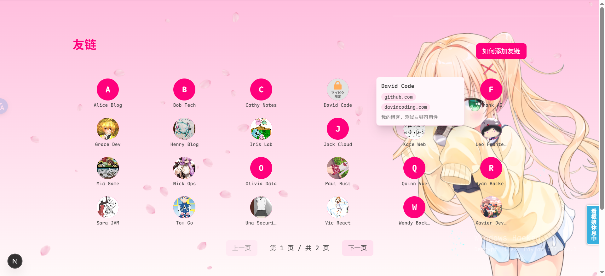

> [!NOTE]
>
> 听着歌看完效果更好，~~当然你也可以右下角点叉~~。

## 静态博客的友链困境

静态博客有一个原罪：**没后端**。

当然这不是真的原罪，只是当你想要一个动态功能的时候就尴尬了。友链就是一个典型——你需要一个地方展示好友的站点，但又不想上 WordPress 那种重型方案，更不想为了一个友链去整数据库。

传统的思路无非几种：

1. 直接写死在页面里 —— 维护起来想死
2. 挂第三方评论当留言板 —— 不是那个味
3. 搞个后端 API —— 那我为什么要用静态博客

> DeepSeek v4 flash: 然后我看了看这个项目：Next.js static export，产出是纯 HTML，托管在 Cloudflare Pages / GitHub Pages 上。

~~数据库？不存在的好吧。~~

## 穷酸方案的核心

说到底，友链不就几个东西嘛：

```
名字 + 链接 + 描述 + 头像
```

结构化一下就是一个 JSON 对象的事情：

```json
{
  "name": "你的站点名字",
  "link": ["https://example.com"],
  "description": "一段简短的介绍",
  "avatar": "https://example.com/avatar.png"
}
```

那我直接把友链数据写成一个 JSON 文件，独立部署到 Cloudflare Pages 上，然后主站 fetch 它不就行了？

`NEXT_PUBLIC_FRIENDS_JSON_URL=https://friendapi.pages.dev/friends.json`

友链仓库本身是个纯静态项目，Cloudflare Pages 的构建命令就一行：

```
mkdir -p public && cp friends.json friends.example.json public/
```

~~对，连框架都没有，纯 cp。~~

## 客户端渲染的选择

有人会问：你为啥不用 `getStaticProps` 在构建时读取？

因为构建时读 JSON 意味着每次增减友链都要重新构建部署。而用客户端 fetch，友链数据可以单独维护，JSON 文件一更新，页面下次打开就是新的。

代价是什么？就是友链页面有一个 loading 状态，等请求回来才渲染。但用户体验上，加个 loading 动画也不是不能接受，而且还有缓存兜底。

在国内可就难受了，经常 fetch 失败，`然后我就是没朋友的波奇了……`

```tsx
"use client";

// ... state, fetch, cache logic ...
// 运行时 fetch，不存在就空列表，不崩溃
```

## localStorage 缓存：断网也不慌

每次打开都去 fetch 未免太浪费，而且就算是 Cloudflare 也有访问频率限制的。所以加了一层缓存：

```typescript
const CACHE_DURATION = 60 * 60 * 1000; // 1小时
```

命中缓存直接渲染，后台静默刷新。就算网络挂了，缓存还在，友链照样显示。

~~GitHub 挂了也不关我事.jpg~~

## 错误容忍：懒人的哲学

我最烦的就是一个页面报错就整个白屏。友链这东西，没了又不是不能活。

所以处理逻辑很简单：

- fetch 失败？当空数据处理，显示`"这个入还没有盆友哦"`
- JSON 解析失败？当空数据处理，显示`"这个入还没有盆友哦"`
- 返回空数组？显示`"这个入还没有盆友哦"`
- 全部失败？安静降级，不弹错误，显示`"这个入还没有盆友哦"`

```typescript
// 所有错误都按空数据处理
console.warn("Error loading friends, treating as empty:", error);
setFriends([]);
saveToCache([]);
setError(null);
```

对用户来说，友链页面顶多是空的，不会炸。

## 分页



友链多了以后不能一屏幕全堆上去，搞个分页：

```
NEXT_PUBLIC_FRIENDS_ITEMS_PER_PAGE=24
```

默认 24 个一页，网格布局，多了翻页。

```typescript
const totalPages = Math.ceil(friends.length / ITEMS_PER_PAGE);
```

上一页下一页，点一下 `window.scrollTo({ top: 0, behavior: 'smooth' })` 回到顶部，用户体验拉满。

> 实际上是不可能多的……

显示`"这个入还没有盆友哦"`

## 怎么加友链？

最穷酸的部分来了——没有后台管理页面，加友链全靠**人工提交**。

但我开了四条通道：

1. **GitHub Issue** — 提个 issue 附上站点信息
2. **Pull Request** — 直接改 JSON 文件提 PR
3. **邮件** — 发邮件给我
4. **关于页** — 随便看看先，找一下我的联系方式

```tsx
<a href="https://github.com/igugyj/pblog-comments/issues/new">
  GitHub Issue
</a>
<a href="https://github.com/igugyj/pblog-comments/pulls">
  Pull Request
</a>
<a href="mailto:hello@pg25-lsae.eu.org">
  发送邮件
</a>
<a href="/about">
  关于本站
</a>
```

~~手动审批，包真的~~

回头在 GitHub 上搞个 Actions 自动合并 PR 也不是不行，但那就不是"穷酸"的范畴了。

对了，我还在 GitHub 上加了 CI/CD，每周检查死链丢弃，然后直接部署到 Cloudflare Pages 上，主站躺着等更新就行。

## 对比传统方案

| 方案              | 成本     | 维护             | 灵活度   |
| ----------------- | -------- | ---------------- | -------- |
| 写死在页面        | 零       | 噩梦             | 极其差   |
| 后端 API + 数据库 | 服务器钱 | 一般             | 高       |
| 第三方友链服务    | 可能付费 | 依赖别人         | 受限     |
| **本方案**        | **零**   | **改 JSON 就行** | **够用** |

## 结尾

穷酸有穷酸的好。

不用买服务器，不用维护数据库，不用管 API 鉴权，不用操心 DDoS。一个 JSON 文件 + 一百多行 React 代码，够了。

> 归根结底还是穷以及没盆友……

当然你说你有几百个友链需要审核后台、需要邮件通知、需要自动交换友链——

那这个方案确实不适合你。

~~但你真有几百个友链吗？~~

---

> [!TIP]
>
> 友链页面的完整源码在仓库的 `components/features/FriendsPageClient.tsx`，感兴趣可以看看，你也可以在站点右下角找到友链入口。

本人是用AI写的这个模块，只知其原理，不知其实现，真要我看我也不一定看得懂。
