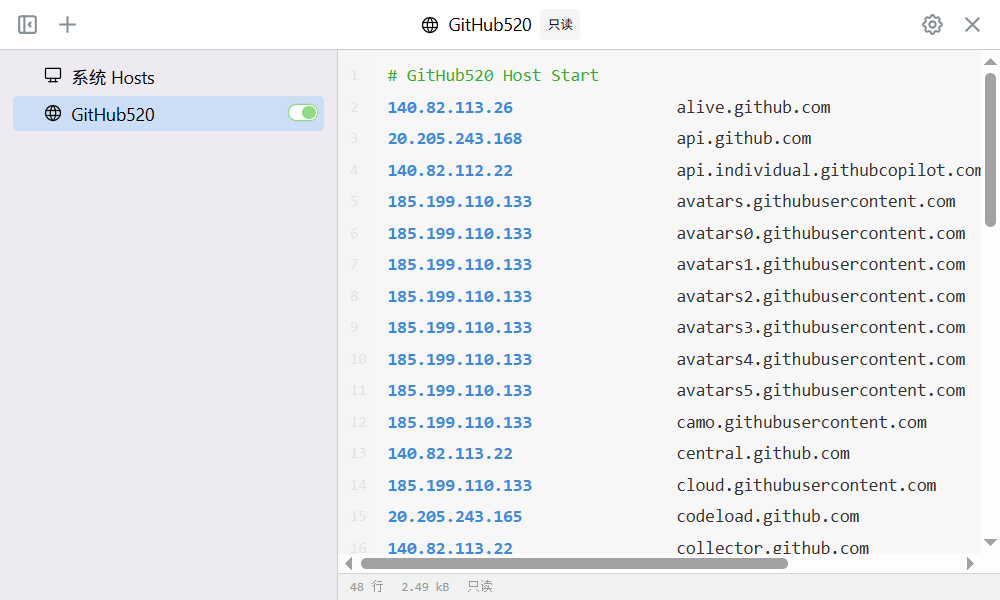

> [!NOTE]
> Cover From [simpleicons](https://simpleicons.org) [CC0 1.0 Universal](https://github.com/simple-icons/simple-icons?tab=CC0-1.0-1-ov-file)

考虑到这个项目是 Chinese All 月榜上面的项目，我写在这估计也没什么用，但是放在这，如果有人（指还不知道这个项目的人）一不小心看到了，可以去尝试一下。

啊，也是过上好日子啊：

现在不打开猫猫都能连上 GitHub，还可以到处看页面，一点影响都没有啊，很爽啊！

那个词怎么说的来着？`相见恨晚`，我要是早点发现这个项目，就可以省一半的魔力吧，这一半的魔力就可以...

