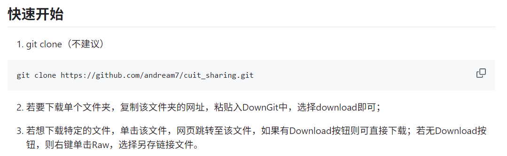
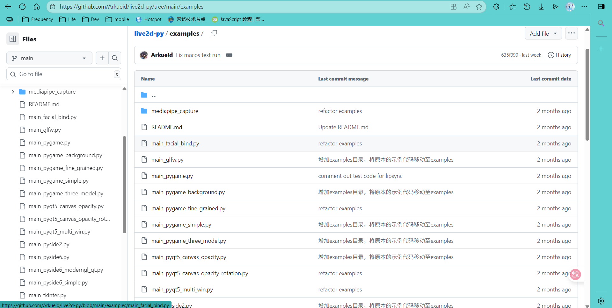
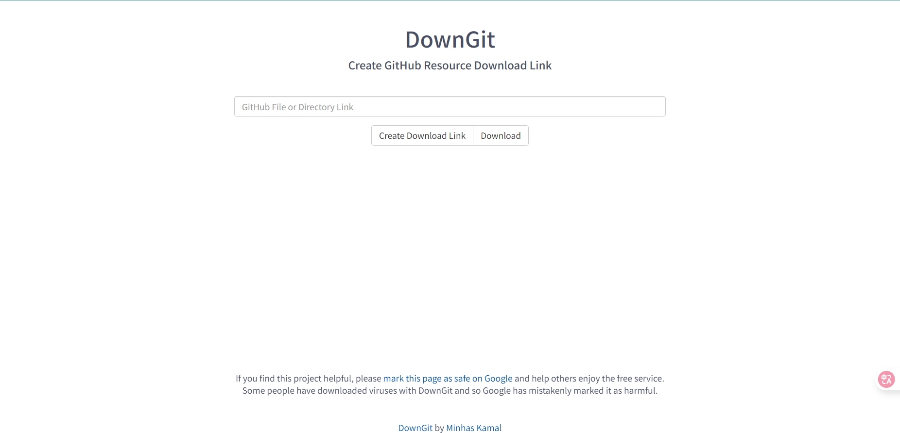
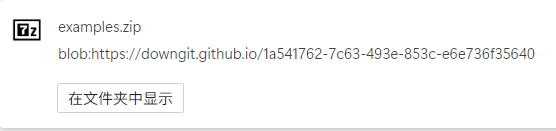

>[!NOTE]
> cover from [pixiv](https://www.pixiv.net/artworks/133051243)

# 直接看懂

非常简单:



from:
[](https://github.com/andream7/cuit_sharing)

# 实操一遍

进入我们想下载的文件夹：



在地址栏复制链接，然后go: _<https://downgit.github.io/#/home>_



粘贴链接然后点download，下载的文件夹会以压缩包的形式下载到您的电脑上：


# 最后

虽然这个方法简单，但是鲜为人知，只有在不断的探索中才能丰富自己的知识，找到适合自己的解决方法。

~~GitHub冲浪腻了来水一篇文章~~
>[!NOTE]
>Cover Information

```txt
ASJC 最も人気のあるの日本語曲《I Miss You》がリリースされ、
以下のプラットフォームで聴くことができます。

Full MV : https://youtu.be/Eur8P7Nku9A

KKBOX : https://kkbox.fm/VaIRl5

YT Music : https://music.youtube.com/playlist?list=OLAK5uy_nRhhgO2VyOwqw6bxWBFkg9QhaguIqrQsI

Spotify : https://open.spotify.com/album/4HPurCZhsb6suc2aRUZPMa

Apple Music : https://music.apple.com/album/1799128465

Amazon : https://music.amazon.co.uk/albums/B0DDRND9ZW?marketplaceId=A1F83G8C2ARO7P&musicTerritory=GB&ref=dm_sh_epFPtLDjZPO0uoG0NW5VPFXuh

「ASJC is available now on Spotify、Amazon Music、Apple Music、Youtube Music、KKBOX 」
```
