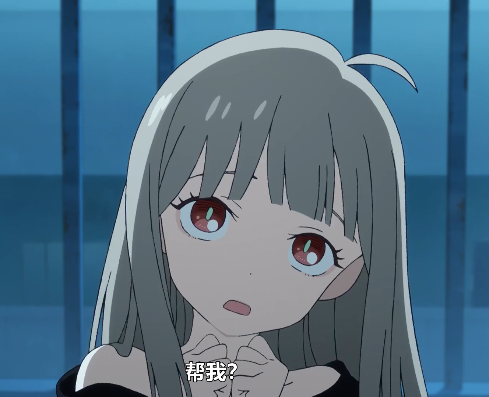
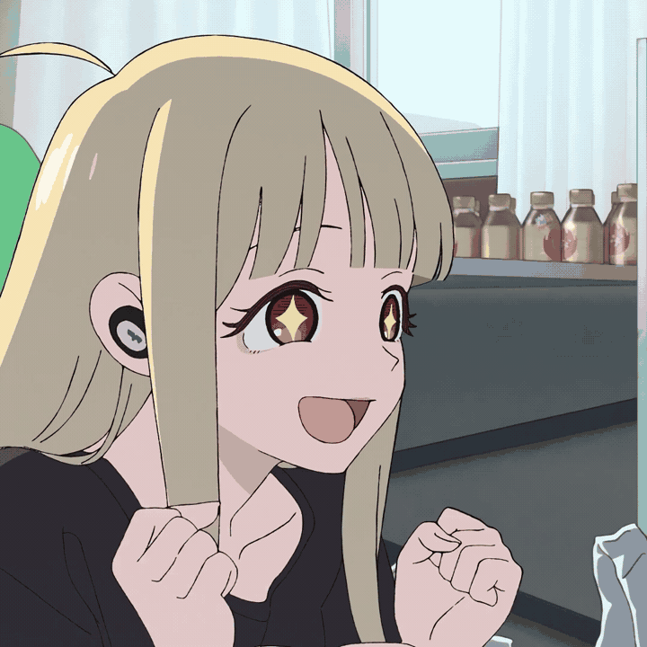
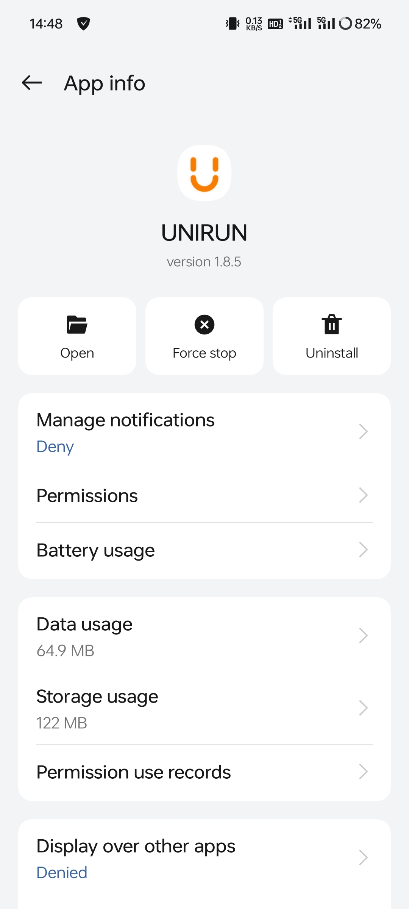
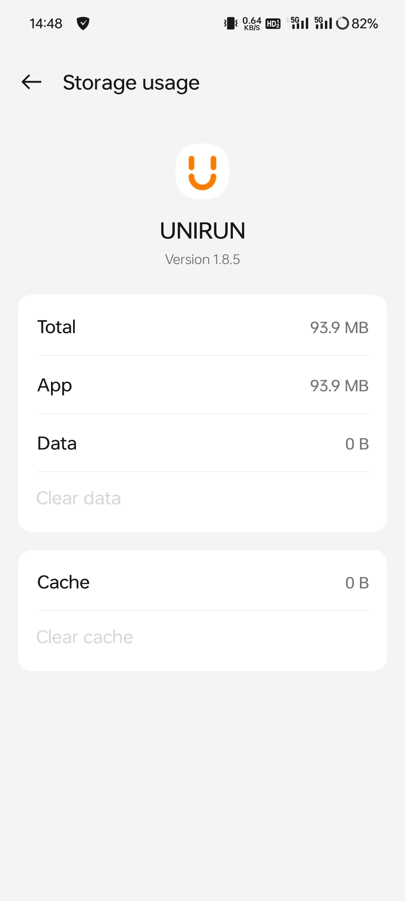
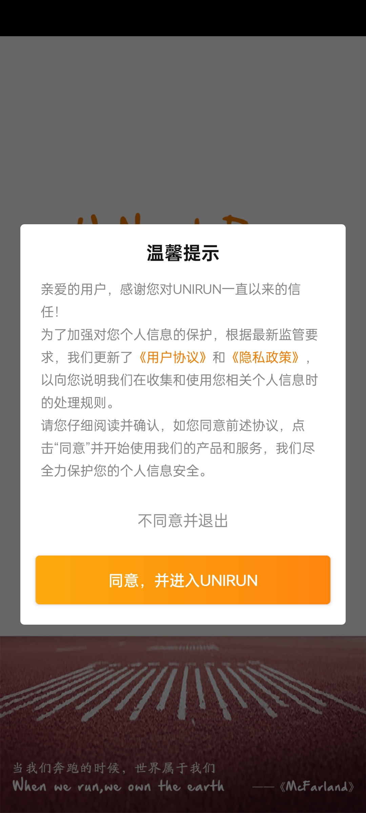
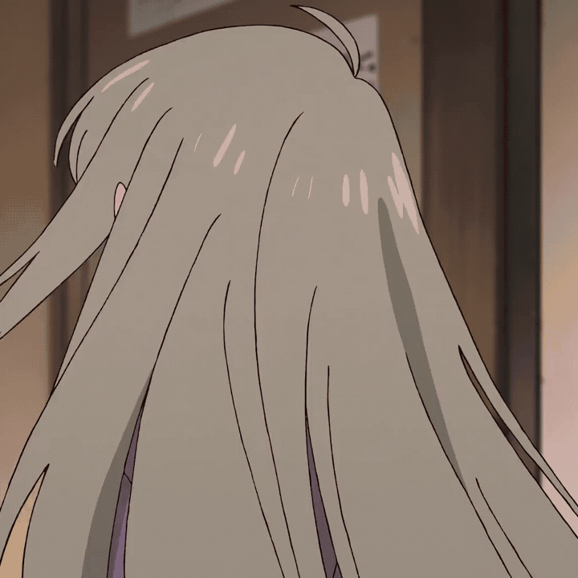
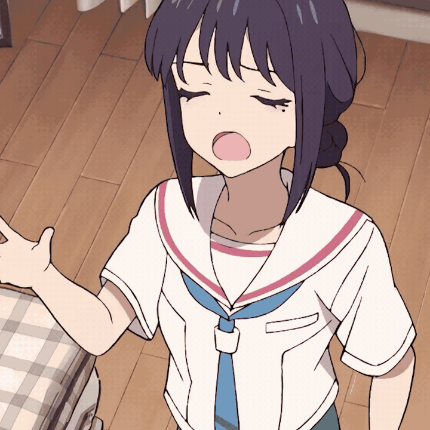

> [!NOTE]
> Image by <a href="https://pixabay.com/users/felix-mittermeier-4397258/?utm_source=link-attribution&utm_medium=referral&utm_campaign=image&utm_content=3625405">Felix Mittermeier</a> from <a href="https://pixabay.com//?utm_source=link-attribution&utm_medium=referral&utm_campaign=image&utm_content=3625405">Pixabay</a>

  <!-- 对方消息（头像左，气泡右） -->
  

    

    

      彩叶彩叶，最近我遇到一个流氓软件，它没有退出登录的按钮，我拿它没办法，求求你帮帮我！

  

    

    

    

  

  <!-- 自己消息（头像右，气泡左） -->
  

    

    

      其实很简单的

  

  <!-- 继续复制上面的行来增加对话 -->
  

    

    

  

    

    

你别卖关子嘛~

  

    

    

      首先，打开应用管理，找到这个软件

    

    

    

  

    

    
然后点击「Clear Data」，注意我这里是已经点了的

    

    

  

  

    

    

哇，真的有效果欸，彩叶好厉害！！！

    

    

    

    
没想到这么简单，我感觉自己强得可怕

    

    

    

    
但愿你是真的会了

    

    

  

