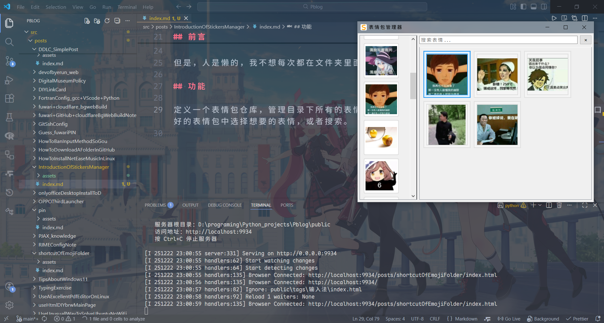
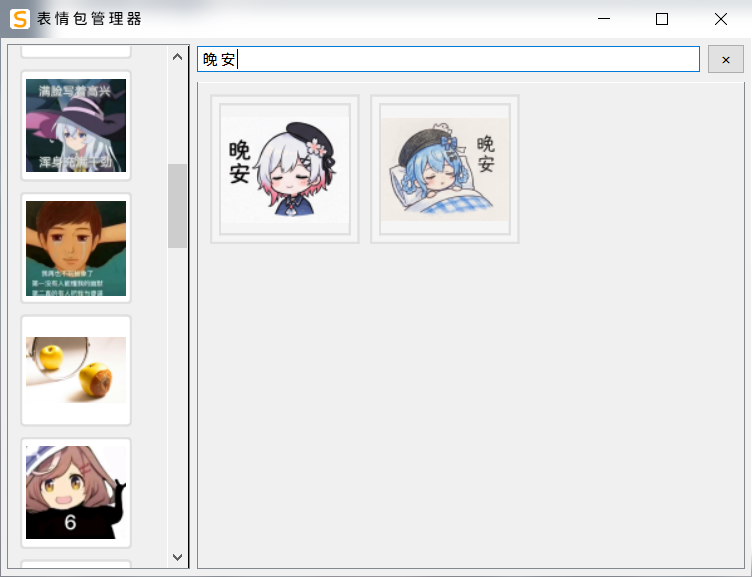

> [!NOTE]
>
> Image by <a href="https://pixabay.com/users/aiduck-7047259/?utm_source=link-attribution&utm_medium=referral&utm_campaign=image&utm_content=8907785">ch B</a> from <a href="https://pixabay.com//?utm_source=link-attribution&utm_medium=referral&utm_campaign=image&utm_content=8907785">Pixabay</a>

## 前言

<a href="../shortcutOfEmojiFolder" class="pjax-link">上回</a>我们说到用脚本来满足快速打开 emo 文件夹的方法。

但是，人是懒的，我不想每次都在文件夹里面找表情，于是，我用 AI 写了一个 Sticker Manager。

## 功能

定义一个表情包仓库，管理目录下所有的表情文件，把快捷键迁移到这个程序，Ctrl+Shift+E 打开窗口，然后在已整理好的表情包中选择想要的表情，或者搜索。





## 实现

```txt
ideas = input()
req.md = DeepSeek.Chat(ideas)
code = Claude.AI.Chat(req.md)
```

## 链接

[](https://github.com/igugyj/EMO)

[](https://github.com/igugyj/StickersManager)

---

多的不说了，查文档就可以了，有问题提 Issue，或者直接 PR。
