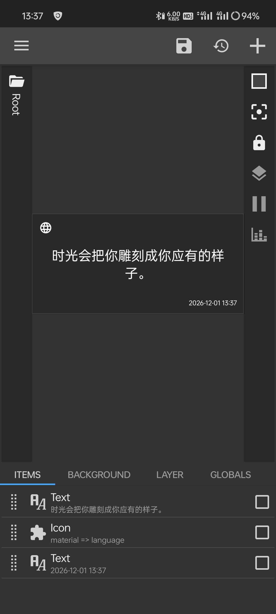
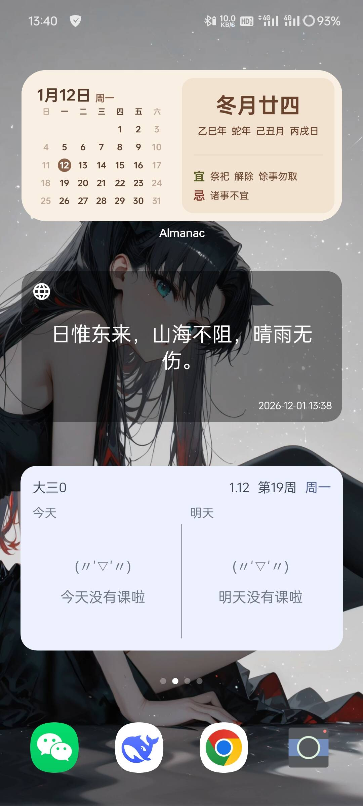

> [!NOTE]
>
> Image by <a href="https://pixabay.com/users/qiaominxu_橋茗旭-18717949/?utm_source=link-attribution&utm_medium=referral&utm_campaign=image&utm_content=8366440">qiaominxu 橋茗旭</a> from <a href="https://pixabay.com//?utm_source=link-attribution&utm_medium=referral&utm_campaign=image&utm_content=8366440">Pixabay</a>

## 开源软件

有一个叫 Quote Unquote 的开源软件，可以直接在桌面展示句子，开箱即用的那种，但是——不支持中文。对 API 的支持不够友好，或者我不知道怎么用。它内置大概 1w+英文句子，大概是来自 Wiki 的吧。

## 自己动手

一言的 API 很优秀，我想直接在 Android 上调用它，询问 AI 一圈，发现 KWGT 是个不错的选择。

## 实现

在 Google 下载 KWGT，然后添加一个它的 Widget 在桌面；

点击这个 Widget，编辑它；

添加一个 Text Item，然后编辑 text 公式：

```html
$wg("https://v1.hitokoto.cn/?encode=text",raw)$
```

意思是获取 API，不解析，这里可以直接获取到句子。

然后再稍微雕琢一下：


最后的外观：

