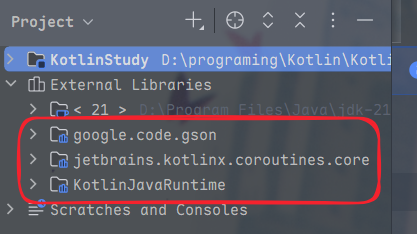
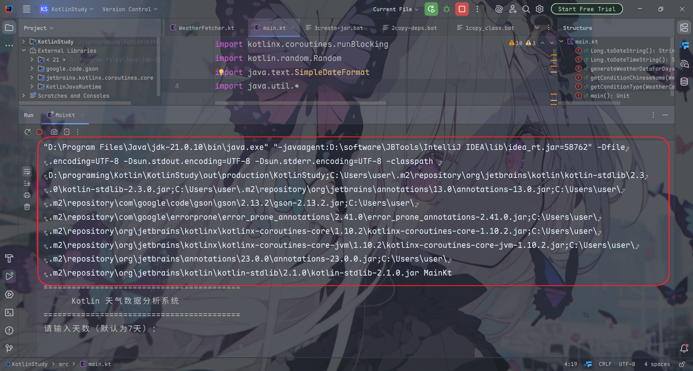
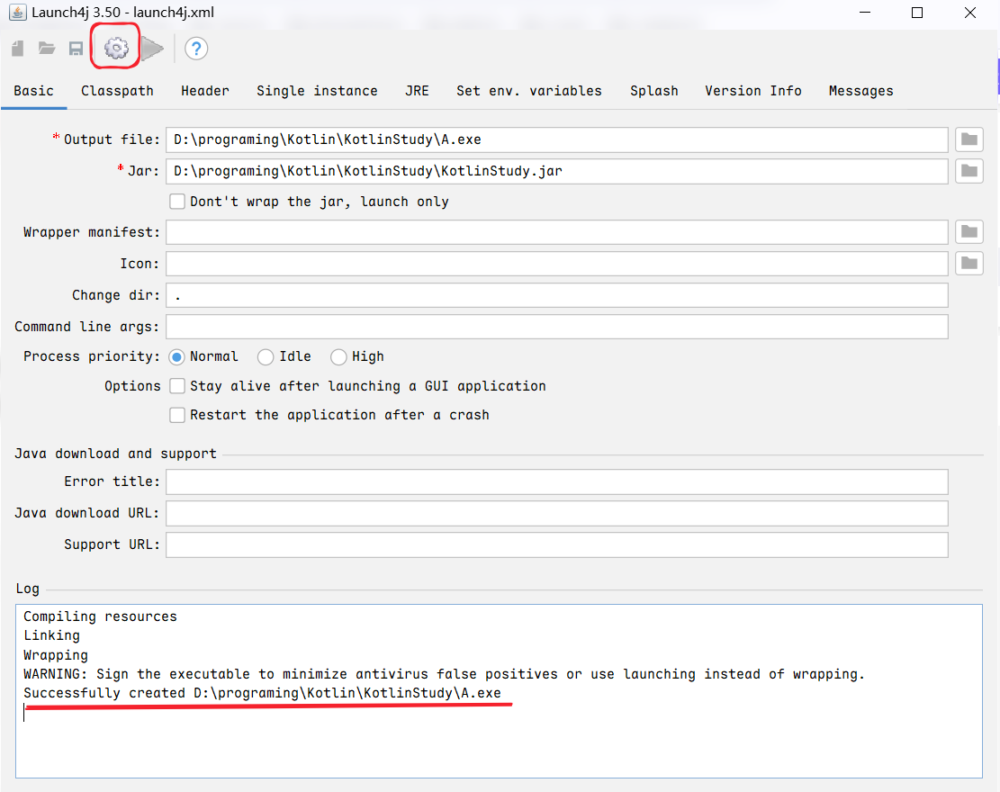
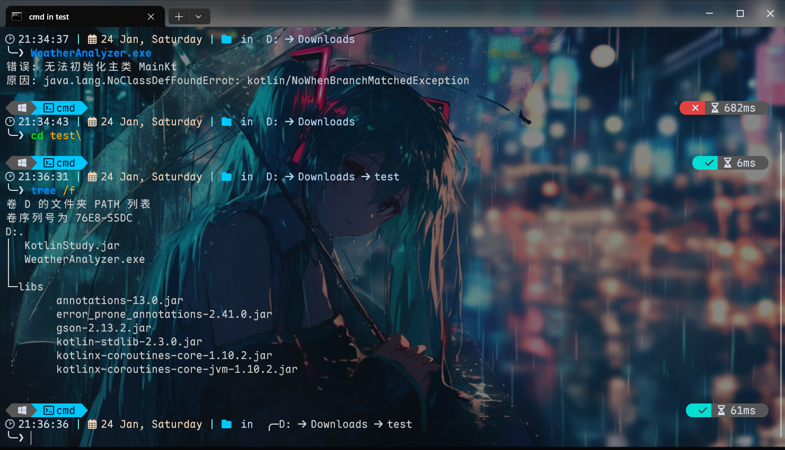

> [!NOTE]
>
> Image by <a href="https://pixabay.com/users/aiduck-7047259/?utm_source=link-attribution&utm_medium=referral&utm_campaign=image&utm_content=8891085">ch B</a> from <a href="https://pixabay.com//?utm_source=link-attribution&utm_medium=referral&utm_campaign=image&utm_content=8891085">Pixabay</a>

## 前言

我想快速入门Kotlin，所以想直接写一个简单的练手项目，虽然最后也是用了`电子铅笔`(指AI)，通过观察AI的代码，我还是有了一点点进步吧。

这不，这个纯Kotlin项目，我打算用`launch4j`打包为可执行文件，然后好在朋友们面前炫耀一番。

## 准备工作

这是我项目中的源文件结构：

<details>
<summary>src目录</summary>

```shell
root
├─src
│ main.kt
│ WeatherAnalyzer.kt
│ WeatherCondition.kt
│ WeatherFetcher.kt
```

</details>

可以看到，这是一个简单的Kotlin项目，只有四个文件，其中`main.kt`是程序的入口。

在打包之前，我已经用IDEA成功运行了程序，这意味这打包所需的文件已经在IDEA默认的构建目录中生成好了：

<details>
<summary>out目录</summary>

```shell
root
├─out
│  └─production
│      └─KotlinStudy
│          │  MainKt$main$1.class
│          │  MainKt.class
│          │  WeatherAnalyzer.class
│          │  WeatherAnalyzerKt.class
│          │  WeatherCondition$Cloudy.class
│          │  WeatherCondition$Foggy.class
│          │  WeatherCondition$Rainy.class
│          │  WeatherCondition$Snowy.class
│          │  WeatherCondition$Sunny.class
│          │  WeatherCondition.class
│          │  WeatherConditionKt$findMaxTemperatureChangePeriod$$inlined$sortedBy$1.class
│          │  WeatherConditionKt.class
│          │  WeatherData.class
│          │  WeatherFetcher$fetchWeatherData$2.class
│          │  WeatherFetcher$fetchWeatherUpdates$1$weatherData$1.class
│          │  WeatherFetcher$fetchWeatherUpdates$1.class
│          │  WeatherFetcher.class
│          │  WeatherFetcherKt$test5$1$updatesJob$1$1.class
│          │  WeatherFetcherKt$test5$1$updatesJob$1.class
│          │  WeatherFetcherKt$test5$1.class
│          │  WeatherFetcherKt.class
│          │  WeatherUtils$WeatherConverter.class
│          │  WeatherUtils.class
│          │
│          └─META-INF
│                  KotlinStudy.kotlin_module
```

</details>

这主意还是DeepSeek想的。

## 打包项目JAR

### 复制编译好的类文件

使用以下的命令将编译好的类文件复制到`classes`目录下：

<details>
<summary>1copy_class.bat</summary>

```bat
chcp 65001
@REM 直接使用 IntelliJ 编译好的类文件（从输出目录复制）
mkdir classes
xcopy /E /I "D:\programing\Kotlin\KotlinStudy\out\production\KotlinStudy\*" "classes\"
```

</details>

### 复制依赖库

> [!TIP]
>
> 这个视各项目而定

可以在IDEA中查看自己项目依赖了哪些库，可以手动将这些库的`jar`文件复制到当前的`lib`目录中：



也可以让AI帮你生成复制脚本：

在运行时查看调用了哪些`jar`：



<details>
<summary>2copy_deps.bat</summary>

```bat
chcp 65001
@echo off
echo 复制依赖库...

if exist libs rmdir /s /q libs
mkdir libs

copy "C:\Users\user\.m2\repository\org\jetbrains\kotlin\kotlin-stdlib\2.3.0\kotlin-stdlib-2.3.0.jar" libs\
copy "C:\Users\user\.m2\repository\com\google\code\gson\gson\2.13.2\gson-2.13.2.jar" libs\
copy "C:\Users\user\.m2\repository\org\jetbrains\kotlinx\kotlinx-coroutines-core\1.10.2\kotlinx-coroutines-core-1.10.2.jar" libs\
copy "C:\Users\user\.m2\repository\org\jetbrains\kotlinx\kotlinx-coroutines-core-jvm\1.10.2\kotlinx-coroutines-core-jvm-1.10.2.jar" libs\
copy "C:\Users\user\.m2\repository\org\jetbrains\annotations\13.0\annotations-13.0.jar" libs\
copy "C:\Users\user\.m2\repository\com\google\errorprone\error_prone_annotations\2.41.0\error_prone_annotations-2.41.0.jar" libs\

echo 依赖库复制完成！
pause
```

</details>

### 创建 JAR 文件

<details>
<summary>3create_jar.bat</summary>

```bat
chcp 65001
@echo off
echo 创建 JAR 文件...

REM 创建清单文件
(
echo Manifest-Version: 1.0
echo Main-Class: MainKt
echo Class-Path: libs/kotlin-stdlib-2.3.0.jar libs/gson-2.13.2.jar libs/kotlinx-coroutines-core-1.10.2.jar libs/kotlinx-coroutines-core-jvm-1.10.2.jar
echo.
) > manifest.txt

REM 创建 JAR
cd classes
"D:\Program Files\Java\jdk-21.0.10\bin\jar" -cfm ..\KotlinStudy.jar ..\manifest.txt .
cd ..

echo JAR 创建完成！
pause
```

</details>

## 打包成exe文件

这里采用开源的launch4j工具，它可以将JAR包转换为可执行的exe文件。

### 下载launch4j

<https://launch4j.sourceforge.net/>

安装不必说，网上有很多教程，这里不再赘述。

用launch4j打包的流程可以参考：

[Launch4j下载、安装和使用教程（附安装包）-51CTO博客](https://blog.51cto.com/u_17564954/14298954)

[Launch4j下载安装和使用图解（附安装包）-CSDN](https://blog.csdn.net/qq_25775935/article/details/153893357)

输出文件名可以自定义，jar选刚刚生成的jar文件。

这里注意一下，打包成exe点击的按钮是这个：



成功后`log`有`successfully`字样。

## 结果

我的目录内算是比较狼藉的，生成的exe只有几kb，在我的机器上可以运行，但是别的就不知道了


---

换个位置就不行了，看来还有依赖：


这是能成功运行的条件：



所有文件加起来不超过4mb，如此强劲，令人惊叹！

---

> [!TIP]
> 2026-02-15
> 似乎需要Java环境才能运行
