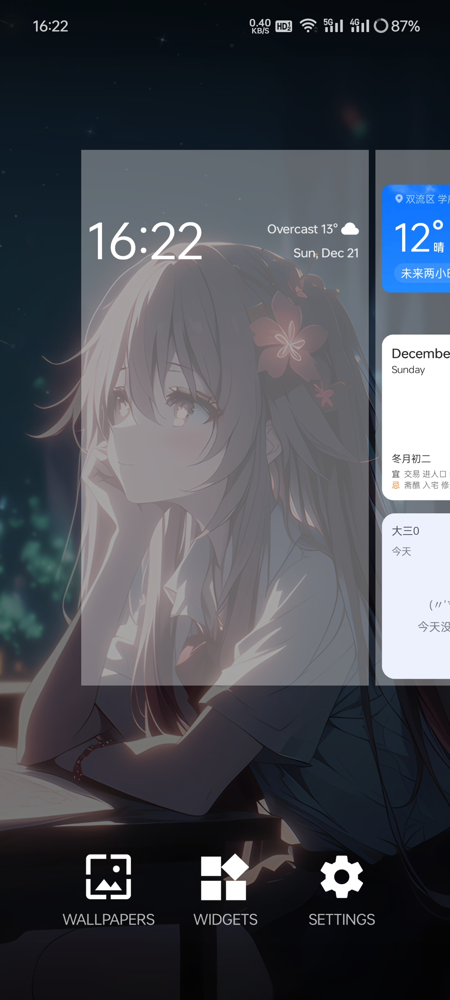
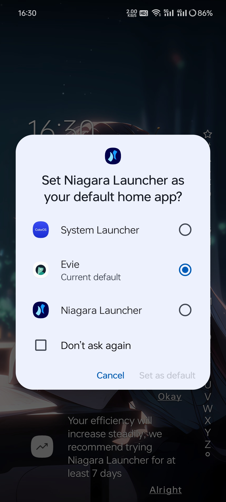

> 封面来源于游戏截图

效果预览：

bilibili 有种方法，但是受到了诟病：<https://www.bilibili.com/video/BV1zTVDzoEPx/>

## 方法

1. 下载一个第三方启动器（如果它本身支持改变系统的启动器那就不用读下面的内容了），我用的是 Evie
2. 下载一个支持篡改默认启动器的启动器，这里推荐：Niagara Launcher
3. 打开这个 Niagara，点击把它设为默认启动器的按钮，就可以选择 Evie。
   

这样设置之后，默认启动器就变成了 Evie，
我测试了一下，重启手机进入的是 ColorOS，过一会儿就进入 Evie 了。
