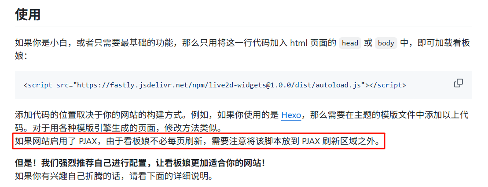

> [!NOTE]
>
> Image by <a href="https://pixabay.com/users/dexmac-12233086/?utm_source=link-attribution&utm_medium=referral&utm_campaign=image&utm_content=8094681">Gianluca</a> from <a href="https://pixabay.com//?utm_source=link-attribution&utm_medium=referral&utm_campaign=image&utm_content=8094681">Pixabay</a>
>
> 博主行文没什么逻辑，本文经 DeepSeek R1 修改润色

## 什么是 PJAX

PJAX 是 **PushState + AJAX** 的黄金组合技术，堪称现代前端优化的利器！它的核心原理非常巧妙：通过 AJAX 异步加载页面中需要变化的内容（避免整个页面刷新），同时利用 PushState 更新浏览器地址栏 URL（保持正常的 URL 跳转体验）。这种组合拳最终实现了"无刷新跳转、加载更快、视觉更流畅"的丝滑体验，特别适合博客、文档站这类需要频繁跳转但页面框架（导航/页脚等）不变的场景。

举个栗子 🌰：当你在我的博客中点击导航链接时，只有中间的文章区域会悄悄刷新，而顶部的导航条、右侧的看板娘、底部的版权信息这些元素都会保持原样，丝毫不会闪烁重载！

---

## 初识 PJAX 的奇妙之旅

[](https://github.com/stevenjoezhang/live2d-widget)

前几天突发奇想，想给自己的小站添加一个可爱的 live2D 看板娘。实现过程倒是不难，但很快就发现了一个致命问题——每次切换页面时，看板娘都会重新加载模型！

正在头秃时，突然在官方文档看到这样一句话："请将脚本放在 PJAX 区域外"。当时整个人都懵了：PJAX 是什么黑魔法？？




作为一个 ~~追求优雅的程序员~~，我决定把这个问题交给万能的 AI

```html
<!-- 引入PJAX库 -->
<script src="https://cdn.jsdelivr.net/npm/pjax@0.2.8/pjax.min.js"></script>

...

<!-- 给所有站内链接添加pjax-link类 -->
<a href="/index.html" class="pjax-link">首页</a>
```

经过几次调试（当然也经历了惨痛的翻车现场 😂），终于成功实现了无刷新加载！

核心逻辑在于这个重初始化函数：

```javascript
window.reinitPageScripts = function () {
  console.log("⚡重新初始化页面脚本");

  // 重新绑定PJAX链接
  addPjaxLinks();

  // 目录重新初始化
  if (window.TOCManager) {
    setTimeout(() => window.TOCManager.reinit(), 50);
  }

  // 更新版权信息和音乐播放器
  generateCopyrightLink();
  updateGlobalPlayer();
};
```

✨ 精华提示：所有需要在页面切换后保持状态的组件（比如标签页、播放器、动态目录）都需要在这里进行重初始化。但为什么看板娘不用呢？因为它只需要静静地待在它的位置上。

---

## 看板娘的 VIP 座位

```html
<body>
  <!-- PJAX进度条（加载时显示）-->
  <div id="pjax-progress"></div>

  <header>...</header>

  <!-- PJAX容器（内容会动态刷新） -->
  <main id="pjax-container"></main>

  <!-- 看板娘专属VIP区域（永远不刷新） -->
  <div id="live2d-widget" class="live2d-widget"></div>

  <footer>...</footer>
</body>
```

让看板娘安稳地待在 PJAX 容器之外，它就能优雅地持续陪伴访客浏览全站，再也不会反复加载啦！效果就像这样丝滑 👇


---

## 实战心得总结

1. **真香警告**：虽然实现时要给所有站内链接添加 `pjax-link` 类（确实有点麻烦），但换来的是肉眼可见的速度提升和超流畅体验！

2. **省流量秘籍**：每次切换页面只加载主要内容区域，相比整页刷新能节省 40%-60% 流量，移动端效果尤其明显！

3. **组件安置术**：
   - 常驻组件（播放器/看板娘）放在 PJAX 容器**外**
   - 动态组件（目录/评论区）放在 PJAX 容器**内**并重初始化

4. **黑科技彩蛋**：其实可以用事件委托自动绑定 PJAX 链接，不用手动添加 class！（AI 是这么说的）
