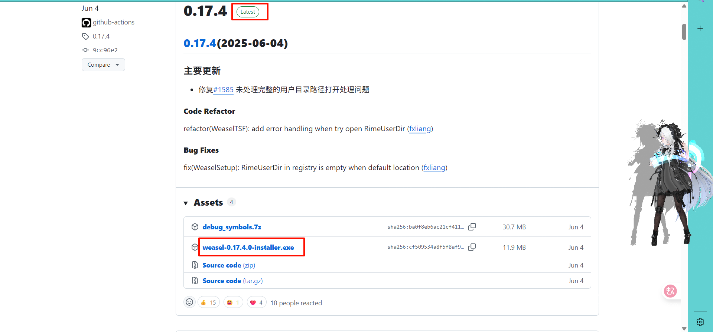
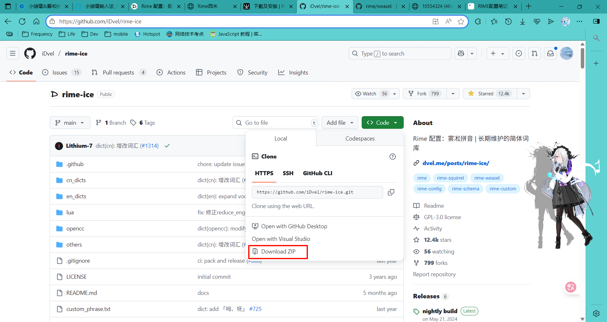
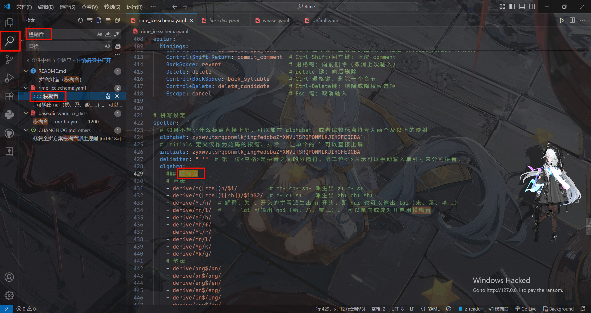
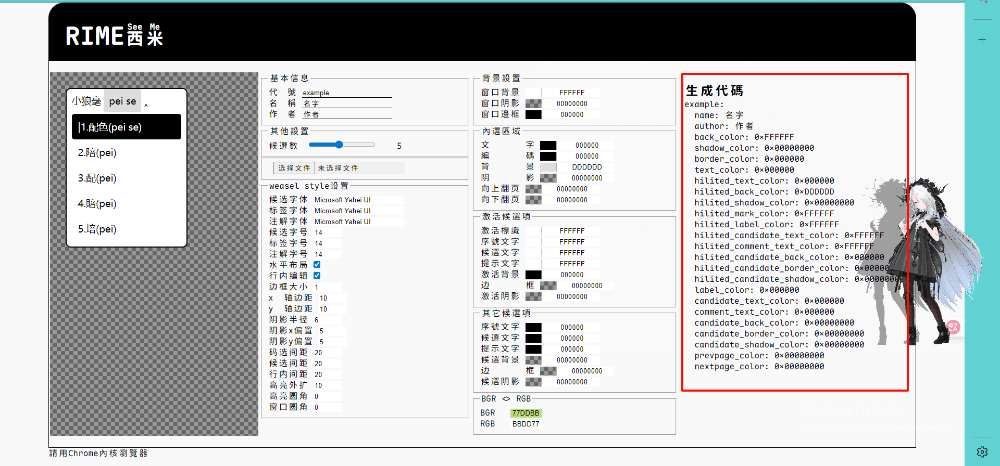
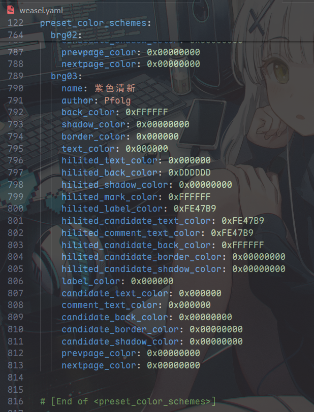
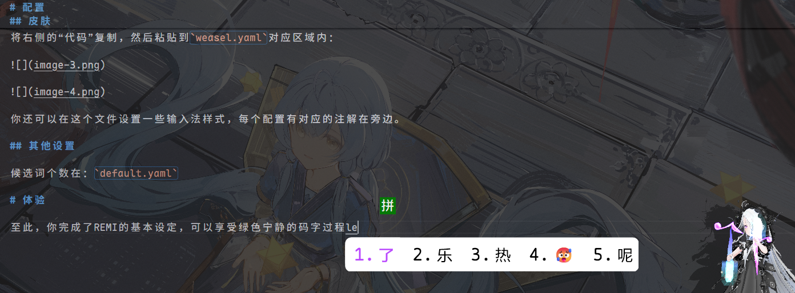

<!-- > [!NOTE]
> _cover from [rime/weasel](https://github.com/rime/weasel/)_ -->

<div style="border-left:4px solid #0969da;background:#ddf4ff;padding:8px 12px;margin:8px 0"><div style="color:#0969da;font-weight:bold">NOTE</div><div style="font-style:italic">cover from <a href="https://github.com/rime/weasel/">rime/weasel</a></div></div>

**为什么选择RIME？**

_因为其他输入法不能满足需求或者**某些需求过剩**。_

# 下载

## rime/weasel

[](https://github.com/rime/weasel)



下载最新版的安装包 安装 即可。

[](https://github.com/iDvel/rime-ice)

下载整个仓库。

## iDvel/rime-ice

[](https://github.com/iDvel/rime-ice)



下载整个仓库。

---

# 配置

<!-- > [!NOTE]
> 这里不展示安装过程了，我用的是25年2月份的一个安装包然后更新到了最新版。 -->

<div style="border-left:4px solid #0969da;background:#ddf4ff;padding:8px 12px;margin:8px 0"><div style="color:#0969da;font-weight:bold">NOTE</div><div>这里不展示安装过程了，我用的是25年2月份的一个安装包然后更新到了最新版。</div></div>

## 基本配置

打开`用户文件夹`，将这里的文件全部备份一下，然后 将下载的`rime-ice-main.zip`解压后的文件全部粘贴到`用户文件夹`。

点击`重新部署`，然后设定一下输入法为`雾凇拼音`，这样，基本功能就配置好了。

_然后基本配置就完成了。_

## 模糊音

找到用户文件夹的`rime_ice.schema.yaml`，将模糊音部分存在的注释 取消注释自己想启用的模糊音功能。

如果模糊音配置不存在于此文件请利用`VSCODE`搜索功能找到该设置的位置：



## 皮肤

你可以利用第一个链接设计自己的皮肤，虽然功能有限，但仍然可以实现自定义。

```diff
# 小狼毫配色在线设计：
# [RIME 西米](https://fxliang.github.io/RimeSeeMe/)
# [小狼毫配色详解](https://github.com/rime/weasel/wiki/定制小狼毫配色)
```

将右侧的“代码”复制，然后粘贴到`weasel.yaml`对应区域内：





你还可以在这个文件设置一些输入法样式，每个配置有对应的注解在旁边。

## 其他设置

候选词个数在：`default.yaml`

# 体验

至此，你完成了RIME的基本设定，可以享受绿色宁静的码字过程了：



# 直接解决

下载我已配置完成（模糊音、简单皮肤）的文件：

文件：https://github.com/Pfolg/Pfolg_Source/tree/main/Rime

工具：https://downgit.github.io/#/home

当然，我倒是希望你们能自己会配置，大佬的话随意。

---

### 参考链接

> [小狼毫&雾凇拼音安装及部署-Windows（图文）](https://www.cnblogs.com/HookDing/p/17949199)
>
> [小狼毫输入法\_修改模糊音设置](https://www.bilibili.com/opus/1001891221657878535)
>
> [Rime 配置：雾凇拼音](https://dvel.me/posts/rime-ice/#%e6%96%b0%e6%89%8b%e6%8c%87%e5%bc%95)
>
> [中州韻輸入法引擎/下載及安裝](https://rime.im/download/)
>
> [](https://github.com/rime/weasel)
>
> [](https://github.com/iDvel/rime-ice)
