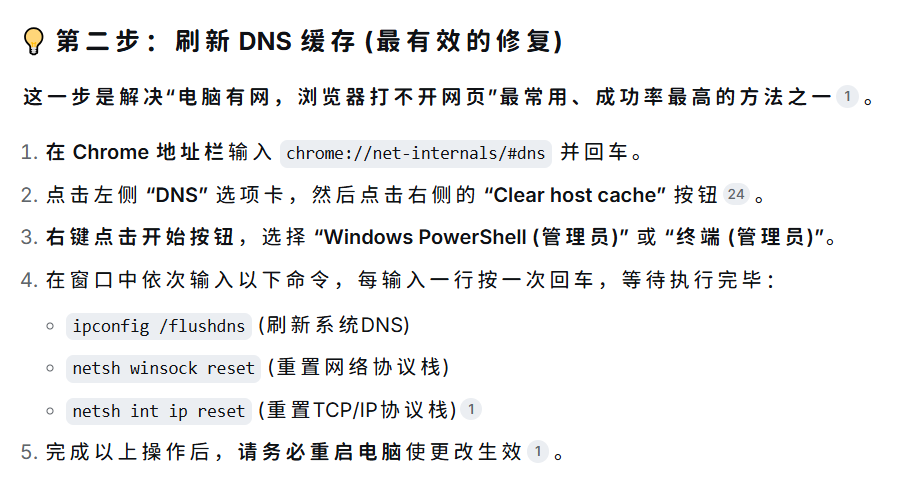
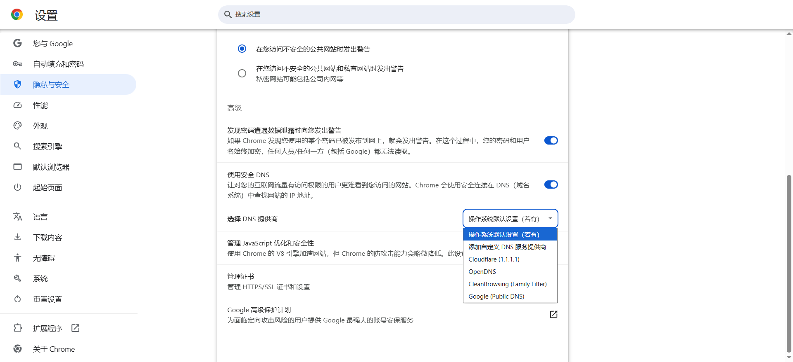

> [!NOTE]
> Image by <a href="https://pixabay.com/users/birgl-6508325/?utm_source=link-attribution&utm_medium=referral&utm_campaign=image&utm_content=4372036">Birgit</a> from <a href="https://pixabay.com//?utm_source=link-attribution&utm_medium=referral&utm_campaign=image&utm_content=4372036">Pixabay</a>
>
> 本文内核由人工生成，内容由人工智能优化。

## 问题描述

近期，浏览器在访问网页时频繁出现连接不稳定现象，具体表现为：部分时段所有页面均可正常加载，而另一些时段则无论输入任何网址均无法打开，甚至连哔哩哔哩等大型网站的加载都异常困难，直接影响视频播放体验。

## 初步排查

问题表现十分典型——仅浏览器无法访问网络，而 QQ、微信等桌面客户端均能正常通信，说明底层网络并未完全中断，故障更可能局限在浏览器或 DNS 解析层面。于是我按以下顺序进行了逐步排查：

1. **检查代理与广告屏蔽工具**：逐一停用 SwitchHosts 与 AdGuard，域名劫持或过滤规则时常引发浏览器解析异常。但关闭后问题依旧。
2. **Windows 网络诊断**：运行系统自带的网络诊断工具，未能给出有效建议，未能解决。
3. **第三方工具重置**：使用 360 安全卫士的网络修复模块进行网络重置，重启计算机后症状依然存在。
4. **AI 辅助诊断**：向 AI 求助，得到的建议是清空 Chrome 自身的 DNS 缓存。

   

然而，清空缓存后仍无法恢复稳定访问。

## 问题定位

灵光一闪，关键词`DNS`触发了回忆。几天前，我曾在无意中调整过 Chrome 的安全 DNS 设置，但当时并未意识到其影响范围。于是立即前往 Chrome 设置中进行检查，在`隐私与安全` → `安全` → `高级`下的`使用安全 DNS`选项中，发现已选择了`选择 DNS 提供商`并指定了 Cloudflare (`https://dns.cloudflare.com/dns-query`) 作为供应商，如下图所示：

这解释了为何所有网页间歇性无法打开：Chrome 启用了 DoH（DNS-over-HTTPS）并强制使用指定的 Cloudflare DNS 服务器，而该服务器在当前网络环境中可能存在连通性或配置问题，导致域名解析时而成功、时而超时。由于 QQ、微信等客户端默认遵循系统 DNS 设置，并未受到 Chrome 安全 DNS 的影响，因此仅浏览器出现异常。

## 解决方案

将上述`使用安全 DNS`设置项由`自定义`恢复为`操作系统默认设置（若有）`（即跟随系统设置），并重新启动 Chrome。之后浏览器网络立即恢复正常，所有网页均可稳定访问。

若需彻底避免此类问题，也可以直接关闭`使用安全 DNS`开关，让 Chrome 完全依赖系统 DNS 解析。

## 总结

此次故障源于对浏览器高级安全配置的随意修改。Chrome 的安全 DNS 功能虽然有助于防劫持和隐私保护，但不当的自定义提供商会直接导致解析失败，且问题极具隐蔽性——仅影响浏览器，其他网络应用完全正常，极易误导排查方向。建议在未透彻理解相关参数含义前，勿轻易更改浏览器中的未知设置，以免引入难以察觉的网络故障。

---

我个人的总结就是`气笑了，没逝千万不要乱设置浏览器`。
