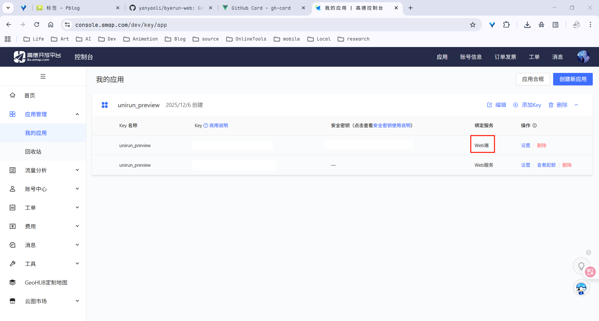
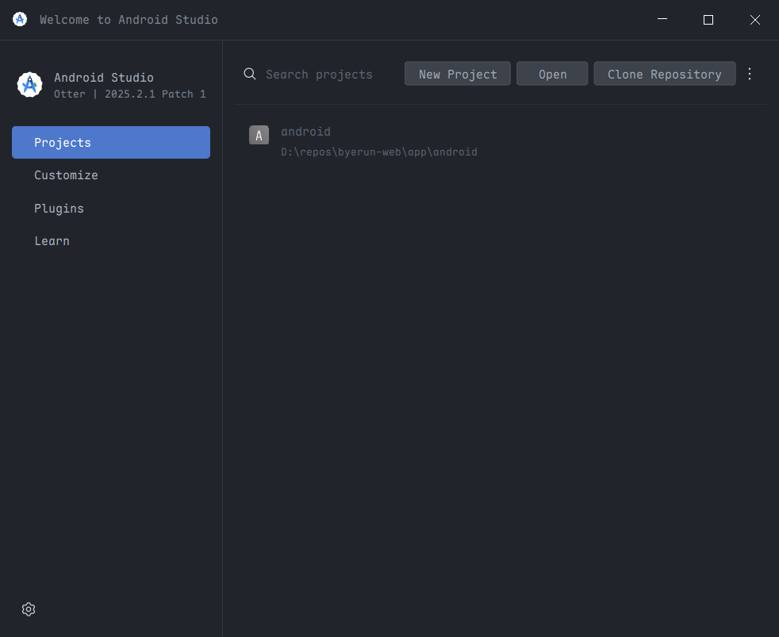
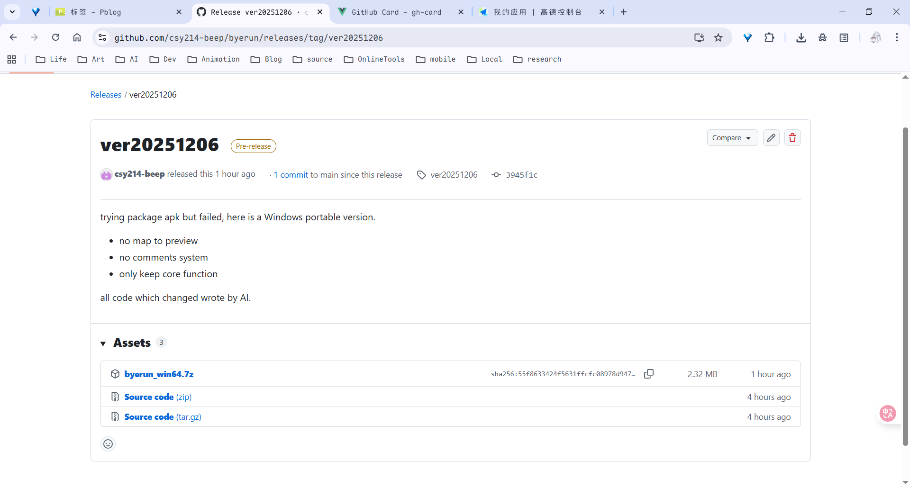

> [!NOTE]
>
> Image by <a href="https://pixabay.com/users/qiaominxu_橋茗旭-18717949/?utm_source=link-attribution&utm_medium=referral&utm_campaign=image&utm_content=8366443">qiaominxu 橋茗旭</a> from <a href="https://pixabay.com//?utm_source=link-attribution&utm_medium=referral&utm_campaign=image&utm_content=8366443">Pixabay</a>

## 关于

[](https://github.com/yanyaoli/byerun-web)

我把这位大佬的网页应用克隆到本地，简单研究了一下。但是我没什么技术，不敢改太多，核心代码我是一点没动，也不知道在哪（嘿嘿

动机是为了把这个网页打包到 Android，让小白也能随时随地用这个工具。

目前 byerun 功能确实丰富，但是，它毕竟是部署到非大陆网络中的，访问起来很麻烦。

大佬的另一个这方面的应用已经暂停更新了：
[](https://github.com/yanyaoli/byerun)
但是能用。

## 我的尝试

克隆项目到本地后，我在部署环境的时候遇到了一下微问题：安装依赖的命令似乎不那么正确：`npm install`，`npm run start`我运行不了，替代是`npm run dev`。

我想先实现 Windows 的本地化，其他的我不想动它，只要大佬有重大更新，我可以同步到应用中。

主要思路是将这个网页项目套个壳，我想先实现 Windows 的，毕竟 Windows 上的实现不会太困难。

然后再把 Android 的琢磨出来，嗯，想象是美好的！

## Windows

基本环境有了，但是在`npm run dev`就让我吃瘪了——我根本无法登录！

我意识到这个程序没我想得那么简单，他可能需要一个后端服务器，我就去[byerun.pages.dev](https://byerun.pages.dev/)逛了一下，发现这程序果然不简单，地图的话大概只需要 API，评论系统似乎需要后端支持（大概，我没深入。

问 AI，说是需要跨域，啥是跨域？！不需要明白，直接 A，主要修改是

`app\src\utils\config.js`

```json
api: {
    baseURL:
      import.meta.env.MODE === "development"
        ? "/v1" // 开发环境使用代理
        : "https://run-lb.tanmasports.com/v1", // 生产环境直接请求
    }
```

`vite.config.js`

```json
server: {
    hot: true,
    hmr: true,
    host: "0.0.0.0",
    proxy: {
      "/v1": {
        target: "https://run-lb.tanmasports.com",
        changeOrigin: true,
        secure: false,
        rewrite: (path) => path,
        configure: (proxy, options) => {
          proxy.on("proxyReq", (proxyReq, req, res) => {
            // 设置跨域头
            proxyReq.setHeader("Origin", "https://run-lb.tanmasports.com");
          });
        },
      },
    },
  },
```

良久，`npm run dev`没问题了，兴奋得我直接刷了 5km，然后就发现我的本地版没有地图（后面去高德搞了一个），也没有评论系统。



也罢，功能优先！

---

但是只有`dev`是不够的，我还想直接在没有环境的系统上运行，于是 AI 提供了 nginx，很好！

## Android

我想把这个网页打包到 Android，让小白也能随时随地用这个工具。

环境我是有的（大概。我想，这么顺利的话不要太过分啊，也这么希冀这，吃瘪了。

按照 AI 的步骤，我建立了项目，看着满页的红条，我是有那么点崩溃的；build 完后也是一页页的 error，我是真的难受；突破万难，debug 是点开 app 时，只是一页白——我人是萎的。



改天学会了，再来吧。

## 结果

结果上我只打包了 Windows 的版本，Android 算是彻底失败了，不过不用灰心，我大概是学到了什么吧

[](https://github.com/igugyj/byerun)



说白了，用我的还不如用大佬以前做的：
[](https://github.com/yanyaoli/byerun)

3CT 的也不错，不知道路线是否已经像人类了。

写完这篇，我平静了许多，该上号了。
