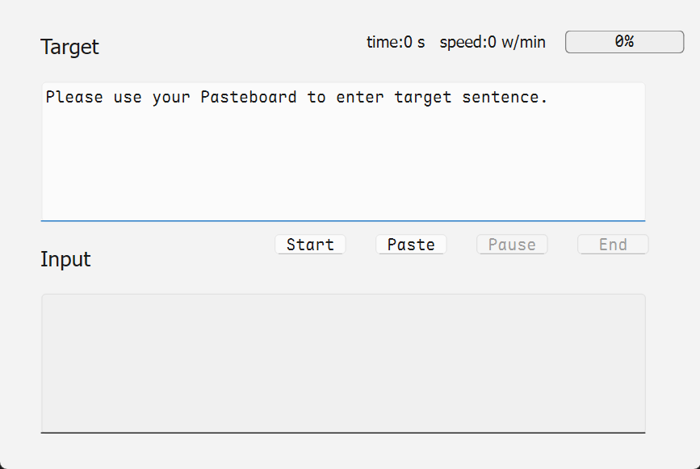
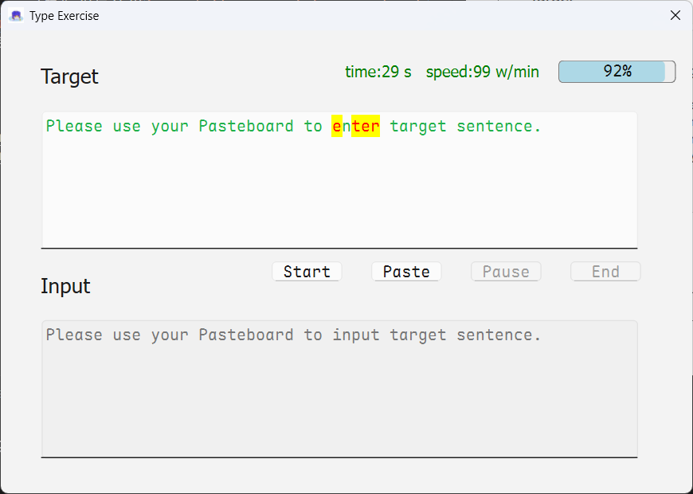
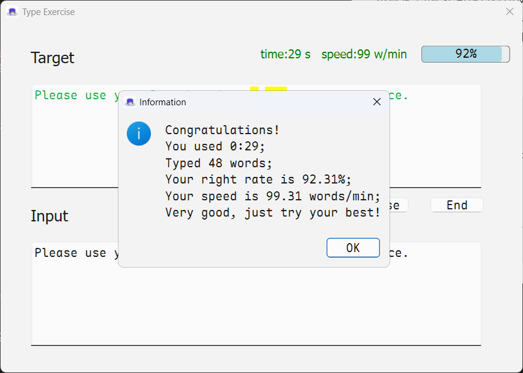

> [!NOTE]
> Image by <a href="https://pixabay.com/users/qiaominxu_橋茗旭-18717949/?utm_source=link-attribution&utm_medium=referral&utm_campaign=image&utm_content=8621000">qiaominxu 橋茗旭</a> from <a href="https://pixabay.com//?utm_source=link-attribution&utm_medium=referral&utm_campaign=image&utm_content=8621000">Pixabay</a>

<br>

这是一款功能简洁的打字练习工具，能够实时追踪输入速度和正确率，通过进度条可视化练习进度，并禁用粘贴功能确保真实训练效果。

核心特点：

1. 实时显示打字速度（字/分钟）和正确率
2. 彩色标记正确/错误字符（绿色正确，红色错误）
3. 禁用粘贴功能保证训练真实性
4. 支持从剪贴板导入练习文本
5. 提供开始/暂停/结束控制和时间统计
6. 训练结束时生成完整数据报告
7. 不会产生缓存数据、不与网络交互

该工具适合需要提升打字速度和准确性的用户，界面简洁直观，操作便捷高效。

具体操作请查看本目录下的演示视频

### 项目结构

源码和相关依赖也放在了本目录下

```shell
---.
- main.py
- requirements.txt
- typing.ui
- 115227382_p0.jpg (封面图片)
```

[download 7z package](assets/typingexercise.7z)

<details>
<summary>main.py</summary>

```python
# -*- coding: UTF-8 -*-
"""
PROJECT_NAME Python_projects
PRODUCT_NAME PyCharm
NAME main
AUTHOR Pfolg
TIME 2025/7/17 7:46
这是一款简洁高效的打字练习工具，通过实时显示打字速度和正确率帮助用户提升输入水平，
采用彩色标记区分正确与错误字符，并禁用粘贴功能确保训练真实性，
支持从剪贴板导入文本进行练习，提供完整的计时和数据统计功能，让用户清晰掌握训练进度和成效。
"""
import os
import sys

from PySide6.QtCore import Qt, QTimer, QEvent
from PySide6.QtGui import QIcon, QAction
from PySide6.QtUiTools import QUiLoader
from PySide6.QtWidgets import QApplication, QWidget, QTextEdit, QLabel, QProgressBar, QPushButton, QMessageBox, QMenu
import pyperclip

"""pyinstaller --onefile --windowed --add-data "typing.ui;." --add-data "115227382_p0.jpg;." main.py"""

def resource_path(relative_path):
    """获取资源的绝对路径（兼容开发环境和打包后环境）"""
    if hasattr(sys, '_MEIPASS'):
        return os.path.join(sys._MEIPASS, relative_path)
    return os.path.join(os.path.abspath("."), relative_path)

# 使用示例

ui_path = resource_path("typing.ui")
icon_path = resource_path("115227382_p0.jpg")

class TypingWindow(QWidget):
    def __init__(self):
        super().__init__()
        loader = QUiLoader()
        loader.load(ui_path, self)
        self.origin_text = "Please use your Pasteboard to enter target sentence."
        self.target_text = ""
        self.input_text = ""
        self.right_num = 0
        self.used_time = 0
        self.timer = QTimer()

        self.targetBox: QTextEdit = self.findChild(QTextEdit, "textEdit")
        self.inputBox: QTextEdit = self.findChild(QTextEdit, "textEdit_2")

        self.infoLabel: QLabel = self.findChild(QLabel, "label_3")
        self.processbar: QProgressBar = self.findChild(QProgressBar, "progressBar")

        self.btn_start: QPushButton = self.findChild(QPushButton, "pushButton_4")
        self.btn_paste: QPushButton = self.findChild(QPushButton, "pushButton_3")
        self.btn_pause: QPushButton = self.findChild(QPushButton, "pushButton_2")
        self.btn_end: QPushButton = self.findChild(QPushButton, "pushButton")

        self.init()

    def on_start(self):
        self.enable_items(True)
        self.inputBox.clear()
        self.timer.start(1000)

    def enable_items(self, b: bool):
        self.inputBox.setEnabled(b)
        self.btn_pause.setEnabled(b)
        self.btn_end.setEnabled(b)

    def on_end(self):
        self.timer.stop()
        QMessageBox.information(
            self,
            "Information",
            f"Congratulations!\nYou used {self.used_time // 60}:{self.used_time % 60};\n"
            f"Typed {self.right_num} characters;\n"
            f"Your right rate is {(self.right_num / len(self.origin_text)) * 100:.2f}%;\n"
            f"Your speed is {self.right_num * 60 / self.used_time:.2f} char/min;\n"
            f"Very good, just try your best!",
            QMessageBox.StandardButton.Ok
        )
        self.enable_items(False)

    def on_input(self):
        self.input_text = self.inputBox.toPlainText()
        self.target_text = ""
        if self.origin_text:
            mother = len(self.origin_text)
            son = len(self.input_text)
            self.right_num = 0
            try:
                for i in range(son):
                    if self.input_text[i] != self.origin_text[i]:
                        if self.origin_text[i] == " ":
                            self.target_text += "<span>\r</span>"
                        else:
                            self.target_text += f"<span style='color:red;background-color:yellow'>{self.origin_text[i]}</span>"
                    else:
                        if self.origin_text[i] == " ":
                            self.target_text += "<span>\r</span>"
                        else:
                            self.target_text += f"<span style='color:#22B14C;'>{self.origin_text[i]}</span>"
                        self.right_num += 1

                self.target_text += self.origin_text[son:]
            except IndexError:
                pass
            if son == 0:
                self.target_text = self.origin_text
            rate = int((self.right_num / mother) * 100)
            self.processbar.setValue(rate)
            self.targetBox.setMarkdown(self.target_text)

    def on_pause(self):
        if self.timer.isActive():
            self.timer.stop()
        else:
            self.timer.start()

    def paste_to_origin(self, x=None):
        if x:
            self.origin_text = x
        else:
            self.origin_text: str = pyperclip.paste()
        self.targetBox.setText(self.origin_text)
        self.infoLabel.setText("time:0 s   speed:0 char/min")
        self.processbar.setValue(0)
        self.inputBox.clear()
        self.enable_items(False)
        self.timer.stop()
        self.right_num = 0
        self.used_time = 0

    def ca_time_speed(self):
        self.used_time += 1
        if self.used_time > 3600:
            app.quit()
        speed = self.right_num * 60 / self.used_time
        color = "red"
        match speed:
            case _ if speed < 30:
                color = "red"
            case _ if 30 <= speed < 60:
                color = "black"
            case _ if speed >= 60:
                color = "green"
        self.infoLabel.setText(f"time:{self.used_time} s   speed:{speed:.0f} char/min")
        self.infoLabel.setStyleSheet(f"color:{color}")

    def init(self):
        self.setWindowFlags(
            Qt.WindowType.Window |
            # Qt.WindowType.WindowMaximizeButtonHint |
            Qt.WindowType.WindowCloseButtonHint
        )
        self.setWindowTitle("Type Exercise")
        self.setWindowIcon(QIcon(icon_path))

        # 设置进度条样式
        self.processbar.setStyleSheet("""
            QProgressBar {
                border: 1px solid grey;
                border-radius: 5px;
                text-align: center;
                background: #EEEEEE;
                height: 12px;
            }
            QProgressBar::chunk {
                background-color: lightblue;
                border-radius: 4px;
            }
        """)
        # 使用快捷方法
        self.processbar.setRange(0, 100)

        # 设置当前值 (范围需提前设置)
        self.processbar.setValue(0)

        self.inputBox.textChanged.connect(self.on_input)
        self.targetBox.setReadOnly(True)
        # 禁止拖放粘贴
        self.inputBox.setAcceptDrops(False)

        # 安装事件过滤器拦截快捷键粘贴
        self.inputBox.installEventFilter(self)

        # 设置自定义右键菜单
        self.inputBox.setContextMenuPolicy(Qt.ContextMenuPolicy.CustomContextMenu)
        self.inputBox.customContextMenuRequested.connect(self.customContextMenu)

        self.enable_items(False)
        self.infoLabel.setText("time:0 s   speed:0 char/min")
        self.targetBox.setMarkdown(self.origin_text)
        self.timer.timeout.connect(self.ca_time_speed)

        self.btn_start.clicked.connect(self.on_start)
        self.btn_paste.clicked.connect(self.paste_to_origin)
        self.btn_pause.clicked.connect(self.on_pause)
        self.btn_end.clicked.connect(self.on_end)

    def eventFilter(self, obj, event):
        """拦截粘贴快捷键"""
        if obj == self.inputBox and event.type() == QEvent.Type.KeyPress:
            # 拦截 Ctrl+V
            if event.key() == Qt.Key_V and event.modifiers() == Qt.ControlModifier:
                return True
            # 拦截 Shift+Insert
            if event.key() == Qt.Key_Insert and event.modifiers() == Qt.ShiftModifier:
                return True
        return super().eventFilter(obj, event)

    def customContextMenu(self, pos):
        """自定义右键菜单（移除粘贴选项）"""
        menu = QMenu(self.inputBox)

        # 添加允许的操作
        copy_action = QAction("copy", self.inputBox)
        copy_action.triggered.connect(self.inputBox.copy)
        menu.addAction(copy_action)

        cut_action = QAction("cut", self.inputBox)
        cut_action.triggered.connect(self.inputBox.cut)
        menu.addAction(cut_action)

        menu.addSeparator()

        select_all_action = QAction("select all", self.inputBox)
        select_all_action.triggered.connect(self.inputBox.selectAll)
        menu.addAction(select_all_action)

        menu.addSeparator()

        clear_action = QAction("clear", self.inputBox)
        clear_action.triggered.connect(self.inputBox.clear)
        menu.addAction(clear_action)

        menu.exec_(self.inputBox.mapToGlobal(pos))

if __name__ == '__main__':
    app = QApplication(sys.argv)
    app.setFont("Maple Mono NF CN")

    root = TypingWindow()
    root.show()

    sys.exit(app.exec())

```

</details>

<details>
<summary>typing.ui</summary>

```xml
<?xml version="1.0" encoding="UTF-8"?>
<ui version="4.0">
 <class>Form</class>
 <widget class="QWidget" name="Form">
  <property name="geometry">
   <rect>
    <x>0</x>
    <y>0</y>
    <width>694</width>
    <height>465</height>
   </rect>
  </property>
  <property name="windowTitle">
   <string>Form</string>
  </property>
  <widget class="QTextEdit" name="textEdit">
   <property name="geometry">
    <rect>
     <x>40</x>
     <y>80</y>
     <width>601</width>
     <height>141</height>
    </rect>
   </property>
  </widget>
  <widget class="QTextEdit" name="textEdit_2">
   <property name="geometry">
    <rect>
     <x>40</x>
     <y>290</y>
     <width>601</width>
     <height>141</height>
    </rect>
   </property>
  </widget>
  <widget class="QLabel" name="label">
   <property name="geometry">
    <rect>
     <x>40</x>
     <y>30</y>
     <width>131</width>
     <height>31</height>
    </rect>
   </property>
   <property name="font">
    <font>
     <family>Maple Mono NF CN Medium</family>
     <pointsize>16</pointsize>
    </font>
   </property>
   <property name="text">
    <string>Target</string>
   </property>
  </widget>
  <widget class="QLabel" name="label_2">
   <property name="geometry">
    <rect>
     <x>40</x>
     <y>240</y>
     <width>111</width>
     <height>31</height>
    </rect>
   </property>
   <property name="font">
    <font>
     <family>Maple Mono NF CN Medium</family>
     <pointsize>16</pointsize>
    </font>
   </property>
   <property name="text">
    <string>Input</string>
   </property>
  </widget>
  <widget class="QProgressBar" name="progressBar">
   <property name="geometry">
    <rect>
     <x>560</x>
     <y>30</y>
     <width>118</width>
     <height>23</height>
    </rect>
   </property>
   <property name="value">
    <number>24</number>
   </property>
  </widget>
  <widget class="QLabel" name="label_3">
   <property name="geometry">
    <rect>
     <x>240</x>
     <y>30</y>
     <width>301</width>
     <height>21</height>
    </rect>
   </property>
   <property name="sizePolicy">
    <sizepolicy hsizetype="Preferred" vsizetype="Preferred">
     <horstretch>0</horstretch>
     <verstretch>0</verstretch>
    </sizepolicy>
   </property>
   <property name="font">
    <font>
     <family>Maple Mono NF CN Light</family>
     <pointsize>12</pointsize>
     <italic>false</italic>
     <bold>false</bold>
    </font>
   </property>
   <property name="text">
    <string>time:00 stspeed:00 w/s</string>
   </property>
   <property name="alignment">
    <set>Qt::AlignRight|Qt::AlignTrailing|Qt::AlignVCenter</set>
   </property>
  </widget>
  <widget class="QPushButton" name="pushButton">
   <property name="geometry">
    <rect>
     <x>570</x>
     <y>230</y>
     <width>75</width>
     <height>24</height>
    </rect>
   </property>
   <property name="text">
    <string>End</string>
   </property>
  </widget>
  <widget class="QPushButton" name="pushButton_2">
   <property name="geometry">
    <rect>
     <x>470</x>
     <y>230</y>
     <width>75</width>
     <height>24</height>
    </rect>
   </property>
   <property name="text">
    <string>Pause</string>
   </property>
  </widget>
  <widget class="QPushButton" name="pushButton_3">
   <property name="geometry">
    <rect>
     <x>370</x>
     <y>230</y>
     <width>75</width>
     <height>24</height>
    </rect>
   </property>
   <property name="text">
    <string>Paste</string>
   </property>
  </widget>
  <widget class="QPushButton" name="pushButton_4">
   <property name="geometry">
    <rect>
     <x>270</x>
     <y>230</y>
     <width>75</width>
     <height>24</height>
    </rect>
   </property>
   <property name="text">
    <string>Start</string>
   </property>
  </widget>
 </widget>
 <resources/>
 <connections/>
</ui>

```

</details>

<details>
<summary>requirements.txt</summary>

```txt
PySide6
pyperclip
```

</details>

### 运行

#### 可执行程序

本目录下的exe可执行程序使用`pyinstaller --onefile --windowed --add-data "typing.ui;." --add-data "115227382_p0.jpg;." main.py`命令打包，可直接运行在**Windows 11 24H2**上

#### 源代码

进入源代码所在目录，在此打开终端

使用以下命令配置环境，我强烈推荐使用虚拟环境运行

```shell
pip install -r requirements.txt
```

使用以下命令启动主程序

```shell
python main.py
```

### 预览







### 注意

代码中有使用AI生成的片段，特别是函数`eventFilter`中的警告目前不修复也不影响程序的运行。

代码注释量极少，若有不懂之处，先行咨询AI，如有问题，请提Issue。
