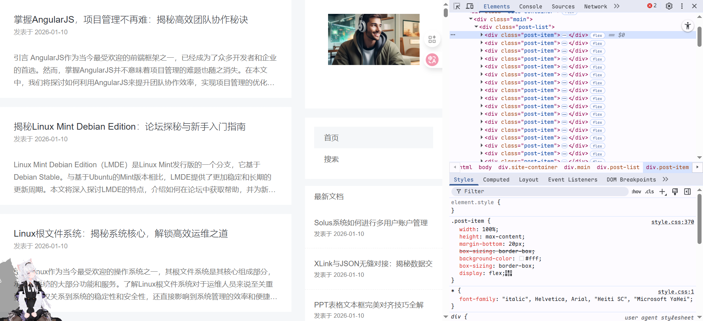
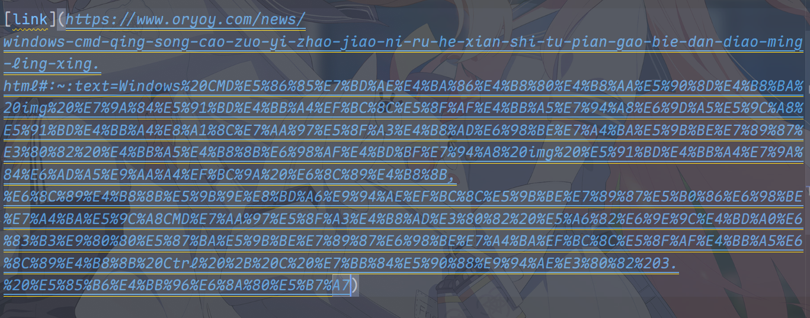
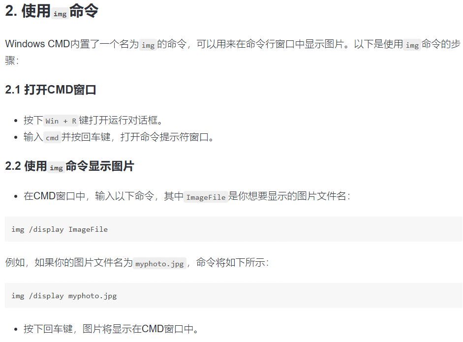

<https://www.oryoy.com/>

## 表现

该网站单日发送了大量文章：

这意味着有相当大的信息会流入互联网中

考虑到我的技术力尚且低下，只能筛选自己可能知道的信息举例。

## 将图片载入终端 Windows

[link](https://www.oryoy.com/news/windows-cmd-qing-song-cao-zuo-yi-zhao-jiao-ni-ru-he-xian-shi-tu-pian-gao-bie-dan-diao-ming-ling-xing.html#:~:text=Windows%20CMD%E5%86%85%E7%BD%AE%E4%BA%86%E4%B8%80%E4%B8%AA%E5%90%8D%E4%B8%BA%20img%20%E7%9A%84%E5%91%BD%E4%BB%A4%EF%BC%8C%E5%8F%AF%E4%BB%A5%E7%94%A8%E6%9D%A5%E5%9C%A8%E5%91%BD%E4%BB%A4%E8%A1%8C%E7%AA%97%E5%8F%A3%E4%B8%AD%E6%98%BE%E7%A4%BA%E5%9B%BE%E7%89%87%E3%80%82%20%E4%BB%A5%E4%B8%8B%E6%98%AF%E4%BD%BF%E7%94%A8%20img%20%E5%91%BD%E4%BB%A4%E7%9A%84%E6%AD%A5%E9%AA%A4%EF%BC%9A%20%E6%8C%89%E4%B8%8B,%E6%8C%89%E4%B8%8B%E5%9B%9E%E8%BD%A6%E9%94%AE%EF%BC%8C%E5%9B%BE%E7%89%87%E5%B0%86%E6%98%BE%E7%A4%BA%E5%9C%A8CMD%E7%AA%97%E5%8F%A3%E4%B8%AD%E3%80%82%20%E5%A6%82%E6%9E%9C%E4%BD%A0%E6%83%B3%E9%80%80%E5%87%BA%E5%9B%BE%E7%89%87%E6%98%BE%E7%A4%BA%EF%BC%8C%E5%8F%AF%E4%BB%A5%E6%8C%89%E4%B8%8B%20Ctrl%20%2B%20C%20%E7%BB%84%E5%90%88%E9%94%AE%E3%80%82%203.%20%E5%85%B6%E4%BB%96%E6%8A%80%E5%B7%A7)

它的网站链接长(chang)得不正常！

### 内容

网站的每一篇文章都有固定的结构，一般是几个标题套一点没有信息含量的内容。

推测：这些内容由低级 AI 生成，通过自动化工具发布到它的服务器中，然后发布。

### 验证

结论：Windows 10 并没有内置所谓 img 命令。

win11 可能有吗？我持怀疑态度

其他资料则过于多，暂时无法判断。

---

## 备案

所以说是有备案就可以为所欲为吗？！

## 其他相关

---

这种网站不但会误导用户，还会造成 AI 输出失真……

每次搜东西都会被这种玩意儿误导，可气！

也罢，相信后人的智慧吧。
