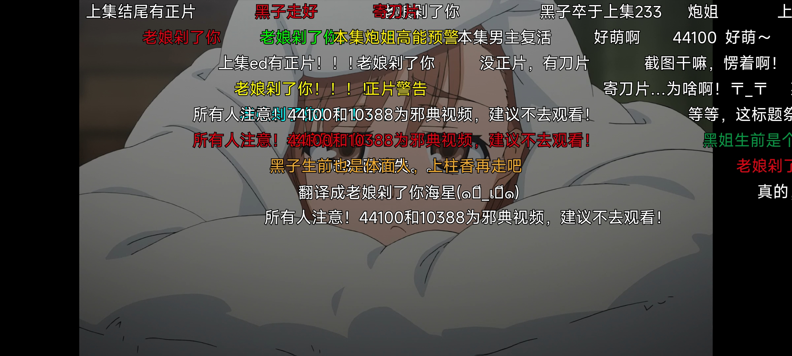
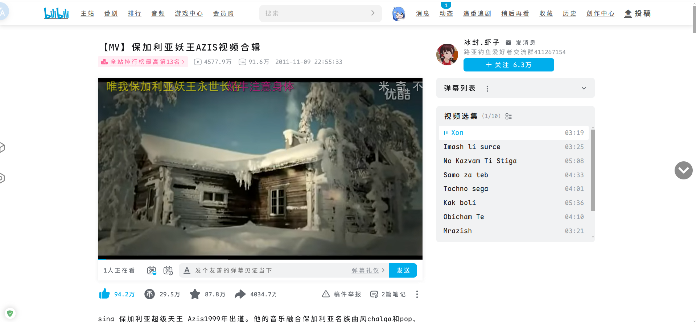
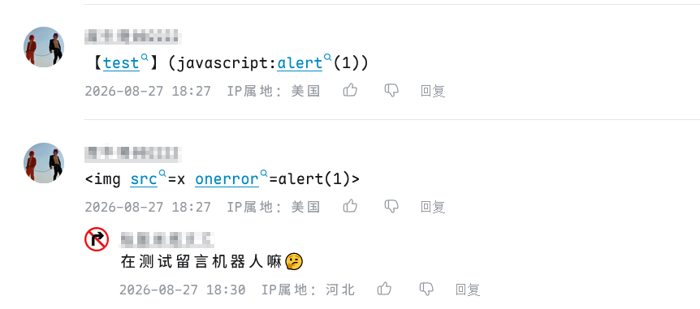
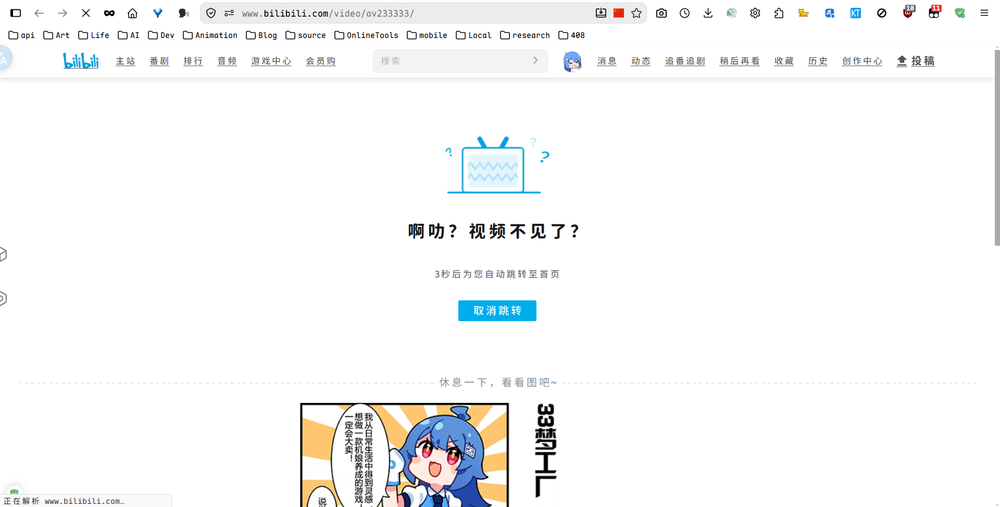
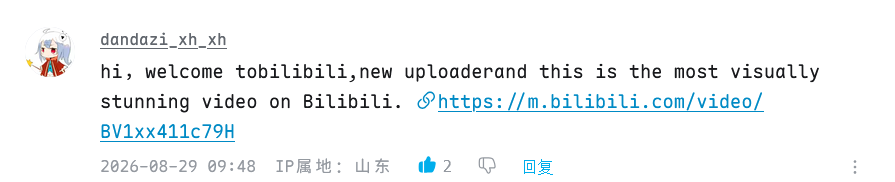

## 引子

今天在看《某科学的超电磁炮》第19集时，全程都有弹幕在刷44100这个数字，以及少量的2333，对于老用户来说，这些应该不陌生，一眼就能看出是什么意思。但是像我这种接触互联网比较晚的，这些数字可能就是“天书”，不知其含义——“一米瓦嘎奈”（何意味）。




## AV号与BV号

### 来源

- **AV号（Archive Video）**：B站早期的视频唯一标识，由**纯数字**组成（如 `av170001`）。它是数据库的自增主键，视频上传时间越早，数字通常越小。
- **BV号（Bilibili Video）**：B站现行的视频唯一标识，由**字母和数字**混合组成的固定长度字符串（如 `BV1GJ411x7h7`）。它是AV号的“马甲”，对外展示用。

### 为什么用BV号取代AV号

- **防爬虫与反盗链**：AV号是连续递增的整数，恶意爬虫只需写个循环（如 `av1` 到 `av100000`）就能批量抓取全站视频信息。BV号是经过算法加密的随机字符串，极大地提高了批量采集的门槛。
- **隐藏商业底牌**：AV号的数字大小直接暴露了B站的总投稿量，这是核心商业数据。换成无规律BV号后，外界无法通过编号推测平台存量。
- **拥抱国际化**：纯数字显得较“古早”，而混合字母的BV号看起来更现代，也方便在海外社交媒体上传播（类似YouTube的视频ID）。

> 我的看法是AV号更亲和用户一点，纯数字方便记忆，BV号只是眼熟，不太好记，其实两者大差不差啦。对于已经“刻进DNA”的用户则没什么区别。

### 用户层面

已有的AV号仍可使用，但不会再有新的AV号，如在搜索框输入`av170001`，可直接跳转对应视频：

【MV】保加利亚妖王AZIS视频合辑：

- <https://www.bilibili.com/video/av170001>
- <https://www.bilibili.com/video/BV17x411w7KC>

同时，新的BV号也有与AV号一样的功能：`BV17x411w7KC`



如果在评论区输入AV或BV号，会显示对应视频的标题，看起来就是蓝字：


居然还有大佬在评论区搞事情……


好了，以上就是AV号和BV号的一些介绍和用法了。

### AV170001

以防你没目睹过`av170001`，可以看看这里嵌入的这个：

> [!CAUTION]
> 可能有裸露内容，谨慎观看！

<div style="width: 100%; aspect-ratio: 16 / 9; overflow: hidden;">
  <iframe
    src="//player.bilibili.com/player.html?bvid=BV17x411w7KC&autoplay=0"
    scrolling="no"
    border="0"
    frameborder="no"
    framespacing="0"
    allowfullscreen="true"
    style="width: 100%; height: 100%; border-radius: 20px;">
  </iframe>
</div>

非常gay！

<details>
<summary>嵌入源码</summary>

```html
<div style="width: 100%; aspect-ratio: 16 / 9; overflow: hidden;">
   
  <iframe
    src="//player.bilibili.com/player.html?bvid=BV17x411w7KC&autoplay=0" /** 此处修改bvid和是否自动播放 */
    scrolling="no"
    border="0"
    frameborder="no"
    framespacing="0"
    allowfullscreen="true"
    style="width: 100%; height: 100%; border-radius: 20px;"
  >
     
  </iframe>
</div>
```

</details>

```
[君之自由]
妖王为了提倡节约用水，特意拍了《HOP》这部公益短片，这部短片讲述了一群男人为了节约用水而挤在一个澡盆里洗澡的故事，他们的精神可嘉，值得我们大家学习
2019-02-03 12:07
```

当然，如果输入不存在的av/bv号，如av233333，则会显示404：



---

## 弹幕中的一些数字

### 233

这个是源于某站的一个表情包的调用方式？好像是输入233就能召唤一个大笑的表情，参见：[【梗指南】233是什么梗](https://www.bilibili.com/video/BV1vv411r73F/)，我感觉这个**梗**本身就有谐音的意思，似乎同“啊哈哈”，“3”越多就是“哈”越多，比谁笑得久？

### 44100和10388

> `所有人注意！44100和10388为邪典视频，建议不去观看！`

嘚，弹幕上是这么说的，10388已404，44100在下面，我个人觉得配得不错。

<div style="width: 100%; aspect-ratio: 16 / 9; overflow: hidden;">

  <iframe
    src="//player.bilibili.com/player.html?bvid=BV1Bx411c7AN&autoplay=0" /** 此处修改bvid和是否自动播放 */
    scrolling="no"
    border="0"
    frameborder="no"
    framespacing="0"
    allowfullscreen="true"
    style="width: 100%; height: 100%; border-radius: 20px;"
  >

  </iframe>
</div>

就很gay。

---

## 数字梗和av号

这个不太好区别，可以先问AI，无果可尝试搜索引擎，最后可在一些视频网站搜索内容深入了解。

很多我都不了解，只有遇到了再了解，但是我也懒，如`114514`是什么意思，我不知道，顶多只知道这是个恶俗梗，我几乎不用，应该很有冒犯性。

实在搜不到的可以问问那些老资历。


---

## 一些经典

某些AV号和BV号似乎“刻进了”某些人的“DNA”：

- **`av1` / `av2`**：B站最远古的记忆。`av1`是创始人徐逸上传的第一个视频《绿坝绿坝★河蟹你全家!》（现地址已不可用）；`av2`是经典考古地《字幕君交流场所》
- **`av170001`**：B站“镇站之宝”级别的“骗萌新”神梗。点击后会看到**保加利亚妖王**的魔性MV，无数人被骗去“洗礼”

在<https://www.bilibili.com/v/popular/history> 上似乎能找到镇站之宝s。

我个人比较喜欢的：

- [BV1Xs411X7wh](https://www.bilibili.com/video/BV1Xs411X7wh/) 【矢泽妮可】妮可酱，给我来一发最带感的Niconiconi！
- [BV1xx411c79H](https://www.bilibili.com/video/BV1xx411c79H/) 【東方】Bad Apple!! ＰＶ【影絵】
- [BV1ic411D7xo](https://www.bilibili.com/video/BV1ic411D7xo/) 《云·原神》动画短片——第二篇 「欸 云朵」
- [BV1GJ411x7h7](https://www.bilibili.com/video/BV1GJ411x7h7/) 年年考，年年错
- [BV1it4y1q7a9](https://www.bilibili.com/video/BV1it4y1q7a9/) 老哥，你坐啊 15   JUNE   PM   04：04

---

## 关于B站国际化

所以是什么时候的事？

<div style="border: thick double #32a1ce;">

B站的国际化是一个持续多年的过程，通常被划分为几个关键阶段：

- **早期探索（2014-2018年）**：早期动作是为后续出海铺路。例如，2014年B站设立了日本分部，2018年在美国纳斯达克上市，获得了国际资本和关注。

- **首次出海（2020年底）**：B站首次正式进入海外市场，首站选择了**泰国**，随后逐步扩展到**马来西亚、新加坡、印尼**等东南亚国家。

- **业务拓展（2021年起）**：除主站外，B站还将漫画业务（Bilibili Comics）和游戏业务推向海外。但在2025年7月，一个白色图标的国际版App被关闭，说明出海并非一帆风顺。

- **全球重启（2026年8月19日）**：这是B站国际化的一次重大升级。B站推出了全新的**国际版App**，目标是**全球市场**。新版App主打**免身份验证注册**和**AI原声翻译**等功能，上线12小时内下载量即突破**500万次**。

所以，如果问“什么时候开始”：

- 广义的国际化起点，可以说是 **2020年底**。
- 但真正面向全球市场的“大招”，则发生在 **2026年8月19日**。

</div>

我刷到的比较负面。

- [最近的B站be like ：](https://www.bilibili.com/video/BV1KMhF6dEXZ)
- [这两天的b站belike：](https://www.bilibili.com/video/BV19D8e6wEkj)


[](https://www.bilibili.com/video/BV1Eq8R6hEq4)
-- https://www.bilibili.com/video/BV1Eq8R6hEq4
[](https://www.bilibili.com/video/BV11TtF61EuR)
-- https://www.bilibili.com/video/BV11TtF61EuR

---
结尾，我以后可能会在自己的资源里面加一点这些内容……

对了，`电脑配件`这个梗源自《某科学的超电磁炮》，意思可自行搜索。

[「我都干了些什么…」](https://www.bilibili.com/video/BV1dyXqBaEE5)