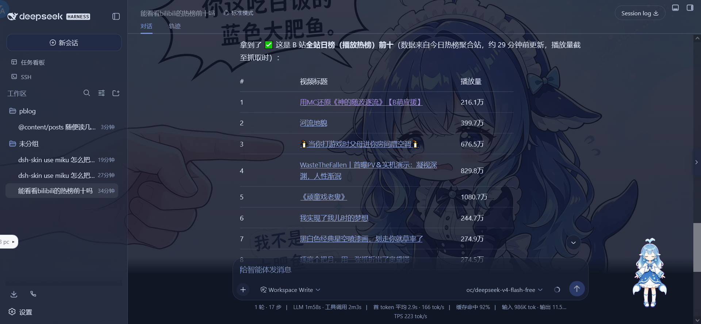
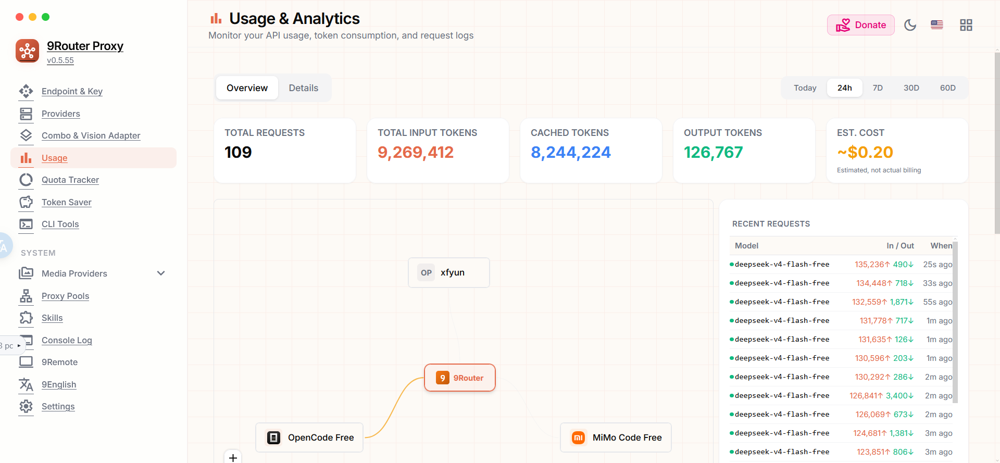
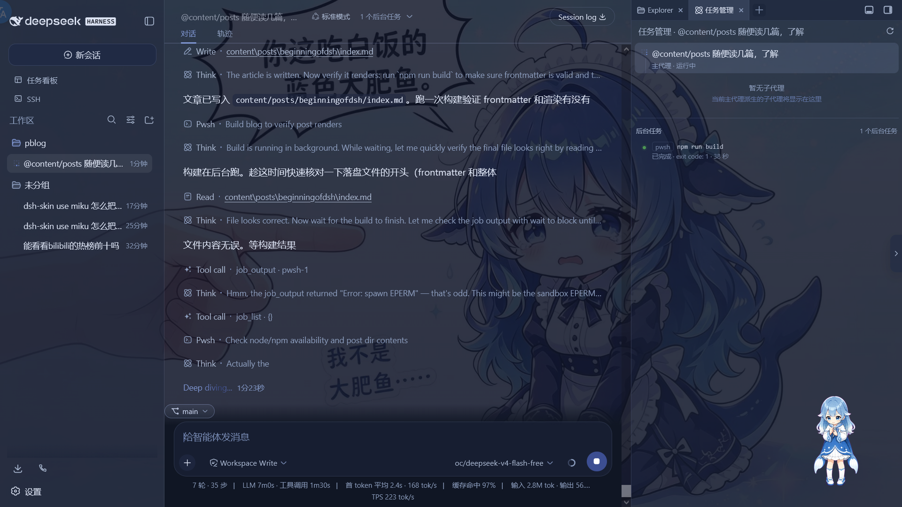

> [!NOTE]
>
> 本文是 DSH 入坑的流水账，由DSH生成。我没啥技术，就是想把折腾过程记下来，顺便感叹一下。
>
> 封面是在某开源群里面顺的表情包

**省流**：

- DSH 是 DeepSeek Harness 的命令行入口，[`npm install -g @deepseek-ai/dsh`](https://www.npmjs.com/package/@deepseek-ai/dsh) 装好，`dsh web` 打开 Web GUI（127.0.0.1:3080）
- 插件就是往 profile 里 pnpm 装包：`dsh plugin --profile web add 插件包名`
- 皮肤在「设置 → 插件配置 → Web UI 插件 → 皮肤中心」，全家桶版本太旧会连皮肤都找不到
- 网页搜索不花钱的最优解：把 argo 这个 MCP 服务挂进 DSH 内置的 [dsh-mcp-client](https://www.npmjs.com/package/@deepseek-ai/dsh-mcp-client)
- 全程用 oc（OpenCode）的免费模型（`oc/deepseek-v4-flash-free`），经 9router 的 opencode 接口接入，一天九百多万 token，一分钱没花

---

## 起因：装 DSH

之前写 Pblog、折腾各种小工具，都是 `import DeepSeek; DeepSeek.chat(idea)` 一把梭（懂的都懂）。这次想找个正经点的 AI 开发环境，就盯上了 DeepSeek Harness，下面简称 DSH。

至于为什么是它——太热门了：刚发布几天，GitHub 上就已经 110k，热度摆在那里，生态和教程很快就会起来，~~早点入坑不亏~~。

安装其实很简单，就是一个 npm 全局包：[`@deepseek-ai/dsh`](https://www.npmjs.com/package/@deepseek-ai/dsh)（源码在 [deepseek-ai/deepseek-harness](https://github.com/deepseek-ai/deepseek-harness)）：

```shell
npm install -g @deepseek-ai/dsh
dsh web
```

`dsh web` 起的就是那个 Web GUI。首次使用会自动初始化 `web` profile，配置文件放在 `~/.dsh/profiles/web/`。顺带说明：我全程没有用 DeepSeek 官方 API，模型是 **oc（OpenCode）的免费模型**（`oc/deepseek-v4-flash-free`），通过 9router 的 opencode 兼容接口接入。装好之后我干的第一件事是……换皮肤（

> AI 都觉得我抽象，我也觉得差不多，改一下：装插件，多么高大上！

## 皮肤：harbor 去哪了

事情的起因是，我在 GitHub 上看到 [zhu1090093659/dsh-web-ui](https://github.com/zhu1090093659/dsh-web-ui)（linxin666 全家桶）这个仓库，里面有 `dsh-skin use harbor` 这种用法，感觉很炫。结果打开软件怎么都找不到使用入口，折腾了半天才搞明白：

- 皮肤中心入口在：**设置 → 插件配置 → Web UI 插件 → 皮肤中心**（列表 + Try on 预览 + Apply 一键应用）
- 我装的全家桶是 [`@linxin666/dsh-web-ui-all@0.1.12`](https://www.npmjs.com/package/@linxin666/dsh-web-ui-all)，皮肤注册表里只有 9 个皮肤（qq98 / ths / xp / blue-fantasy / dragon-heir / minecraft / whale-song / trading / miku）
- 而 harbor（夕港，蓝港 + 日落橙配色）是 **0.1.16 才加进 [`@linxin666/dsh-skins`](https://www.npmjs.com/package/@linxin666/dsh-skins)** 的——版本太旧，列表里根本没有，自然找不到入口

> 不不不，就是我笨，没找到入口。

解法：升级全家桶，然后 GUI 一键应用。皮肤的互斥由 `dsh-skin use` 管理（写 `~/.dsh/cordis.patch.yml` 的 managed 区段），新版皮肤中心已经在宿主进程内置了等价逻辑，不用手敲命令。

## 插件：dsh plugin 与 pnpm 的坑

DSH 的插件设计很有意思：**插件本质就是 pnpm 包**，profile 由一堆插件 bundle 按顺序叠 patch 层，用户还能在自己的 `cordis.patch.yml` 里覆盖。装插件就是一行：

```shell
dsh plugin --profile web add 插件包名
```

建议先装插件市场 [`dshmarket`](https://www.npmjs.com/package/dshmarket)，之后在设置页里就能逛/搜社区插件、一键安装升级换主题，不用再手敲命令：

```shell
dsh plugin --profile web add dshmarket
```

然后我踩了~~入坑以来最大的一个坑~~：装 [`dsh-better-sidebar`](https://www.npmjs.com/package/dsh-better-sidebar)（VSCode 式右侧工作台：文件树 + 编辑器 + 真实终端 + Git 面板 + 内嵌浏览器）时，pnpm 直接判安装失败。查了半天才明白，是 **pnpm ≥ 10 的安全机制**：默认禁止依赖包跑 build 脚本，而 `node-pty`（终端原生模块，需要编译）和 `protobufjs`（需要生成代码）都被拦了下来。修法：

```shell
cd C:\Users\user\.dsh\profiles\web
pnpm approve-builds        # 空格勾选 node-pty 和 protobufjs，回车确认
dsh plugin --profile web add dsh-better-sidebar
```

> 这个问题先出现在了 linxin666/dsh-web-ui-all 安装时。

`pnpm approve-builds` 会把批准结果持久化到 package.json 的 `pnpm.onlyBuiltDependencies`，以后装任何插件都不会再卡这两个包。另外注意：**装完插件大多要重启 dsh web 才生效**。

## 网页搜索：和付费 API 的斗智斗勇

我最想要的功能其实是网页搜索。结果发现 DSH 内置的 `web_search` 工具挂在 `ctx.web` 接缝上，唯一的提供方是官方 DeepSeek（[`dsh-web-search-deepseek`](https://www.npmjs.com/package/@deepseek-ai/dsh-web-search-deepseek)），**必须要有 `DEEPSEEK_API_KEY`，按量付费**——这条路跟我无缘。

于是开始找免费方案。先问有没有第三方插件：GitHub 的 dsh-plugin 主题页从我的沙箱里完全连不上（SSL 全被拦），npm 上也没有现成的 dsh 搜索插件，官方工具又要收费……就在这时候，作者把 [taxueseek/argo](https://github.com/taxueseek/argo) 的 README 甩给我看：

> Argo 阿尔戈：给 Agent 用的统一搜索与证据核验——120+ 引擎、10 个 MCP 工具，**不配任何 API Key 也能免费跑**

而且它官方就写了 DSH 的一行安装：

```shell
dsh plugin --profile web add "github:taxueseek/argo#main&path:packages/dsh-plugin"
```

> 这条路似乎不那么好走，我直接叫AI帮我把MCP装好，一劳永逸。

但是！官方 bundle 走的是 `npx + 全局 pip install pyyaml`，而我是 **uv 用户（无全局 pip）**，这条路等于污染环境。好在作者很懂：README 明确说同 id `mcp-argo` 可以在用户层 `cordis.patch.yml` 覆盖，改用本地源码路径——这是官方背书的玩法。

## MCP：把 argo 挂进 dsh-mcp-client

不查不知道，DSH **内置了 [`@deepseek-ai/dsh-mcp-client`](https://www.npmjs.com/package/@deepseek-ai/dsh-mcp-client)**，MCP 服务器就是挂成一个插件实例，写在 profile 的 `cordis.patch.yml` 里。而 argo 本体是个 Python MCP 服务器（`scripts/mcp_server.py`，暴露 `argo_search` / `argo_research` / `argo_evidence` 等工具），于是方案就三步：

1. **拉一份真源**：`git clone` 到 `C:\Users\user\.local\share\argo`（v2.8.0，带 .git，以后 `git pull` 就能升级）
2. **uv 建专属环境**：目录内置 `.venv`，装 `pyyaml` + `curl_cffi`（过反爬）+ `ddgs`（本地免 key 后端），不碰全局 Python
3. **挂 MCP**：`cordis.patch.yml` 加一个插件实例，由 DSH 的 MCP 客户端 spawn：dsh web 启动时自动拉起、崩了自动重连

```yaml
- insert:
    - id: mcp-argo
      name: "@deepseek-ai/dsh-mcp-client"
      config:
        serverName: argo
        transport: stdio
        command: C:\Users\user\.local\share\argo\.venv\Scripts\python.exe
        args:
          - C:\Users\user\.local\share\argo\scripts\mcp_server.py
        cwd: C:\Users\user\.local\share\argo
        env:
          PYTHONUTF8: "1"
```

最后那个 `PYTHONUTF8=1` 是个隐藏坑：Windows 中文系统下 Python 默认用 ANSI 码页读文件，而 argo 的配置是 UTF-8，会直接 GBK 报错。设了这个环境变量就一劳永逸。

验证结果很爽：**149 个引擎**，模块全部正常导入；实测「贵州茅台股价」1.3 秒出结果（sina_quote 双源：现价 1341.99 ↓-0.98%），英文论文查询正确路由到 academic → arxiv/openalex。最后把旧的 npm 版 `argo-search@1.0.1`（47 引擎的过时版）清掉，单真源、无副本、不污染。

> 结果是C盘又臃肿了几分。

## 实战：顺手查个 B 站热榜

工具链跑通之后，我随手试了下「能看看 bilibili 的热榜前十吗」。B 站自己的排名 API 有反爬，agent 就自己换招：先直接抓，不行换聚合站（今日热榜），还懂得加去缓存参数重新核对，最后把全站日榜前十名连同播放量整理成表格给你。整个过程我就在旁边看着，啥也没干。



## 为什么我这么感叹

折腾下来最大的感受，就两个：

1. **DSH 是真的强**。profile 分层（bundle patch + 用户覆盖）、插件即 pnpm 包、内置 MCP 客户端、沙箱 + 审批体系……这套设计既有深度又干净。我的很多「想要」最后都变成「一行命令 + 一段配置」，而且 agent 能直接读 checkout 里的文档、翻 node_modules，自己就把坑摸平了——我负责惊讶和说「好的，你来执行」。

> 一个能 DIY 的 harness 真的很酷！

1. **oc（OpenCode）是真的慷慨**。我全程没碰 DeepSeek 官方 API，用的是 oc（即 OpenCode）提供的免费模型（`oc/deepseek-v4-flash-free`），通过 9router 的 opencode 兼容接口接入——9router 本身只是个非常好用的工具（路由器），慷慨的是 oc/OpenCode。统计今天的用量：**109 个请求、约 927 万输入 token（其中 824 万是缓存命中）、12.7 万输出 token**，按常规价格估算大概 \$0.20——而实际账单是 **\$0**，一分钱没花。一天白嫖九百多万 token，这种慷慨我很难不感叹。

> 我是希望哪天别有人上门催债，但我确实没登录账户。



从「怎么装个皮肤」这种小问题开始，一路到把 MCP 搜索引擎跑通，我没费多少神：大部分研究、踩坑、debug 都是 agent 带着我完成的。**真的没让我耗费太多的精力就能做好一些事**——这期真的神了！



## 相关链接

- [@deepseek-ai/dsh（npm）](https://www.npmjs.com/package/@deepseek-ai/dsh) · [deepseek-ai/deepseek-harness（GitHub）](https://github.com/deepseek-ai/deepseek-harness)
- [zhu1090093659/dsh-web-ui（GitHub，皮肤全家桶仓库）](https://github.com/zhu1090093659/dsh-web-ui) · [@linxin666/dsh-web-ui-all（npm）](https://www.npmjs.com/package/@linxin666/dsh-web-ui-all) · [@linxin666/dsh-skins（npm）](https://www.npmjs.com/package/@linxin666/dsh-skins)
- [dshmarket（npm，插件市场）](https://www.npmjs.com/package/dshmarket)
- [dsh-better-sidebar（npm）](https://www.npmjs.com/package/dsh-better-sidebar)
- [taxueseek/argo（GitHub）](https://github.com/taxueseek/argo)
- [@deepseek-ai/dsh-mcp-client（npm）](https://www.npmjs.com/package/@deepseek-ai/dsh-mcp-client)
- [@deepseek-ai/dsh-web-search-deepseek（npm）](https://www.npmjs.com/package/@deepseek-ai/dsh-web-search-deepseek)

enjoy!
