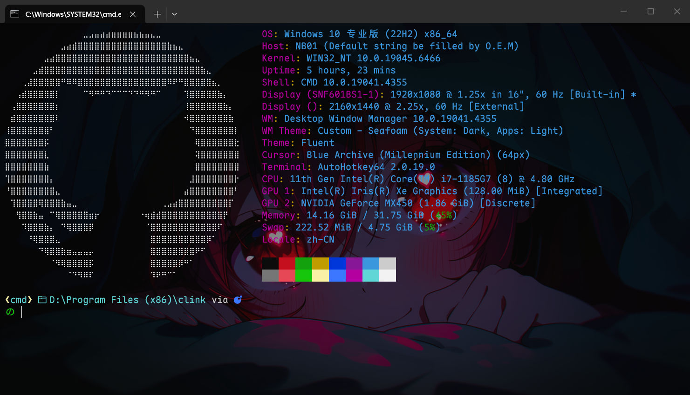
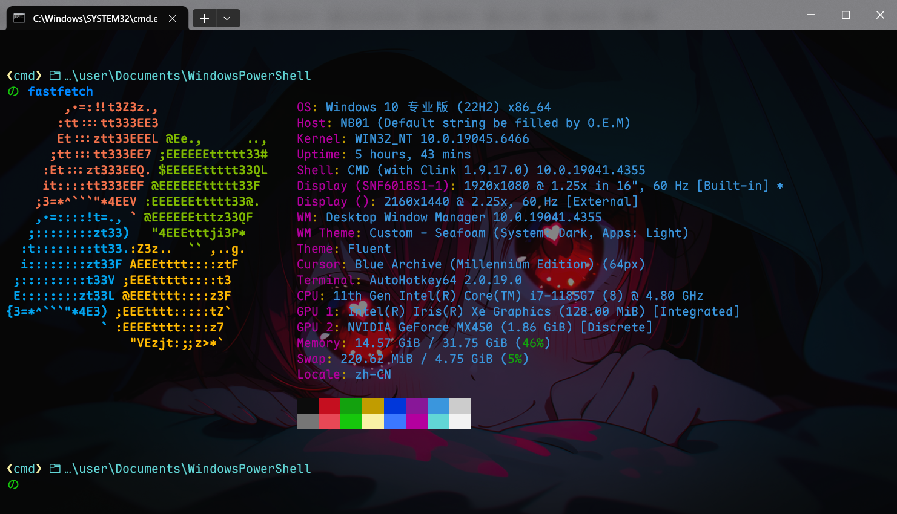

> [!NOTE]
> Image by <a href="https://pixabay.com/users/andsproject-26081561/?utm_source=link-attribution&utm_medium=referral&utm_campaign=image&utm_content=9728394">ANDRI TEGAR MAHARDIKA</a> from <a href="https://pixabay.com//?utm_source=link-attribution&utm_medium=referral&utm_campaign=image&utm_content=9728394">Pixabay</a>

## 前言

安装什么的不说了，无非clink，starship，terminal。

terminal的默认配置要求已经改好，比如默认字体，背景、背景透明度什么的。

## 环境变量


> 番外：如果fastfetch显示没有命令，也需要添加环境变量。

## 注册表

导航至：

```txt
计算机\HKEY_CURRENT_USER\SOFTWARE\Microsoft\Command Processor
```

新建`字符串值` 键名：`AutoRun`，值：`"D:\Program Files (x86)\clink\clink.bat" inject --autorun --profile ~\clink`；这里的路径按自己的情况修改。

该设置的意义是：每次打开Cmd时，都会自动加载clink.bat。

## clink配置

导航至`"D:\Program Files (x86)\clink`，路径也是你的clink_x64.exe所在处。

### starship

这是让AI改的，用于避免同时执行其他命令与`load(io.popen('starship init cmd'):read("*a"))()`冲突。

如我使用`oh-my-posh.lua`时，发生了`D:\Program Files (x86)\clink\oh-my-posh.lua:1: attempt to call a nil value`这样的错误。

<details>
<summary>starship.lua</summary>

```lua
-- 保存当前的默认输入流
local old_stdin = io.input()

-- 将默认输入流临时重定向到一个空文件或 nil
-- 这里以重定向到空设备为例，你也可以使用 io.tmpfile()
io.input("nul")

-- 执行 Starship 初始化，此时它不会有可读的输入
local starship_init = io.popen('starship init cmd')
load(starship_init:read("\*a"))()
starship_init:close()

-- 恢复原来的默认输入流
io.input(old_stdin)

```

</details>

---

### 启动其他命令

如果没有使用fastfetch，则不必新建`fastfetch.lua`文件。

如果要运行其他命令，只需要参考此处的思想即可。

我在这个目录下新建了一个`fastfetch.lua`文件，内容如下：

```lua
os.execute("chcp 65001 > nul &&  fastfetch")
```

用于启动自定义命令，让终端以UTF-8编码显示，然后执行fastfetch命令，显示系统logo:



[GitHub-logo.txt](assets/GitHub.txt)

这种logo文件可以在网上随便找个网站生成，当然，得先有个图。

这个网站不错：<https://1ktools.com/zh-cn/tools/image/ascii-generator>

---

## starship配置

导航至`C:\Users\user\.config`，对应你的用户名。

新建`starship.toml`文件，内容如下：

这是我自己的配置，根据[使用 starship 统一 cmd, powershell, git bash 等样式 - 知乎](https://zhuanlan.zhihu.com/p/674148271) 修改。

<details>
<summary>starship.toml</summary>

```toml
# 设置配置范例，开启编辑器的自动补全
"$schema" = 'https://starship.rs/config-schema.json'

# 在命令之间插入空行
add_newline = true

format = '''
(bold green)$shell $directory$all$character'''

[character]
# 所有状态统一使用 "の"，并分别设置颜色（可选）
success_symbol = "[の](bold green)"
error_symbol   = "[の](bold red)"
vicmd_symbol   = "[の](bold cyan)"
# 如果需要 vi 替换模式也统一：
vimcmd_replace_one_symbol = "[の](bold cyan)"
vimcmd_replace_symbol     = "[の](bold cyan)"
vimcmd_visual_symbol      = "[の](bold cyan)"

# 禁用 package 组件，完全隐藏它的提示符
[package]
disabled = true

# A continuation prompt that displays two filled in arrows
continuation_prompt = "▶▶"

# 显示文件夹路径
[directory]
format = "[ $path]($style)[$read_only]($read_only_style) "
truncation_symbol = '…/'

[shell]
format = '[❮](bold yellow)[$indicator]($style)[❯](bold yellow)'
powershell_indicator = 'pwsh'
fish_indicator = 'fish'
bash_indicator = 'bash'
unknown_indicator = 'mystery shell'
style = 'cyan bold'
disabled = false

[sudo]
style = 'bold green'
symbol = ' ‍  '
disabled = false

# A minimal left prompt
# format = """$character"""

# move the rest of the prompt to the right
# right_format = """$all"""
[aws]
symbol = "  "

[buf]
symbol = " "

[c]
symbol = " "

[conda]
symbol = " "

[dart]
symbol = " "

[docker_context]
symbol = " "

[elixir]
symbol = " "

[elm]
symbol = " "

[fossil_branch]
symbol = " "

[git_branch]
symbol = " "
format = "[$symbol$branch(:$remote_branch)]($style) "
style = "bold yellow"

[git_status]
conflicted = ' '
ahead = '  '
behind = ' '
diverged = ' '
up_to_date = '✓'
untracked = ' '
stashed = ' '
modified = ' '
staged = '[++\($count\)](green)'
renamed = ' '
deleted = ' '

[golang]
symbol = " "

[guix_shell]
symbol = " "

[haskell]
symbol = " "

[haxe]
symbol = " "

[hg_branch]
symbol = " "

[hostname]
ssh_symbol = " "

[java]
symbol = " "

[julia]
symbol = " "

[lua]
symbol = " "

[meson]
symbol = "  "

[nim]
symbol = "  "

[nix_shell]
symbol = " "

[nodejs]
symbol = " "

[pijul_channel]
symbol = " "

[python]
symbol = " "

[erlang]
symbol = "  "

[ruby]
symbol = " "

[rust]
symbol = " "

[scala]
symbol = " "

[os.symbols]
Alpaquita = " "
Alpine = " "
Amazon = " "
Android = " "
Arch = " "
Artix = " "
CentOS = " "
Debian = " "
DragonFly = " "
Emscripten = " "
EndeavourOS = " "
Fedora = " "
FreeBSD = " "
Garuda = "  "
Gentoo = " "
HardenedBSD = "  "
Illumos = "  "
Linux = " "
Mabox = " "
Macos = " "
Manjaro = " "
Mariner = " "
MidnightBSD = " "
Mint = " "
NetBSD = " "
NixOS = " "
OpenBSD = "  "
openSUSE = " "
OracleLinux = "  "
Pop = " "
Raspbian = " "
Redhat = " "
RedHatEnterprise = " "
Redox = "  "
Solus = "  "
SUSE = " "
Ubuntu = " "
Unknown = " "
Windows = "  "
```

</details>

## powershell配置

导航至`D:\Users\user\Documents\WindowsPowerShell\Microsoft.PowerShell_profile.ps1`，对应你的用户名。

或者在终端执行以下命令：

```shell
notepad $PROFILE
```

粘贴：

```txt
[Console]::OutputEncoding = [System.Text.UTF8Encoding]::new()
Invoke-Expression (&starship init powershell)
if (Get-Command clink_x64.exe -ErrorAction SilentlyContinue) {
    clink inject --quiet
} else {
    Write-Warning "Clink not found. Please install Clink first."
}
fastfetch
```

- 在新终端启用utf-8编码
- 在新终端启用starship
- 在新终端启用clink
- fastfetch打印系统信息

## 番外：FastFetch配置

导航至：`C:\Users\user\.config\fastfetch`，对应你的用户名。

<details>
<summary>config.jsonc</summary>

```jsonc
{
  "$schema": "https://github.com/fastfetch-cli/fastfetch/raw/master/doc/json_schema.json",
  "display": {
    "color": {
      "keys": "magenta",
      "output": "cyan",
      "separator": "yellow",
    },
  },
  "logo": {
    "type": "auto", // Logo type: auto, builtin, small, file, etc.
    "source": "C:\\icons\\GitHub.txt",
    //"C:\\icons\\GitHub2.txt", // Built-in logo name or file path
    // Linux GNU GhostFreak Windows
    /*
    "padding": {
      "top": 2, // Top padding
      "left": 2, // Left padding
      "right": 6 // Right padding
    },*/
    "color": {
      // Override logo colors
      "1": "white",
      "2": "#80ba01",
      "3": "#02a4ef",
      "4": "#ffb902",
    },
  },
  "modules": [
    // "title",
    //"separator",
    "os",
    "host",
    "kernel",
    "uptime",
    "packages",
    "shell",
    "display",
    "de",
    "wm",
    "wmtheme",
    "theme",
    "icons",
    // "font",
    "cursor",
    "terminal",
    "terminalfont",
    "cpu",
    "gpu",
    "memory",
    "swap",
    {
      "type": "disk",
      "folders": ["C:/", "D:/"],
    },
    // "localip",
    //"battery",
    //"poweradapter",
    "locale",
    "break",
    "colors",
  ],
}
```

</details>

我这里是自定义文件内的ASCII art，打印GitHub的logo。

使用`fastfetch --print-logos`可以查看所有可用的logo。

更改为Windows：`"source": "Windows",`



logo特别多，可以根据需要选择。

---

> [!REFERENCES]
> [ASCII字符画生成器](https://1ktools.com/zh-cn/tools/image/ascii-generator)
>
> [使用 starship 统一 cmd, powershell, git bash 等样式 - 知乎](https://zhuanlan.zhihu.com/p/674148271)
>
> [Starship 终端美化神器 瞬间让你眼前一亮 - Bilibili](https://www.bilibili.com/video/BV1p3onYLE3c)
