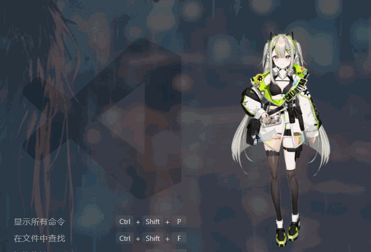

Pelr 项目的 TTS 播放语音的时候嘴应该跟着张合。这个功能花了不少时间才折腾出一个能用的版本，记录一下过程。

## 需求

TTS 播语音的时候，模型的 `ParamMouthOpenY` 参数能自然地跟着动。不需要用户配置，不依赖额外库。

## 尝试过的方案

### RMS 波形分析

最直接的想法：解码音频算 RMS（均方根音量），映射成嘴的张合度。

问题是 Voicevox 输出的音频音量全局偏低，RMS 峰值只有 0.02–0.15。把增益拉到 6 倍，嘴也只能张开 4–10%，几乎看不出来。

### 自动增益控制

预扫描整个音频找到峰值 RMS，按比例归一化。结果爆破音的毛刺把基准拉高了，正常语音段反而被压缩。去除 top 5% 异常值后还是不稳定。

### 固定包络

放弃分析波形，改用固定模板：淡入 → 保持 → 淡出。简单是简单，但嘴全程一个开度，完全不自然。

### 随机音节

80–250ms 随机切换目标值，模拟说话节奏。结果一开一闭太机械，像机器人。

### 正弦波叠加

三个不同频率的正弦波叠加，看起来平滑。但运动模式还是可预测的，时间一长就能看出规律。

## 最终方案

Perlin 噪声。三层叠加：

| 层  | 频率   | 振幅 | 作用       |
| --- | ------ | ---- | ---------- |
| 1   | 8.0 Hz | 0.18 | 音节级微动 |
| 2   | 3.2 Hz | 0.12 | 词组节奏   |
| 3   | 1.1 Hz | 0.08 | 语句呼吸感 |

加上 100ms 淡入、200ms 淡出、EMA 平滑，效果"将就"——能用，比 RMS 方案好很多，口形开合幅度正常了，但运动模式还是有点机械感。

## 一些细节

- 纯时间驱动，不分析音频波形。解决了很多 TTS 引擎音量不统一的问题
- 三层噪声的本质是用非周期信号模拟唇部肌肉的随机微动
- 口形范围控制在 `[0.15, 0.65]`，不会张太大也不会闭太紧
- `StopLipSync` 时主动把嘴归零，防止模型一直张着嘴
- 不是真实的语音拟合，而是根据音频模拟的数学实现，整体上来说可以糊弄一下我自己

## 后续

全程AI！！！

> [!NOTE]
> 参考了：<https://www.bilibili.com/video/BV1AgwhesEtn>
