> [!NOTE]
> Image by <a href="https://pixabay.com/users/qiaominxu_橋茗旭-18717949/?utm_source=link-attribution&utm_medium=referral&utm_campaign=image&utm_content=8750155">qiaominxu 橋茗旭</a> from <a href="https://pixabay.com//?utm_source=link-attribution&utm_medium=referral&utm_campaign=image&utm_content=8750155">Pixabay</a>

<div style="border-left:4px solid #0969da;background:#ddf4ff;padding:8px 12px;margin:8px 0"><div style="color:#0969da;font-weight:bold">NOTE</div>
<div>有一说一，真的不容易，踩了一堆坑，搞了大概三个小时。
<span style="font-style:line-through">中间实在是憋不住了，在厕所茅塞顿开了。</span>
😂
<br>
本来是想用hexo的，但可能会重蹈以前的覆辙，在浏览主题的时候，看到一个比较好看的主题：
</div>

</div>

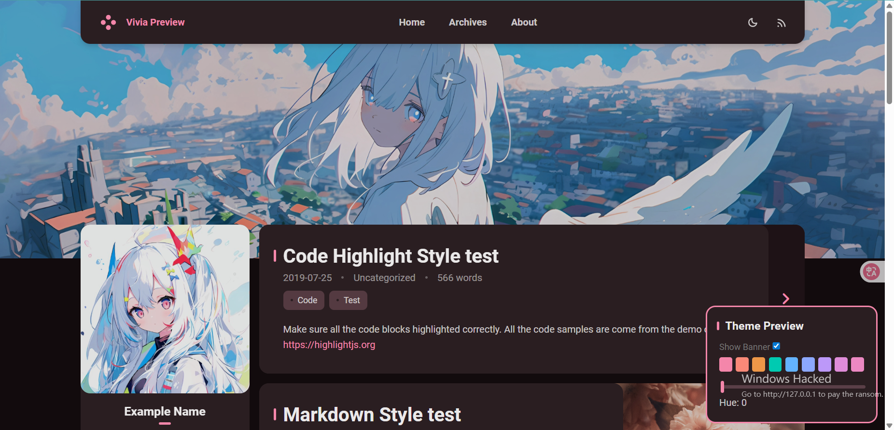

[Vivia Preview](https://saicaca.github.io/vivia-preview/)

[](https://github.com/saicaca/hexo-theme-vivia)

<div style="color:red;">这能不入？这必须入啊！</div>

结果人家GitHub主页这样写：

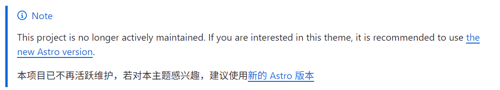

然后就跳转到下面的那个链接了。

[](https://github.com/saicaca/fuwari)

接着，咱们的配置开始了。

### 开始之前

<!-- >[!NOTE]
>请大致浏览一下这篇文章，觉得自己确实没问题再进行实践，否则会损失时间成本。
>
>_以下操作的一个大前提是VsCode是使用GitHub登录的，也可能是全局git信息已配置完毕_ -->

<div style="border-left:4px solid #0969da;background:#ddf4ff;padding:8px 12px;margin:8px 0"><div style="color:#0969da;font-weight:bold">NOTE</div><div>请大致浏览一下这篇文章，觉得自己确实没问题再进行实践，否则会损失时间成本。</div>
<div style="font-style:italic">以下操作的一个大前提是VsCode是使用GitHub登录的，也可能是全局git信息已配置完毕</div>
</div>

如果你此前安装了`hexo`，请删掉（可选）。再尝试这个更简单的方法。

_请你弃坑Hexo，加入Astro！_

### 环境配置

不要忽略了[环境配置](https://github.com/saicaca/fuwari/blob/main/docs/README.zh-CN.md#-%E8%A6%81%E6%B1%82)：

#### 安装Node.js

[Node.js — Download Node.js®](https://nodejs.org/zh-cn/download)

下载适合你的系统的安装程序并进行安装。

> 我猜是Windows

安装不用多说，这里给一个验证安装成功的方法：

`Win + R` 键入`cmd` 回车（按Enter）

输入`node -v`，输出类似以下的东西就算成功：

```shell
> node -v
v22.14.0
```

#### 安装npm

AI说是和Node.js一起安装的，验证一下：

```shell
> npm -v
11.4.2
```

#### 安装Git

[Git - Downloads](https://git-scm.com/downloads)

依旧是下载安装验证：

```shell
> git -v
git version 2.48.1.windows.1
```

环境配好了，该克隆仓库了。

---

### 克隆fuwari

#### 创建新仓库

点击此链接进入saicaca/fuwari仓库：

[](https://github.com/saicaca/fuwari)

---

然后我们点击`Use this template`>>`Create a new repository`

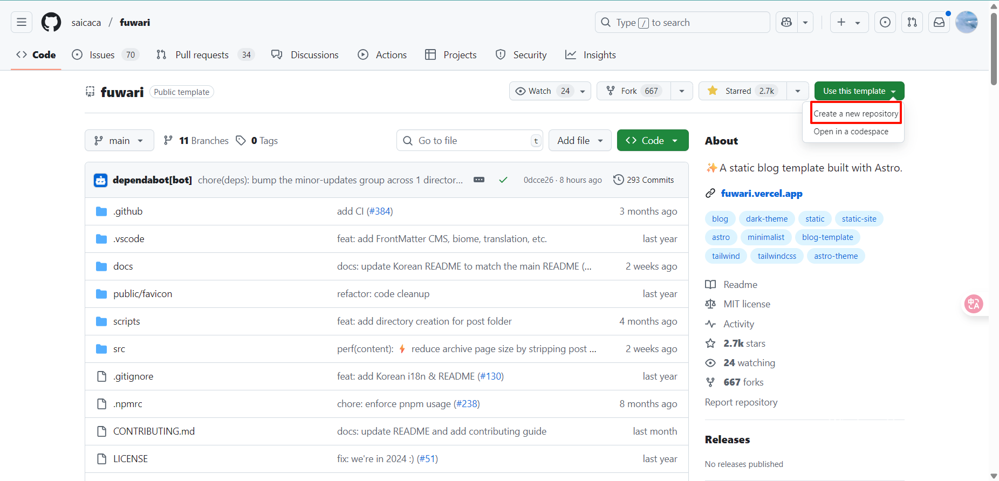

---

填写新仓库信息：

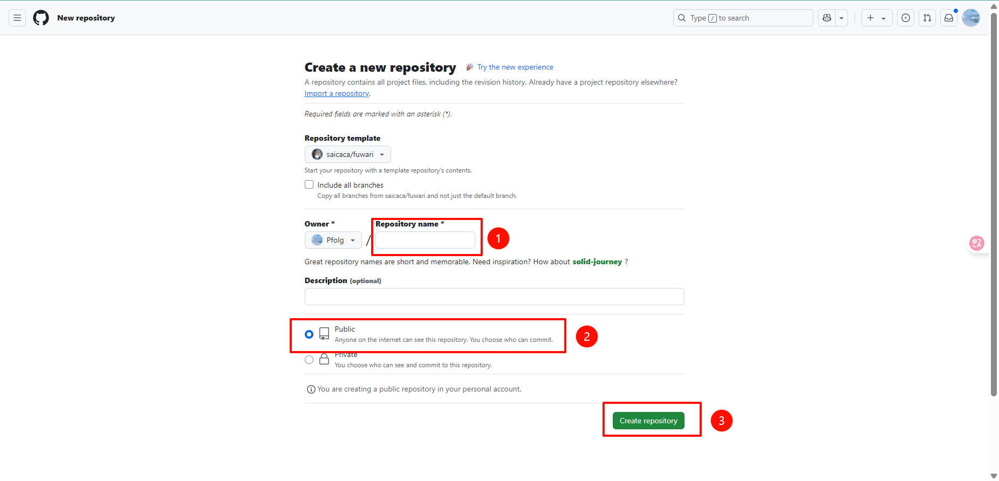

这里我用`fuwari`作为我的新仓库名称。

---

参考[官方的教程](https://github.com/saicaca/fuwari/blob/main/docs/README.zh-CN.md#-%E4%BD%BF%E7%94%A8%E6%96%B9%E6%B3%95-2)，这里我们忽略4、5步以避免对大脑造成不必要的冲击：

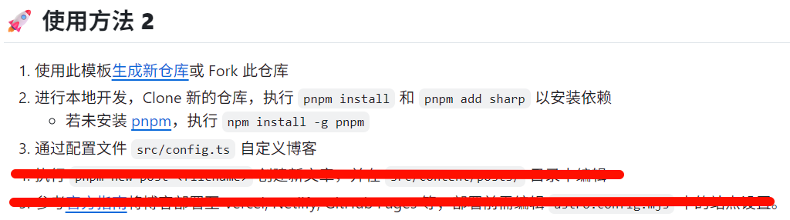

#### 将仓库克隆到本地

打开`VsCode`，随便找个文件夹`初始化仓库`

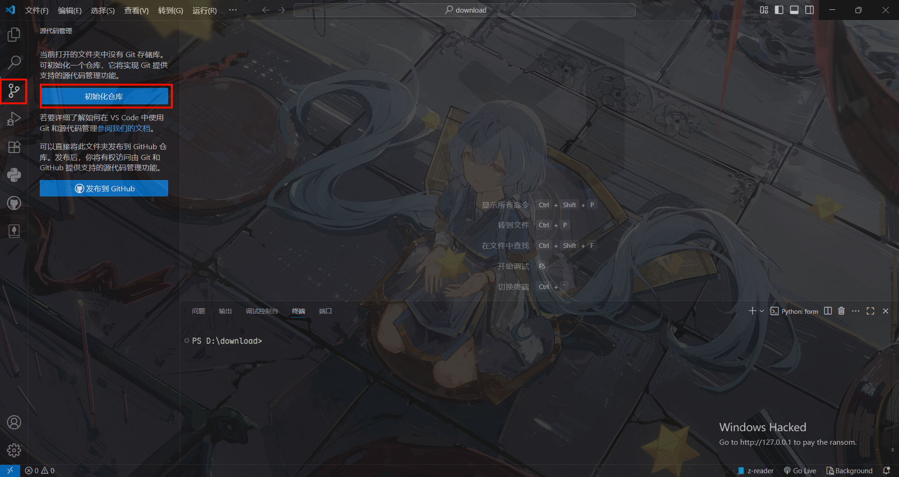

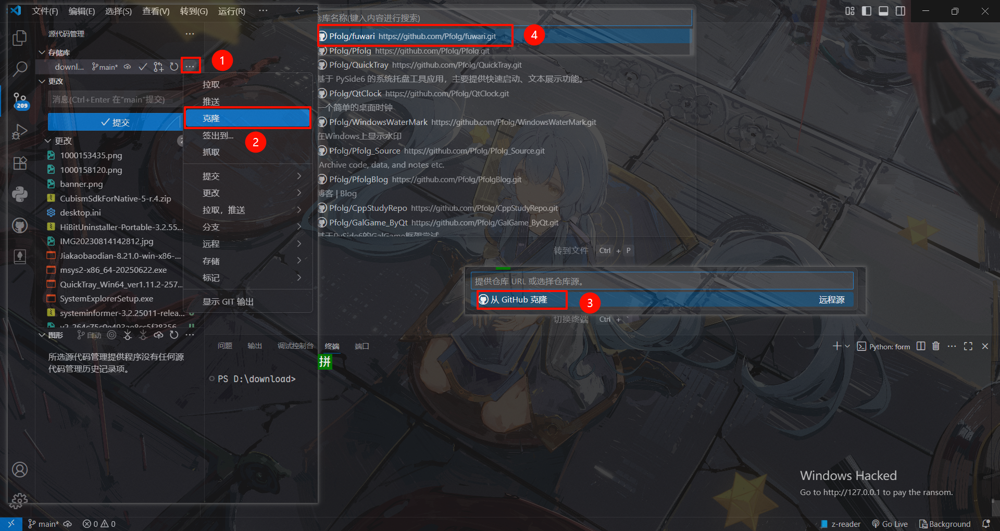

然后选择一个文件夹放置这个仓库。

<!-- >[!NOTE]
> 记得把原来那个文件夹产生的`.git`文件夹删了。 -->
<div style="border-left:4px solid #0969da;background:#ddf4ff;padding:8px 12px;margin:8px 0"><div style="color:#0969da;font-weight:bold">NOTE</div><div>记得把原来那个文件夹产生的`.git`文件夹删了。</div></div>

#### 初始化环境

打开vscode的终端：

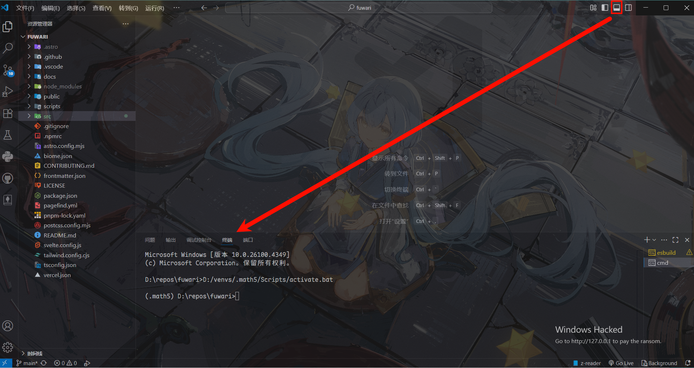

安装pnpm：

```shell
npm install -g pnpm
```

再执行

```shell
pnpm install
pnpm add sharp
```

这里和配置文件的修改可以参考：[Fuwari静态博客搭建教程 - AcoFork Blog](https://www.afo.im/posts/fuwari/)

### 配置

根据自己的情况酌情修改配置文件：`src\config.ts`

<!-- >[!NOTE]
> 也可以不修改，先预览一下再修改：`pnpm dev`，再访问 [localhost:4321](localhost:4321) -->

<div style="border-left:4px solid #0969da;background:#ddf4ff;padding:8px 12px;margin:8px 0"><div style="color:#0969da;font-weight:bold">NOTE</div><div>也可以不修改，先预览一下再修改：<span style="background-color:lightgrey">pnpm dev</span>，再访问 <a href="http://localhost:4321">localhost:4321</a></div></div>

### 提交

这一步（下图）忽略，因为我们用的是VsCode。

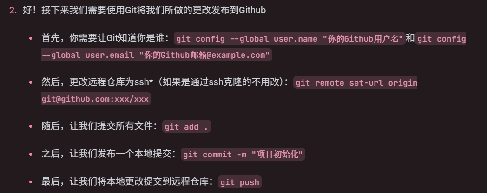

点点鼠标就能做到`add`、`push`，当然，前提是你的VsCode是用GitHub登录的。

如果提示账户相关问题，建议问AI，这两个命令可以解决部分问题：

`git config --global user.name "你的GitHub用户名"`

和

`git config --global user.email "你的GitHub邮箱@example.com"`

大概点击6下就行了，原理就是上面的那些命令：

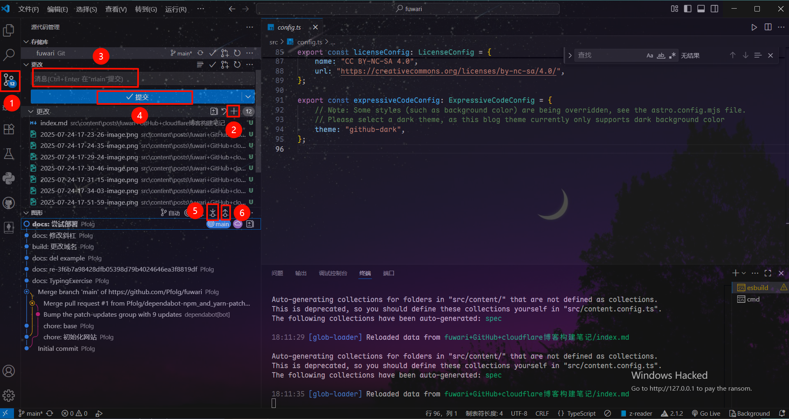

<div style="border-left:4px solid #0969da;background:#ddf4ff;padding:8px 12px;margin:8px 0"><div style="color:#0969da;font-weight:bold">NOTE</div><div>之后可以在GitHub看到刚刚的提交（有文件的更改才能提交哦）。</div></div>

---

### 本地预览

使用命令`pnpm dev`，然后终端会不断跳出来一些信息：

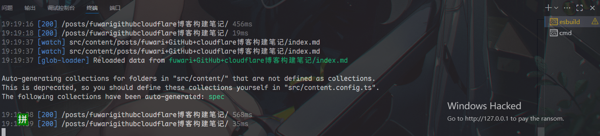

进入网站 [localhost:4321](localhost:4321) 访问我们本地的博客：


---

### 发布到地球

如果你本地成功预览了，那可以开始发布了。

当然，这一步也是最磨人的，很多人都讲不明白。

<div style="border-left:4px solid #1a7f37;background:#dafbe1;padding:8px 12px;margin:8px 0"><div style="color:#1a7f37;font-weight:bold">TIP</div><div>如利用GitHub的deploy功能发布到\<username\>.github.io，我到现在都没整明白。</div></div>

这里我们直接进入<https://dash.cloudflare.com/> 注册一个账户，具体不细讲了。

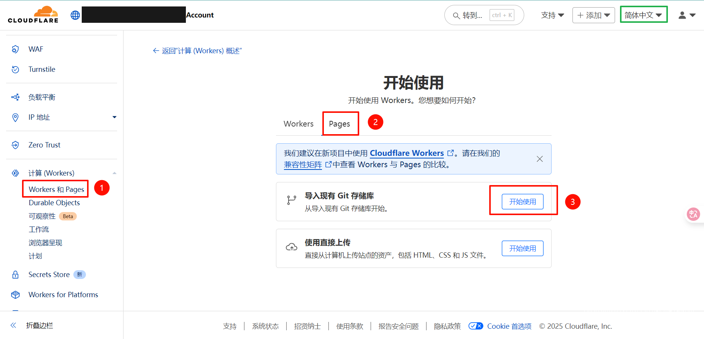

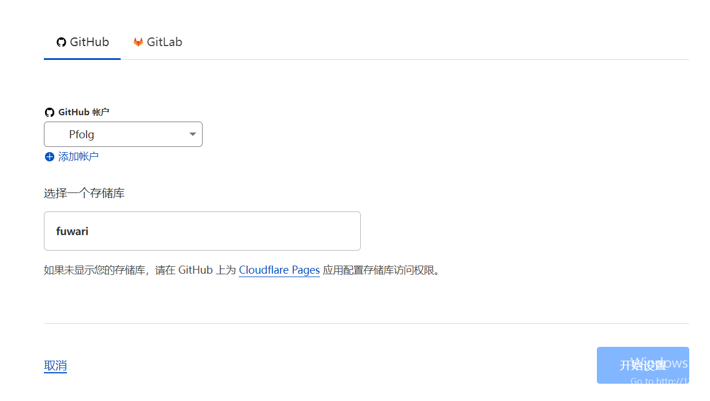

**保存并部署**

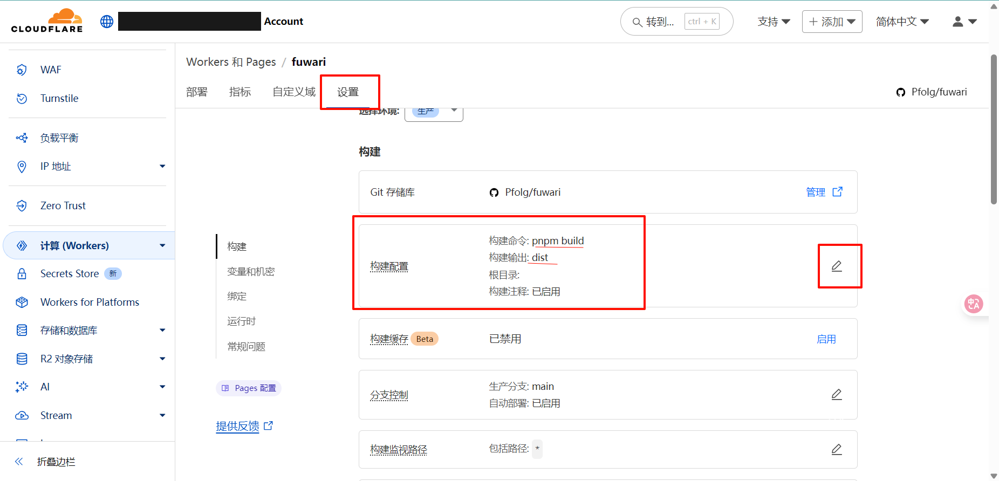

这里配置就完成了。

---

### 将域名添加到配置文件

点击访问获取域名：

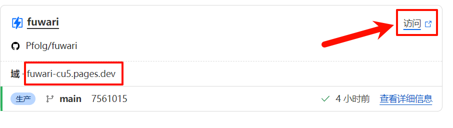

我这里是<https://fuwari-cu5.pages.dev/> ，也就是这里的域，有条件的还可以自定义域名。

找到位于根目录的文件`astro.config.mjs`，修改：

```json
// https://astro.build/config
export default defineConfig({
+ site: "https://fuwari-cu5.pages.dev/",//填入你的域名
 base: "/",
```

然后重新部署（提交）就完成了。

---

### 结尾废话

值得一提的是，这里的信息可能告诉了你这个方法确实能白嫖cloud flare的部署：


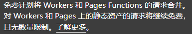

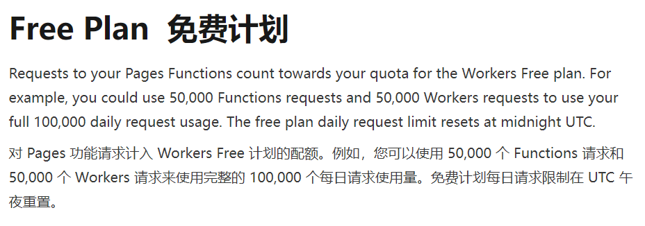

---

<!-- >[!TIP]
>cloud flare有自动部署功能，只要你的仓库有更改，它就会执行部署，但仓库中如果含有影响部署的因素这会部署失败。 -->

<div style="border-left:4px solid #1a7f37;background:#dafbe1;padding:8px 12px;margin:8px 0"><div style="color:#1a7f37;font-weight:bold">TIP</div><div>cloud flare有自动部署功能，只要你的仓库有更改，它就会执行部署，但仓库中如果含有影响部署的因素这会部署失败。</div></div>

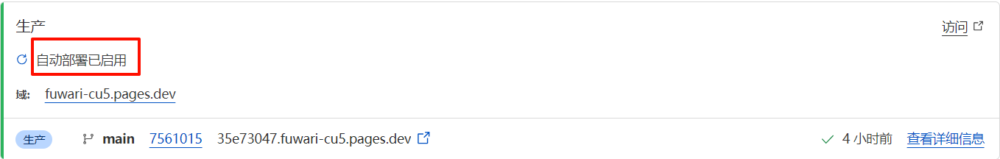

如图，艰辛的探索里程：

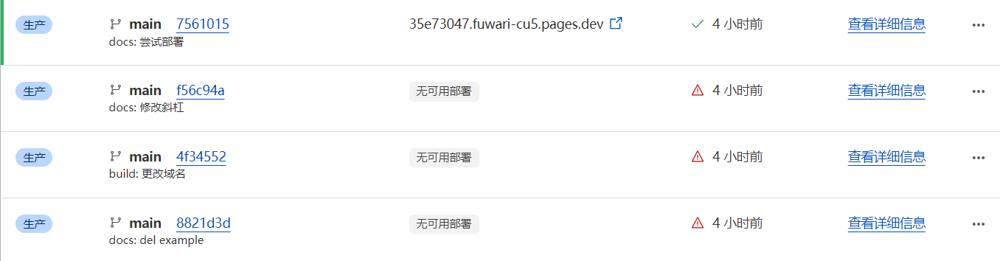

---

<!-- >[!WARNING]
>如果不使用自定义域名的话，在国内应该是没办法访问的。 -->

<div style="border-left:4px solid #9a6700;background:#fff8c5;padding:8px 12px;margin:8px 0"><div style="color:#9a6700;font-weight:bold">WARNING</div><div>如果不使用自定义域名的话，在国内应该是没办法访问的。</div></div>

---

> **引用/可能有帮助的文章**
>
> [Fuwari静态博客搭建教程 - 二叉树树的博客](https://www.afo.im/posts/fuwari/)
>
> [fuwari/docs/README.zh-CN.md at main · saicaca/fuwari · GitHub](https://github.com/saicaca/fuwari/blob/main/docs/README.zh-CN.md)
>
> [pnpm 基本详细使用教程（安装、卸载、使用、可能遇到的问题及解决办法）-CSDN博客](https://blog.csdn.net/m0_56416743/article/details/136122153)
>
> [部署你的 Astro 站点至 GitHub Pages | Docs](https://docs.astro.build/zh-cn/guides/deploy/github/)
