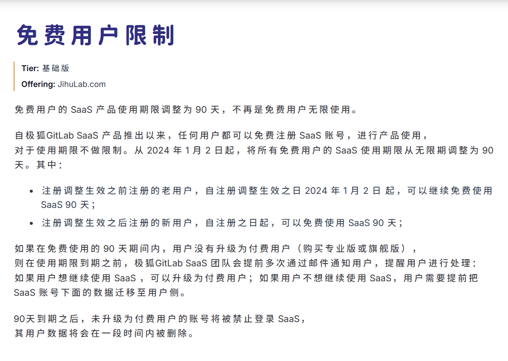
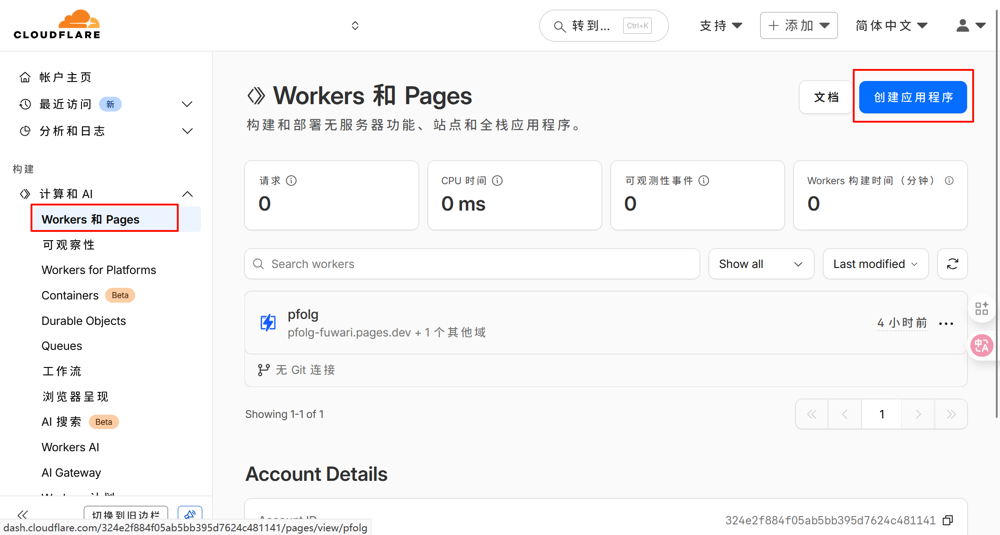
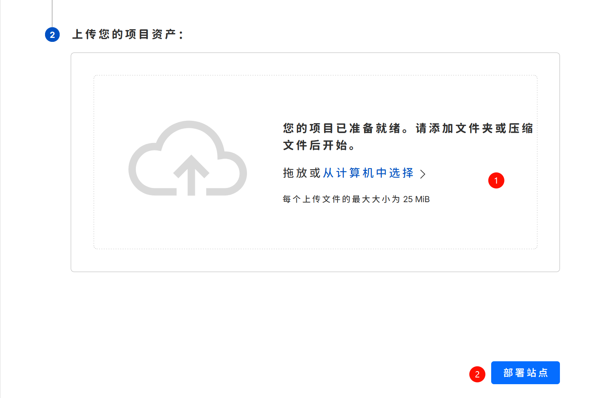
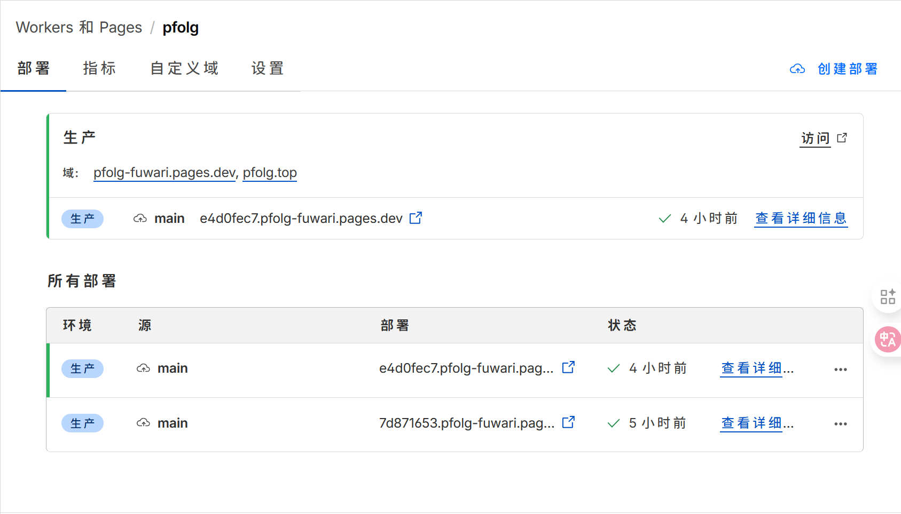

> [!NOTE]
> Image by <a href="https://pixabay.com/users/wallpaper24h-41930513/?utm_source=link-attribution&utm_medium=referral&utm_campaign=image&utm_content=8712742">LY KIMLOR</a> from <a href="https://pixabay.com//?utm_source=link-attribution&utm_medium=referral&utm_campaign=image&utm_content=8712742">Pixabay</a>

## 前言

由于GitHub账户被标记，原来博客依赖的仓库无法访问，但是我的本地仓库还在，修修补补还能用。

## GitLab

GitLab不在中国区提供服务，取而代之的是极狐GitLab。

极狐GitLab 提供了 pages 功能，可以用来搭建静态网站，但是——

还有，它不能被没有权限的人访问，简言之，我的网站虽然成功搭建了，但是只能自己看——这和没搭建有什么区别？再次，过了90天之后，我又不会富起来，我不会购买它的服务，时间一到我的账户数据就会被清除。

## 去GitHub化的Cloudflare

种种原因叠加之下，我不得不找寻一种免费且可用的方式为这个博客续命，当然，我也不能让我的域名白买。

于是我选择了Cloudflare，因为它 **免费**，限制条件少。

_扯皮到此为止_

## 具体步骤

- 进入：<https://dash.cloudflare.com> 如果没有Cloudflare账号，就注册一个。

- 创建应用程序
  

- 选择Pages
  

> 这里选择`拖放文件`

---

问题来了，这里有人要问，“主包主包，我们既没有Git储存库，又没有文件，怎么办？”

那没有我们不能现弄吗？

参考一下[官方文档](https://github.com/saicaca/fuwari/blob/main/docs/README.zh-CN.md#-%E6%8C%87%E4%BB%A4)

| Command                            | Action                                 |
| :--------------------------------- | :------------------------------------- |
| `pnpm install` 并 `pnpm add sharp` | 安装依赖                               |
| `pnpm dev`                         | 在 `localhost:4321` 启动本地开发服务器 |
| `pnpm build`                       | 构建网站至 `./dist/`                   |
| `pnpm preview`                     | 本地预览已构建的网站                   |
| `pnpm new-post <filename>`         | 创建新文章                             |
| `pnpm astro ...`                   | 执行 `astro add`, `astro check` 等指令 |
| `pnpm astro --help`                | 显示 Astro CLI 帮助                    |

我们 ~~从上到下执行一遍呢？~~ 把依赖安装好，把资源配好，如果`pnpm dev`都没问题了，就`pnpm build`，然后把`dist`上传了就行了：

剩下的没啥了，微调一下就好了，点击`域`就可以访问我们的网站了。

---

## 总结

### 迁移背景

1. 原GitHub仓库因账户问题无法访问
2. 尝试GitLab（极狐）失败原因：
   - Pages功能存在访问权限限制
   - 免费账户存在90天数据保留期限
3. 选择Cloudflare的核心优势：
   - 完全免费的静态站点托管服务
   - 无强制绑定代码仓库要求
   - 支持自定义域名配置

### 核心实施步骤

1. **平台准备**
   - 注册/登录Cloudflare控制台
   - 创建Pages类型应用程序

2. **项目构建**
   - 本地执行`pnpm install`和`pnpm add sharp`安装依赖
   - 运行`pnpm build`生成dist构建产物
   - 直接拖放dist目录到Cloudflare部署

3. **域名配置**
   - 在Cloudflare控制台绑定自有域名
   - 自动获取\*.pages.dev测试域名
   - 支持HTTPS自动配置

### 最终成果

通过Cloudflare Pages实现了：

- 完全脱离GitHub/GitLab的独立部署
- 永久免费的全球CDN加速
- 完整的自定义域名支持
- 可视化拖拽式部署流程

该方案特别适合需要快速迁移静态站点且追求零运维成本的开发者，整个过程无需代码仓库绑定，仅通过构建产物即可完成部署。

### 缺陷

少了GitHub功能少一半，原有的评论系统失效，自动构建也失效，全部流程需自己手动来，很麻烦。

但也不失为一条出路了。
