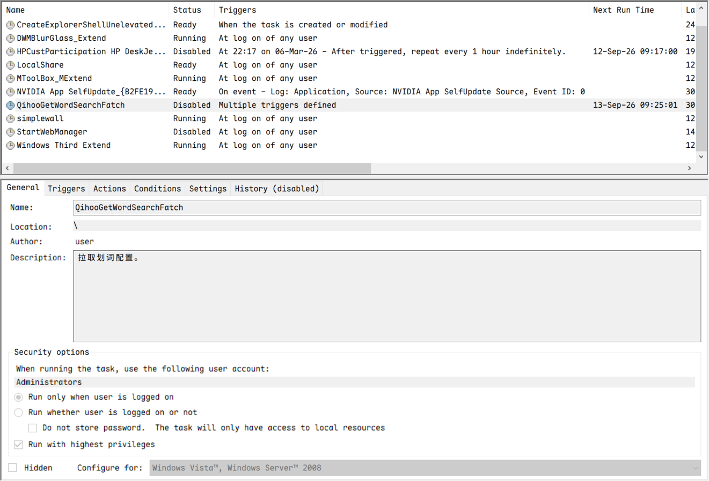
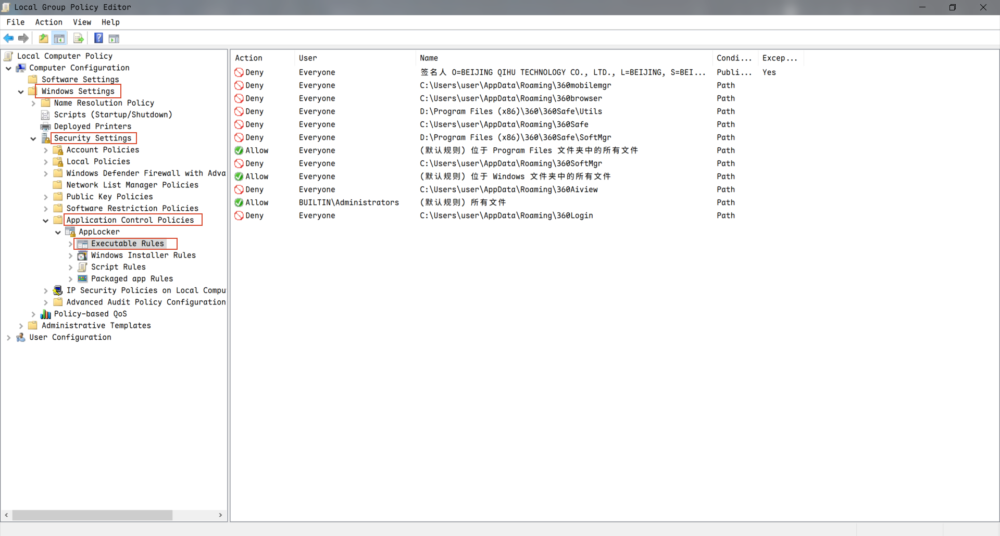
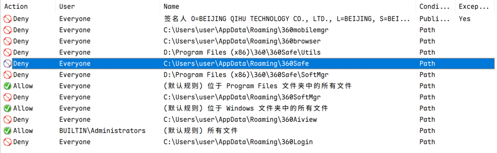
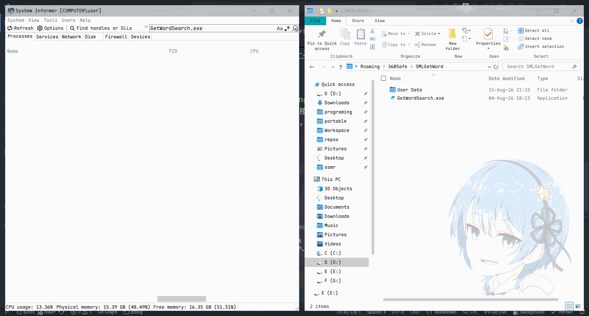

> Image by <a href="https://pixabay.com/users/sergeitokmakov-3426571/?utm_source=link-attribution&utm_medium=referral&utm_campaign=image&utm_content=4824367">Sergei Tokmakov, Esq. https://Terms.Law</a> from <a href="https://pixabay.com//?utm_source=link-attribution&utm_medium=referral&utm_campaign=image&utm_content=4824367">Pixabay</a>

## 引子

本来想去任务计划程序里面看看ClamAV的守护脚本还在不在，能不能启动，结果发现了一坨大变！

可以看到，这个名为`QihooGetWordSearchFatch`的计划任务目的是为了启动`"C:\Users\user\AppData\Roaming\360Safe\SMLGetWord\GetWordSearch.exe"`，它的注释是`拉取划词配置。`，但是我并没有配置过相关内容，甚至这个任务昨天我是删了的，今天又在我扫描病毒之后出现在了这里。

那么问题来了，肯定不止我一个人的360在搞事情，高级的玩意防不了，这种级别的小把戏我还不能防吗，是它先不讲武德的啊！

---

## 搞事情

删肯定是没办法的，毕竟它又出现在了那里。

这样用组策略，百试百灵，目前只见到它在计划任务里，没看到它确实运行在电脑上。

等到哪天360把魔爪伸向了组策略，那我就该考虑重装系统了。

先按<kbd>Win</kbd> + <kbd>R</kbd>，打开运行窗口，输入`gpedit.msc`，然后按<kbd>Enter</kbd>，然后按下图路由：

于是一顿操作之后（很麻烦，真的）：

> 其实这是我之前做的，具体怎么配可以在网上找更详细的教程。

直接把整个`AppData\Roaming\360Safe`目录的程序禁用掉就行了，其他按需禁用，颗粒度自己掌握，当然——不禁也没关系，毕竟只有360的那些把戏。

看看效果：

非常好，直接就被系统杀了。

---

## 总结

- 计划任务是瘤子，动不了，启动360时有自修复在搞鬼。
- 用组策略来得更干脆
