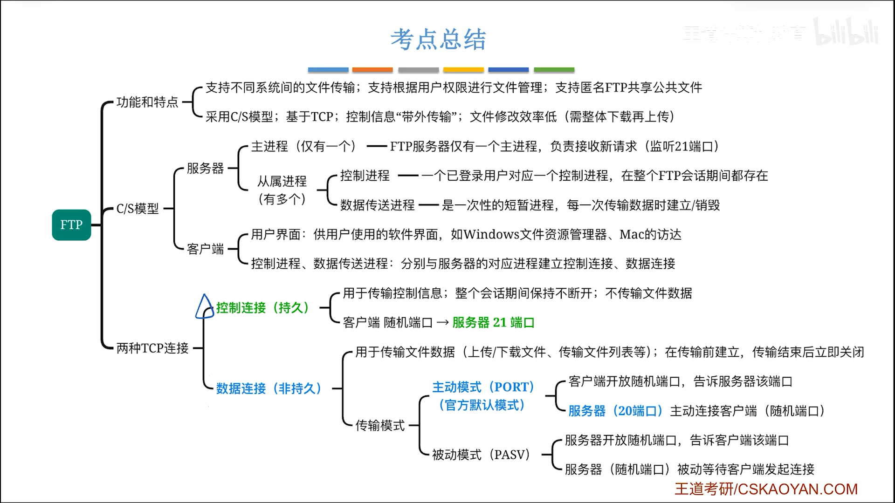

## 介绍

FTP 提供了不同主机间文件传输的功能，它基于 TCP 协议，使用C/S模型。



> 考试一般默认主动模式，但实际情况默认被动模式

目前人们一提到不同设备间的文件传输，一般就是QQ、微信这类即时通讯软件，或者LocalSend、LANDrop这种专业、方便的工具。但是，用了FTP后才发现姜还是老的辣。不知道我以上提到的软件采用的是何种实现，不过我目前非常推荐用FTP啦，可能是因为我有一个比较好用的客户端？

## FileZilla

The [FileZilla Client](https://filezilla-project.org/index.php) not only supports FTP, but also FTP over TLS (FTPS) and SFTP. It is open source software distributed free of charge under the terms of the **GNU General Public License**(GPL).

```shell
状态: 正在连接 192.168.137.106:2211...
状态: 连接建立，等待欢迎消息...
状态: 不安全的服务器，不支持 FTP over TLS。
状态: 已登录
```

我通常用它来下载一些科研数据，很方便，操作比较直观、方便，网络状况良好时操作文件就像在本地操作文件管理器一样丝滑。

它是双栏布局，左边本地右边远程，双击一边的文件就会把文件下载到另一边的目录内，也可以直接拖动文件/文件夹操作。

似乎只支持PC端，还好，Windows和Linux都有支持。

## Amaze

Amaze 是一个开源的Android文件管理器，我平时用它来替代原生的文件管理器，用起来非常方便，它提供有FTP server功能。

现在，我用它让我的文件在局域网里实现了传输自由，0/目录下的所有文件都可以被PC端访问，都具有`rwx`权限。

似乎不止一个第三方开源的文件管理器支持FTP，按喜好挑选即可。

## 传输能力

取决于网络状况和带宽，即`短板效应`。

比如我下载资料的时候，大部分时候是300kB/s，这说明服务器最高支持到这个值。

而我本地一对一链接，Android作为server，Windows作为client，最高可达6MB/s，原因在于我的Windows无线网卡最高能到这个值，而Android是远高于这个值的。
