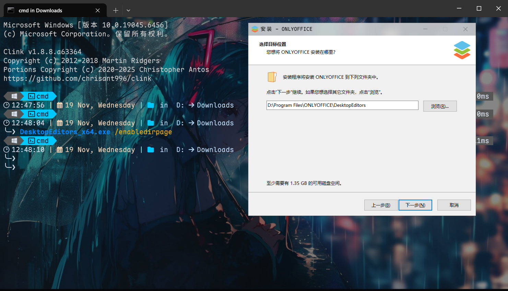

> [!NOTE]
> Image by <a href="https://pixabay.com/users/dgsstudios-39215122/?utm_source=link-attribution&utm_medium=referral&utm_campaign=image&utm_content=8460974">Sam</a> from <a href="https://pixabay.com//?utm_source=link-attribution&utm_medium=referral&utm_campaign=image&utm_content=8460974">Pixabay</a>

<!-- >[!NOTE]
>
>在[此处](https://www.onlyoffice.com/zh/download-desktop)下载onlyoffice桌面版。 -->

<div style="border-left:4px solid #0969da;background:#ddf4ff;padding:8px 12px;margin:8px 0"><div style="color:#0969da;font-weight:bold">NOTE</div><div>在<a href="https://www.onlyoffice.com/zh/download-desktop">此处</a>下载onlyoffice桌面版。</div></div>

请下载离线安装包，如果下载**MSI安装包**，**可能不需要**用这种方式设置路径。

一般地，直接运行安装包没有选择路径的权利。

我们需要用命令行的方式来设置路径：

```shell
DesktopEditors_x64.exe /enabledirpage
```

然后运行安装包就有选择路径的选项了：



---

如果上述方法因版本更新不再有效，你还可以尝试以下方法：

- 寻找 MSI 安装包：ONLYOFFICE 通常也会提供 MSI 格式的安装包。与 EXE 安装包不同，MSI 安装包默认会显示目录选择页面，不会隐藏这一选项。你可以在官方的下载页面查找是否有名为 "MSI installer" 的版本。

- 使用在线安装程序：ONLYOFFICE 还提供了一个在线安装程序。这个程序主要功能是自动检测并安装适合你系统版本的软件，但对于是否能自定义安装路径，目前的资料没有明确说明。你可以尝试运行它，看其是否提供高级选项。
