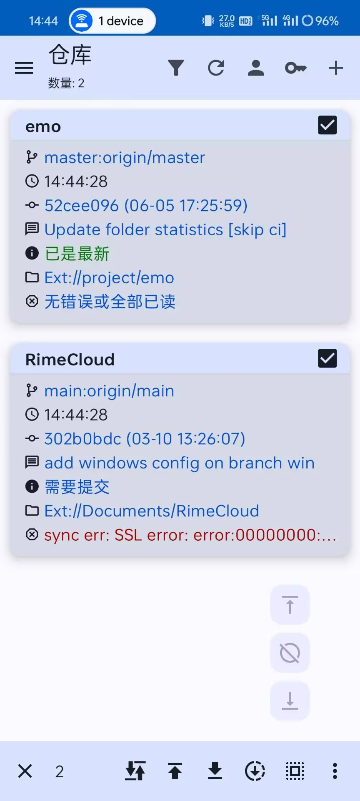
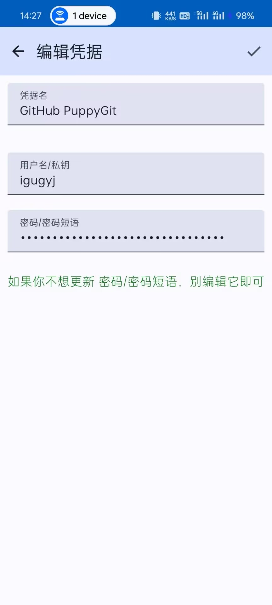
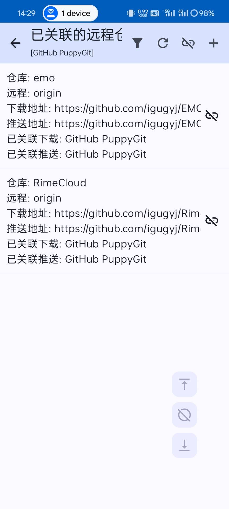
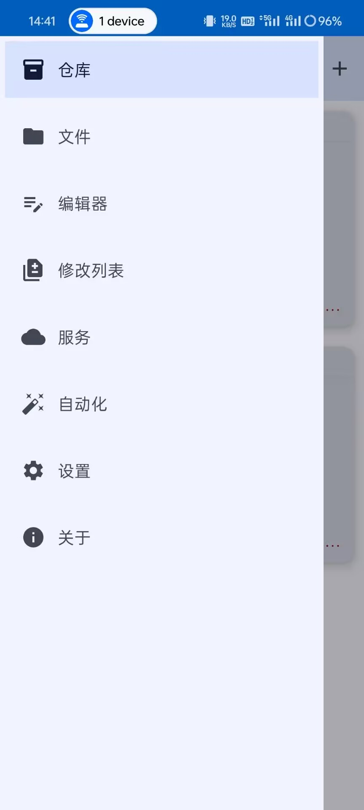

> [!NOTE]
> image from：<https://github.com/catpuppyapp/PuppyGit>

## 前言

我所要讲的是下载到用token（启用了2fa的）管理git仓库的一条路径，如果可以直接用https的，可以不用看这篇，ssh我常用，但是没摸索出来，本来是先尝试的这个，但是失败了。无奈之下还是用token走通了。

首先要下载PuppyGit，可以在[GitHub](https://github.com/catpuppyapp/PuppyGit)或F-Droid上下载到，很方便的。

我原来用过[GitSync](https://github.com/ViscousPot/GitSync)，这也是非常优秀的一个Android git 工具，但是内有付费机制，我又不太会构建apk，就没用它了，但是它确实是一个非常优秀的软件！

不用担心，两个项目目前都比较活跃，自己可以按需选择，我这里推荐PuppyGit，因为它的的确确没有用户限制，唯一的门槛就是它是开源的（对于一些人来说国内比较难用上这类软件）。



## 配置

如果你已经成功安装了PuppyGit，那咱们就进入正题吧！

克隆/导入 在右上角的`+`按钮，这些都非常熟悉了吧，如果感到陌生，那这篇文章可能不适合你。

我选择导入我的`emo`仓库，这是我管理表情包的仓库，在发现PuppyGit之前，我一直用的是Termux，后者更强大也更受欢迎，但是并没有专门针对git开发，它是个通用终端！

好的，我们导入或克隆仓库之后，就要进行配置才能正常使用，不然我们是只能pull不能push的，看看仓库的远程地址对了吗，是不是http/https，如果是ssh，记得采用适合自己的方式配置，本文不采用ssh，所有的远程仓库均采用https连接，但是习惯了子模块的我可是真的要喝一壶了……

记得在右上角第三个按钮填写自己的信息：用户名&邮箱，然后在钥匙按钮那里填写凭证，ssh应该也在此步，我没成功，还得练，这里还是token适合我。

去Git平台获取token，填到`密码`，用户名就是平台用户名，凭证名随意：



回退到凭证管理器，单击刚刚编辑的凭证，关联仓库：



---

回到仓库页面就可以fetch/pull/push操作了，不明白的选项可以长按，会有提示说明。

## https与ssh

https方便，但是对网络要求高，就很那个，你懂得吧~ （捂脸\*3

ssh配置复杂，但可以一劳永逸，平时也特别快。

## 结语

看着简单，其实一点也不难，PuppyGit有些配置需要自己好好找一找，仔细琢磨，这会对你使用git有很大的帮助。当然，只是同步个仓库可不是PuppyGit的全部了，它的其他功能做得也特别好！



本来人家就是用来：

```txt
Clone A Repo
Obsidian + PuppyGit
Markor + PuppyGit
Markdown Preview
Switch DarkMode and Chinese
Resolve Conflicts/Squash Commits
Auto Sync Obsidian Vault
PuppyGit + Tasker
```

也许我可以用来同步我的rime词库也说不定呢？这波必须得把免费的薅秃！
