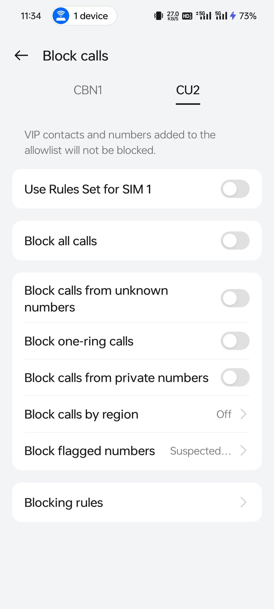
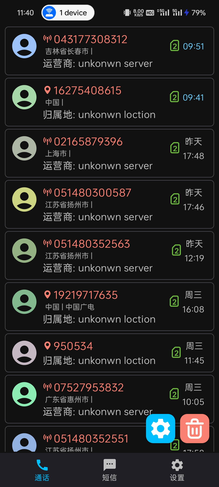
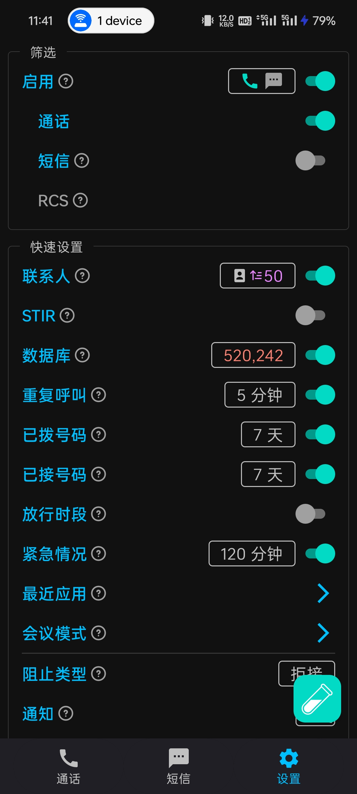
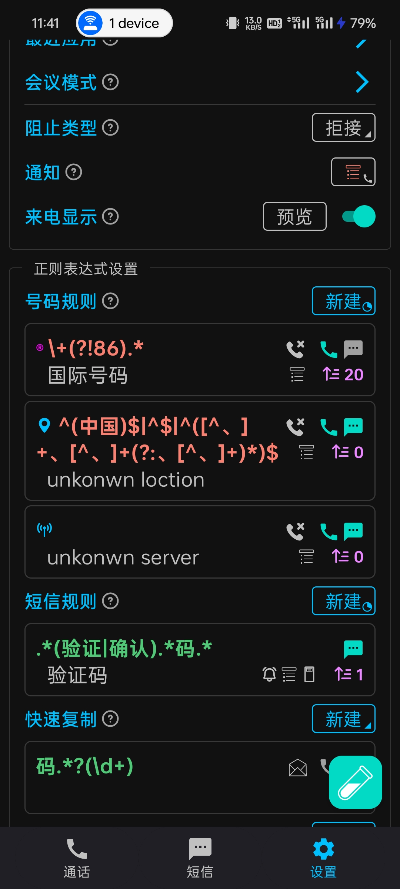
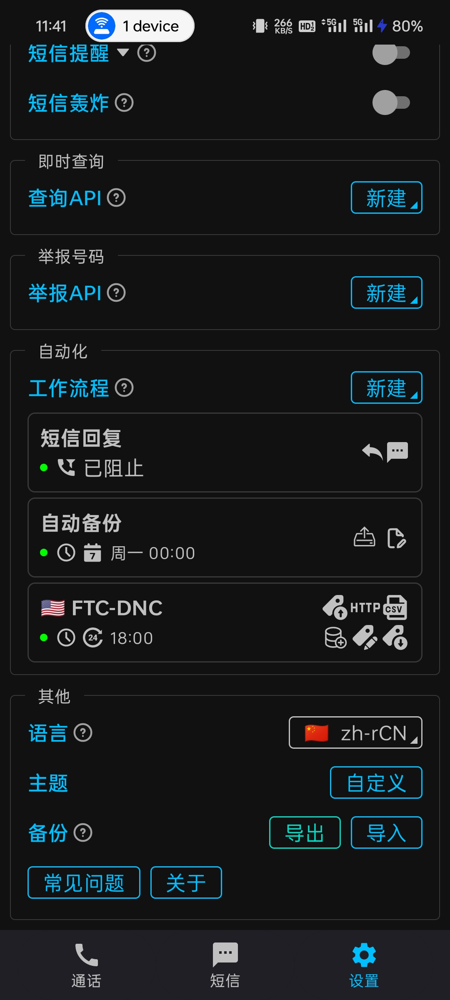

> [!CAUTION]
> 不推荐那些不知道如何配置、不想学或者没有能力学的人使用。

## 引子

在我所在的地方，广告费似乎是一笔非常不菲的收入。电信诈骗的收获也是非常可观的，动辄张大爷被骗了五万，王大娘又是八万。什么老伴的救命钱、一个月的生活费……

但是大多还是推销，什么李老师，叫孩子去培训，一个月提40分……

拜托，我真的需要这些吗？我还没结婚，甚至还没有收入，我还是家里面的血吸虫呢！

---

## 探索

基于手机自带的`Phone`软件，它提供了简单的骚扰拦截功能，但是不够，依然有许多漏网之鱼。在不过滤的情况下，每天约有≥3个电话打来。

但是我又不能像流量卡一样把电话全禁了，万一有什么事确实联系不上我就*牙白*了。

然后还是问的AI，我找到了SpamBlocker，具体功能可以看它的[README.md](https://github.com/aj3423/SpamBlocker)，我平时用着感觉不错。

有一个问题是，它不能在电话接入之前拦截电话，必须是已经到你的终端，在弹出接听界面之前才开始拦截。

也就是说，打游戏或者刷视频该卡还是得卡。

---

## 效果

可以看到，每天还是有许多电话打来，但是很多我都不需要。欸，这里好像有个米哈游的电话（021似乎在上海虚拟号中占多数，但很多并不是mhy的

## 配置

这是我导出的配置，可以直接用，谨慎一点最好：[SpamBlocker.2026_09_11.gz](assets/SpamBlocker.2026_09_11.gz)

优先级配置要分清，哪个先拦哪个后拦很重要，现在我解释不出来，在配置时懂了一会儿，当天晚上大脑就清除缓存了：

这是我简单分析了一般骚扰电话的特征然后总结的正则表达式，拦截国外电话+未知地理位置+未知运营商：

> - 未知地理位置一般是只显示`中国`，或者显示了多个市，如`四川省成都市、眉山市`。
> - 未知运营商则是不显示运营商，为空，直接拦。

这是我设置的自动工作流程，至于短信这一块，有没有好好工作我也不知道，备份和数据库更新应该有好好运行：

配置完后记得找点号码来测试一下，如未被记录的骚扰电话，可以测多次，把记录删了再测就行。

值得一提的是我这里似乎不支持STIR，保持关闭即可。

总体上效果还可以，至少能帮我免了行注目礼的仪式。PVE可能有意思，但PVP是绝对有意思的！
