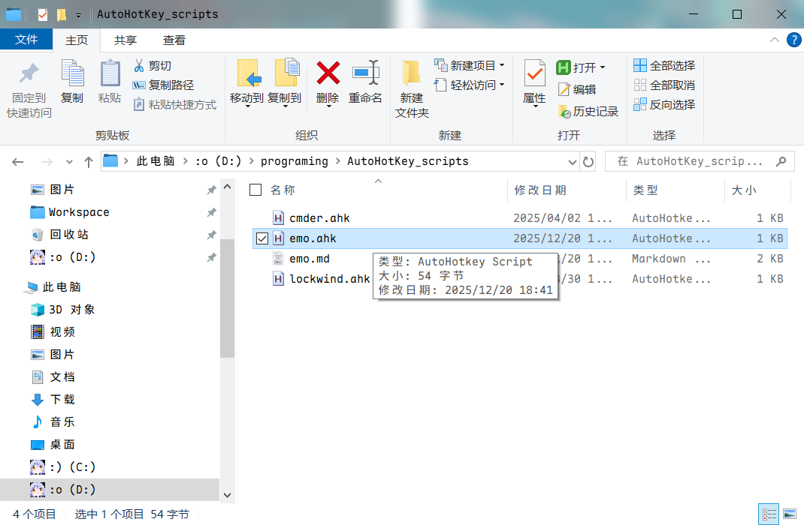

## 前言


有时，我们在发表情的时候，总是会发觉军火不够，而 Windows 电脑上的一些表情是我们收藏里没有的，但是，每次打开这个文件夹都很麻烦，我们又不想回朋友太慢，为了求快，我想到两种方法。


## 方法一：Win+R 打开 EMO 文件夹


在当前用户文件夹内新建一个`bat`文件，用于打开 EMO 文件夹：

```bat
explorer "D:\Users\Pfolg\Pictures\EMO"
```

按 Win + R，输入`emo`，终端闪烁一下，文件夹打开：


---

## 方法二：Autohotkey 定义快捷键



写入以下内容：

```autohotkey
^+e::
    Run, D:\Users\Pfolg\Pictures\EMO
return
```

> 精简的命令总有一段悲伤的故事


按`Ctrl + Shift + E`，EMO 文件夹打开：


---
