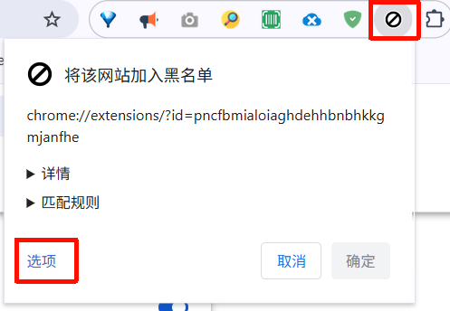
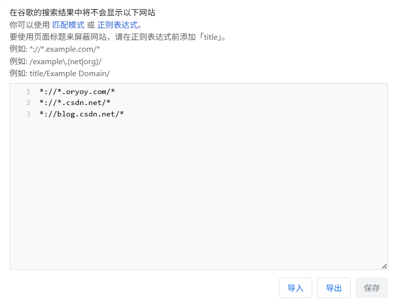
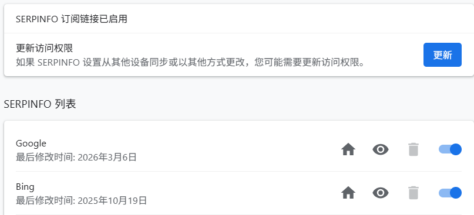
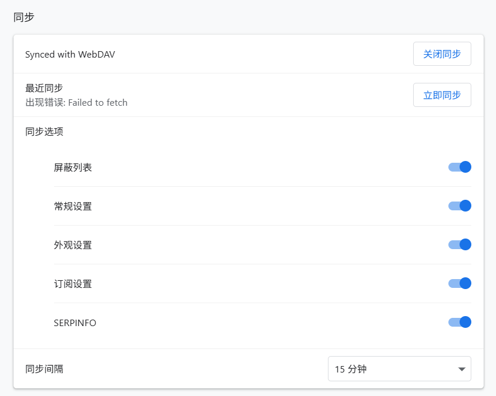
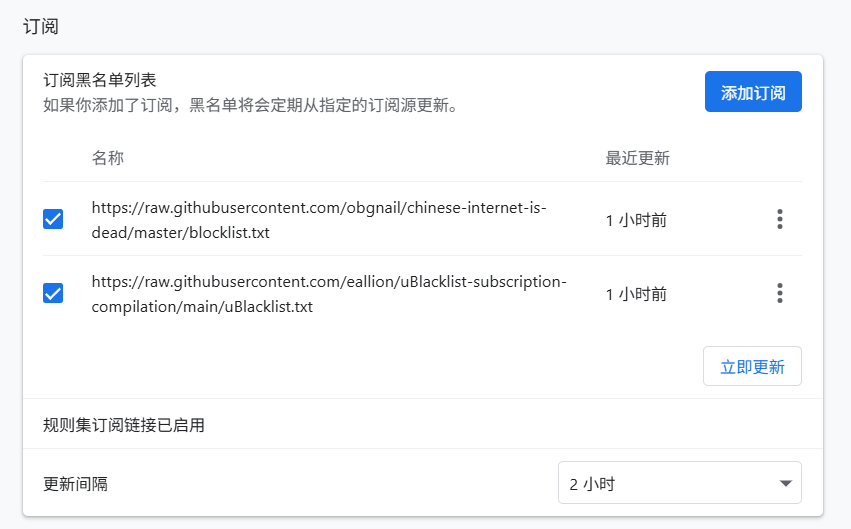
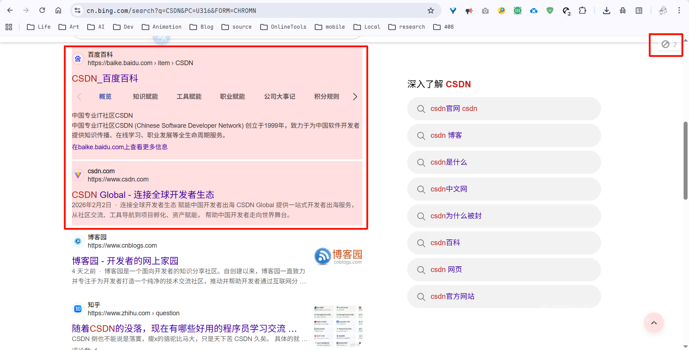

> [!NOTE]
> Image by <a href="https://pixabay.com/users/qiaominxu_橋茗旭-18717949/?utm_source=link-attribution&utm_medium=referral&utm_campaign=image&utm_content=9362630">qiaominxu 橋茗旭</a> from <a href="https://pixabay.com//?utm_source=link-attribution&utm_medium=referral&utm_campaign=image&utm_content=9362630">Pixabay</a>
>
> Music: <https://music.163.com/#/song?id=3360087255&uct2=U2FsdGVkX1+TaRSiy1vNr3Zy/atU9K4kPu1nUf96Zws=>

## 安装ublocklist插件

在Chrome中安装ublocklist插件

1. 打开Chrome浏览器
2. 点击右上角的三个垂直点，选择“更多工具”
3. 点击“扩展程序”
4. 点击“获取更多扩展程序”
5. 搜索“ublocklist”
6. 点击“添加到Chrome”

## 配置ublocklist插件

点击“选项”，配置ublocklist插件

添加自己想屏蔽的网站，用通配符表示所有子域名

---

`其他搜索引擎`是一个关键配置：

建议把Google和Bing打开，其他选择性开启，根据个人需求调整。

---

我这里使用WebDAV来同步插件设置：

---

订阅列表可以在GitHub找：

## 效果展示

如我搜索“CSDN”，就会屏蔽掉必应的搜索结果：百度和CSDN的结果不会展示，点击右上角可以查看排除的结果。

## 总结

神中神！

`adguard`可以屏蔽广告和跟踪器等，但它无法优化掉那些我们不想看到的垃圾搜索结果，且adguard的屏蔽有上限。

但是`ublocklist`可以屏蔽掉那些我们不想看到的垃圾搜索结果，至于上限，暂时没看到有限制。

但是，如果没有好好配置，那么`ublocklist`就无法屏蔽掉那些我们不想看到的垃圾搜索结果，毕竟这插件装半年了，昨天我才鼓捣了一下，大受震惊。
